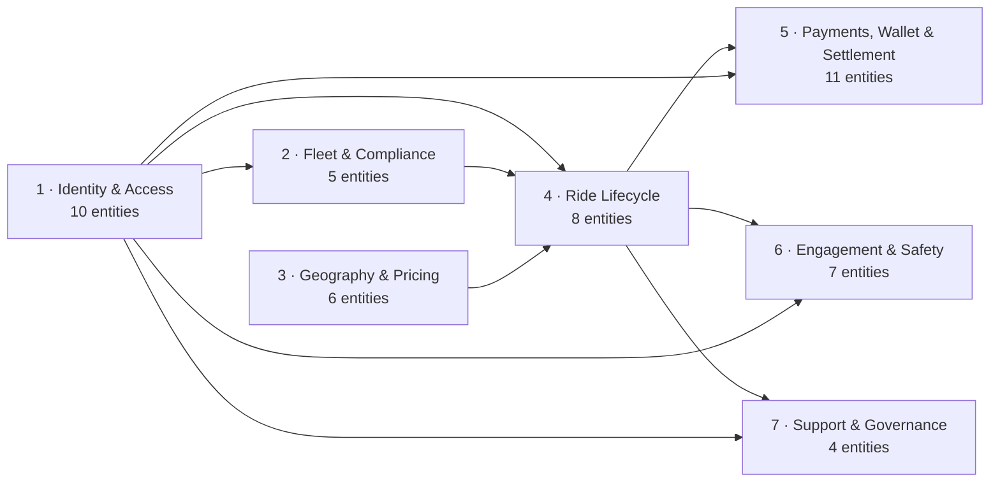
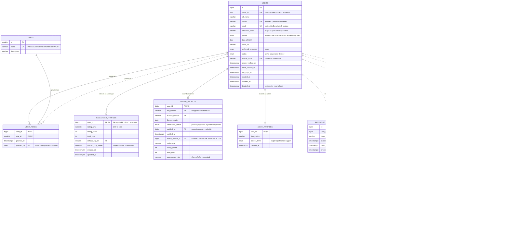
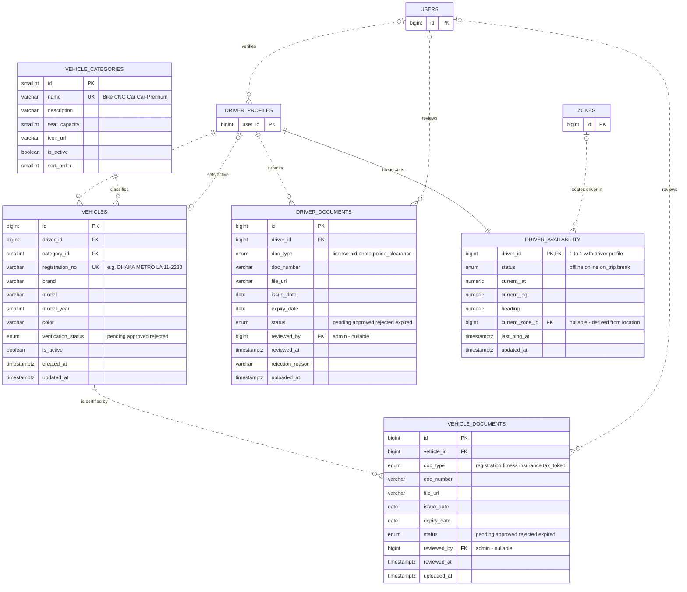
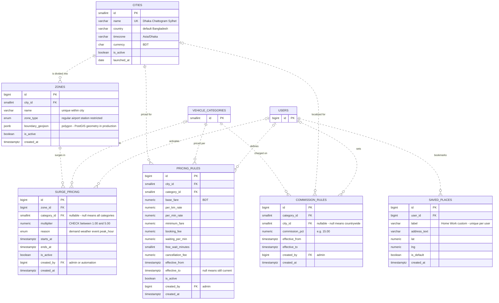
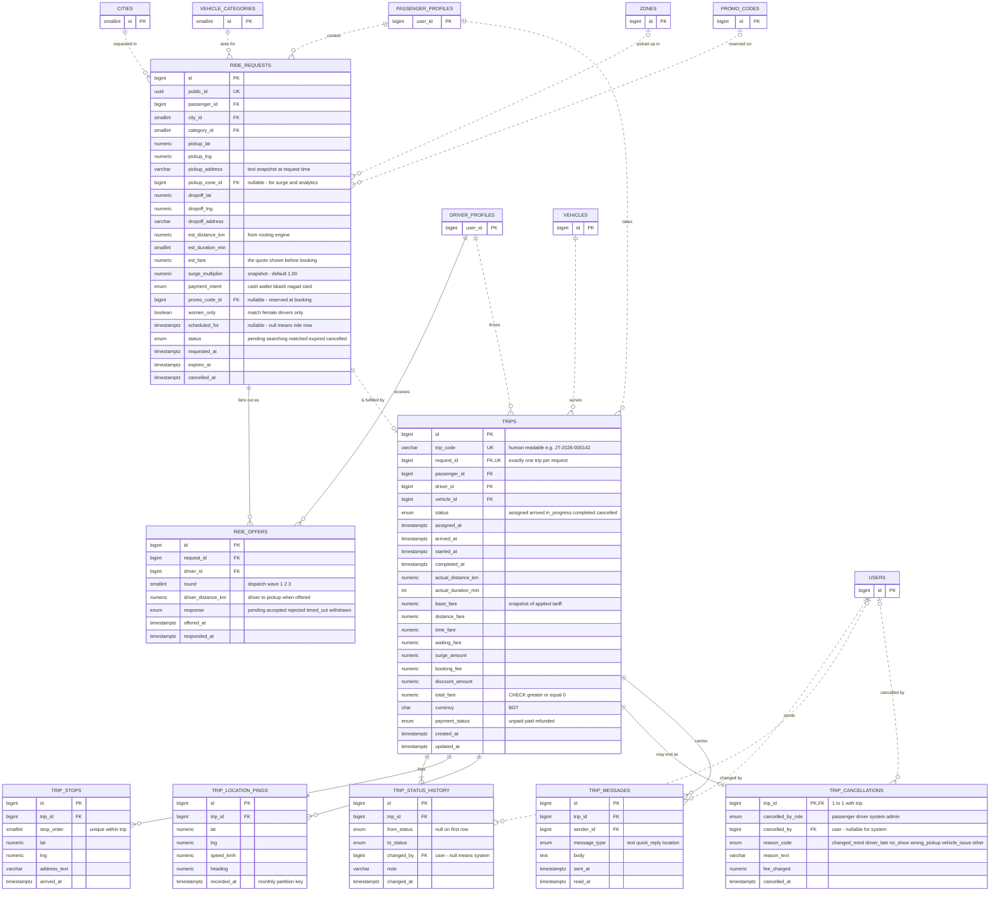
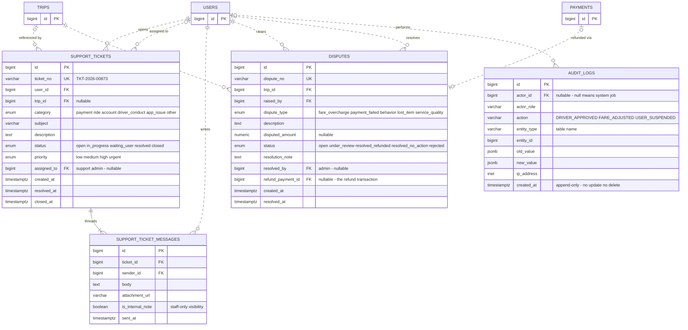

# Cholo (চলো) — Ride-Sharing Platform
## Complete Database Architecture & ER Design

| | |
|---|---|
| **Document** | Database Architecture & Entity-Relationship Design |
| **Version** | 1.0 — 14 July 2026 |
| **Project** | Cholo — a ride-sharing web platform for Bangladesh (working name, rename freely) |
| **Course context** | Database Management Systems — designed at production quality, explained at student level |
| **Target DBMS** | PostgreSQL 16 |
| **Market context** | Bangladesh-first: BDT currency, bKash / Nagad / SSLCommerz payments, NID-based driver KYC, phone-first accounts |
| **Scope of this document** | Entities, relationships, ER diagrams, design justification. The runnable SQL (DDL), normalization proofs (UNF→BCNF), and full data dictionary follow in the next document — they are built directly from this design. |

**How to render the diagrams:** every diagram in this file is written in Mermaid. GitHub renders them automatically in any `.md` file. You can also paste any block into [mermaid.live](https://mermaid.live) to export PNG/SVG for slides, or install the VS Code extension "Markdown Preview Mermaid Support".

---

## 1. How to Read This Document

### 1.1 Cardinality notation (Crow's Foot, as Mermaid draws it)

| Symbol | Meaning | Read as |
|---|---|---|
| `||` | Exactly one | "must have exactly one" |
| `|o` / `o|` | Zero or one | "may have at most one" |
| `|{` / `}|` | One or more | "has at least one" |
| `o{` / `}o` | Zero or more | "may have many" |

Example: `USERS ||..o{ REFRESH_TOKENS` reads *"one user has zero-or-many refresh tokens; every refresh token belongs to exactly one user."*

### 1.2 Line styles

| Line | Meaning |
|---|---|
| **Solid** (`--`) | **Identifying / existence-dependent relationship.** The child is a weak entity, an associative (junction) table, or a 1:1 extension — it is meaningless without its parent (e.g., a trip's status history cannot exist without the trip). |
| **Dashed** (`..`) | **Non-identifying association.** A regular foreign-key reference between two independent entities (e.g., a trip references a vehicle, but the vehicle exists on its own). |

### 1.3 Key markers

| Marker | Meaning |
|---|---|
| `PK` | Primary key (surrogate `bigint` identity unless stated otherwise) |
| `FK` | Foreign key |
| `UK` | Unique constraint |
| `PK, FK` | Column is both — used by 1:1 extension tables and composite-key junction tables |

### 1.4 Entity kinds used in the catalog tables

| Kind | Meaning | Examples |
|---|---|---|
| **Strong** | Independent entity with its own identity | `users`, `trips`, `cities` |
| **Extension** | 1:1 subtype of another entity; PK **is** the parent's PK | `driver_profiles`, `passenger_profiles` |
| **Weak** | Existence-dependent on a parent; deleted with it | `trip_status_history`, `trip_stops` |
| **Associative** | Junction table resolving a many-to-many relationship | `user_roles`, `ride_offers`, `favorite_drivers` |
| **Ledger** | Append-only financial/audit record — never updated, never deleted | `wallet_transactions`, `audit_logs` |

### 1.5 Naming and datatype conventions

- Tables: `snake_case`, **plural** (`ride_requests`). Columns: `snake_case`, singular.
- Every mutable table carries `created_at` / `updated_at` (`timestamptz` — always store UTC; Dhaka time is a *display* concern).
- **Money is always `NUMERIC(12,2)` + a `currency CHAR(3)` column (default `'BDT'`) — never `FLOAT`**, because binary floats cannot represent 0.1 exactly and money must never drift.
- Coordinates are `NUMERIC(9,6)` lat/lng pairs (≈11 cm precision) — deliberately provider-agnostic so the same schema works with OpenStreetMap or Google Maps. Zone polygons and radius searches upgrade cleanly to PostGIS later.
- Categorical states use PostgreSQL `ENUM` types (values shown in quotes inside the diagrams).
- Rows exposed outside the API also carry a `uuid public_id` so internal sequential IDs are never leaked in URLs or receipts.

---

## 2. Design Philosophy

Six principles drive every decision below — quote these in your presentation:

1. **Model the business, not the app screens.** A ride is not one thing; it is a *request* (demand), a *dispatch process* (offers), and a *trip* (fulfillment). Each gets its own entity, which is why unfulfilled demand is analyzable at all.
2. **Snapshot what must not change; reference what must stay current.** A completed trip's fare must read the same in five years even if tariffs triple — so fares, commission percentages, and surge multipliers are *copied* onto the trip records at booking/completion time, while live rules live in effective-dated rule tables.
3. **Financial truth is append-only.** Wallet balances are derivable from an immutable transaction ledger; nothing financial is ever `UPDATE`d or `DELETE`d — corrections are new compensating rows.
4. **The schema enforces safety, not just the code.** Token *hashes* instead of tokens, masked account numbers, gateway tokenization instead of card numbers, `CHECK` constraints on scores and amounts, and audit logs by design.
5. **One person, one account, many roles.** A user can be a passenger today and also a driver tomorrow without a second account — subtype *profile* tables extend one `users` table.
6. **Design for Dhaka-scale writes.** GPS pings and notifications are the highest-volume tables, so they are structured for time partitioning from day one.

---

## 3. The 7 Domains — System Map

The 51 entities are organized into 7 domains. Arrows show the dominant direction of foreign-key dependency (who references whom).



### 3.1 Entity inventory at a glance

| # | Domain | Entities |
|---|--------|----------|
| 1 | **Identity & Access** (10) | `users`, `roles`, `user_roles`, `passenger_profiles`, `driver_profiles`, `admin_profiles`, `refresh_tokens`, `password_reset_tokens`, `otp_verifications`, `login_sessions` |
| 2 | **Fleet & Compliance** (5) | `vehicle_categories`, `vehicles`, `driver_documents`, `vehicle_documents`, `driver_availability` |
| 3 | **Geography & Pricing** (6) | `cities`, `zones`, `saved_places`, `pricing_rules`, `surge_pricing`, `commission_rules` |
| 4 | **Ride Lifecycle** (8) | `ride_requests`, `ride_offers`, `trips`, `trip_stops`, `trip_status_history`, `trip_location_pings`, `trip_cancellations`, `trip_messages` |
| 5 | **Payments, Wallet & Settlement** (11) | `payment_methods`, `payments`, `wallets`, `wallet_transactions`, `promo_codes`, `promo_redemptions`, `receipts`, `driver_earnings`, `driver_payout_accounts`, `withdrawals`, `invoices` |
| 6 | **Engagement & Safety** (7) | `ratings`, `favorite_drivers`, `referrals`, `emergency_contacts`, `sos_alerts`, `notifications`, `user_reports` |
| 7 | **Support & Governance** (4) | `support_tickets`, `support_ticket_messages`, `disputes`, `audit_logs` |

**Totals: 51 entities · 101 documented foreign-key relationships · 4 associative tables · 7 weak entities · 4 extension tables · 2 append-only ledgers.**

---
## 4. Domain 1 — Identity & Access (10 entities)

**One `users` table holds every human** — passenger, driver, admin, support agent. Role-specific data lives in 1:1 *extension* tables (`passenger_profiles`, `driver_profiles`, `admin_profiles`) whose primary key **is** the user's ID. Permissions are granted through a `roles` ↔ `user_roles` many-to-many, so one person can hold several roles with one login. Authentication artifacts (refresh tokens, OTPs, reset tokens, sessions) are separate entities because they have their own lifecycles and must be revocable individually.



### 4.1 Entity catalog

| Entity | Kind | PK | Attributes | Purpose |
|---|---|---|---|---|
| `users` | Strong | `id` | id, public_id, full_name, phone*, email, password_hash, gender, date_of_birth, photo_url, preferred_language, status, referral_code*, phone_verified_at, email_verified_at, last_login_at, created_at, updated_at, deleted_at | Single account per human; all subtypes hang off it |
| `roles` | Strong (lookup) | `id` | id, name*, description | RBAC role catalog |
| `user_roles` | Associative | `(user_id, role_id)` | user_id, role_id, granted_at, granted_by | Resolves users M:N roles; records who granted what, when |
| `passenger_profiles` | Extension | `user_id` | user_id, rating_avg, rating_count, total_trips, default_city_id, women_only_mode, created_at, updated_at | Passenger-only attributes; denormalized rating aggregates for fast display |
| `driver_profiles` | Extension | `user_id` | user_id, nid_number*, license_number*, license_expiry, verification_status, verified_by, verified_at, active_vehicle_id, rating_avg, rating_count, total_trips, acceptance_rate, cancellation_rate, created_at, updated_at | Driver KYC + performance metrics used by dispatch |
| `admin_profiles` | Extension | `user_id` | user_id, designation, access_level, created_at | Staff attributes and access tier |
| `refresh_tokens` | Strong | `id` | id, user_id, session_id, token_hash*, issued_at, expires_at, revoked_at, replaced_by | Long-lived credential for silent re-login; rotation chain detects token theft |
| `password_reset_tokens` | Strong | `id` | id, user_id, token_hash*, expires_at, used_at, created_at | Single-use, short-lived reset links |
| `otp_verifications` | Strong | `id` | id, user_id, phone, otp_hash, purpose, attempts, expires_at, verified_at, created_at | Phone OTP for signup/login/payout confirmation (BD is phone-first) |
| `login_sessions` | Strong | `id` | id, user_id, device_type, device_name, ip_address, user_agent, logged_in_at, logged_out_at, is_active | Device/session audit trail; lets a user "log out of all devices" |

*Starred attributes are `UNIQUE`.*

**Constraints that shape this domain:** composite PK `(user_id, role_id)` prevents duplicate role grants · profile PKs double as FKs (`ON DELETE CASCADE` — a profile cannot outlive its user) · `users.deleted_at` implements soft delete so historical trips keep a valid reference · partial unique index allows only one *active* refresh token per session.

### 4.2 Textual ER

```text
USERS
 ├─ 1 : 0..1 ─ PASSENGER_PROFILES   "extends as passenger"  (profile: total)
 ├─ 1 : 0..1 ─ DRIVER_PROFILES      "extends as driver"     (profile: total)
 ├─ 1 : 0..1 ─ ADMIN_PROFILES       "extends as admin"      (profile: total)
 ├─ 1 : 0..N ─ USER_ROLES ─ N..0 : 1 ─ ROLES        (M:N resolved)
 ├─ 1 : 0..N ─ LOGIN_SESSIONS ─ 1 : 0..N ─ REFRESH_TOKENS
 ├─ 1 : 0..N ─ PASSWORD_RESET_TOKENS
 └─ 1 : 0..N ─ OTP_VERIFICATIONS   (user side optional: pre-signup OTP)
```

### 4.3 Relationships, cardinality, participation — and why

| # | Relationship | Entities | Cardinality | Participation | FK · delete rule | Why it exists |
|---|---|---|---|---|---|---|
| 1 | extends as passenger | USERS → PASSENGER_PROFILES | 1 : 0..1 | users partial · profile **total** | `passenger_profiles.user_id` · CASCADE | Subtype pattern: passenger data without polluting `users`; one login, many roles |
| 2 | extends as driver | USERS → DRIVER_PROFILES | 1 : 0..1 | users partial · profile **total** | `driver_profiles.user_id` · CASCADE | Driver KYC and metrics are irrelevant to 95% of users — isolate them |
| 3 | extends as admin | USERS → ADMIN_PROFILES | 1 : 0..1 | users partial · profile **total** | `admin_profiles.user_id` · CASCADE | Staff attributes separated for least-privilege queries |
| 4 | is granted | USERS → USER_ROLES | 1 : 0..N | users partial · junction **total** | `user_roles.user_id` · CASCADE | Resolves users↔roles M:N; a person can be passenger *and* driver |
| 5 | granted via | ROLES → USER_ROLES | 1 : 0..N | roles partial · junction **total** | `user_roles.role_id` · RESTRICT | Role catalog stays intact while grants come and go |
| 6 | granted by | USERS → USER_ROLES | 0..1 : 0..N | both partial | `user_roles.granted_by` · SET NULL | Accountability: which admin gave this role |
| 7 | authenticates with | USERS → REFRESH_TOKENS | 1 : 0..N | users partial · token **total** | `refresh_tokens.user_id` · CASCADE | Multiple devices ⇒ multiple refresh tokens; revoke per device |
| 8 | anchors | LOGIN_SESSIONS → REFRESH_TOKENS | 1 : 0..N | session partial · token **total** | `refresh_tokens.session_id` · CASCADE | Token rotation chain per session detects replayed (stolen) tokens |
| 9 | requests | USERS → PASSWORD_RESET_TOKENS | 1 : 0..N | users partial · token **total** | `password_reset_tokens.user_id` · CASCADE | Reset links must expire and be single-use — needs own lifecycle |
| 10 | verifies via | USERS → OTP_VERIFICATIONS | 0..1 : 0..N | both partial | `otp_verifications.user_id` · CASCADE | OTP may be sent *before* the account exists (signup), hence optional user |
| 11 | signs in from | USERS → LOGIN_SESSIONS | 1 : 0..N | users partial · session **total** | `login_sessions.user_id` · CASCADE | Security audit trail; powers "active devices" screen |

---

## 5. Domain 2 — Fleet & Compliance (5 entities)

Vehicles belong to drivers and are classified by **vehicle categories** (Bike, CNG, Car, Car Premium — the Pathao-style lineup). Both drivers and vehicles must upload **documents** that admins review; a driver goes online only when every required document is approved. `driver_availability` is a deliberately separate 1:1 table: it is rewritten every few seconds by GPS heartbeats, and isolating it keeps that write-storm away from the stable `driver_profiles` row.



*`DRIVER_PROFILES`, `USERS`, `ZONES` are shown as stubs — full attributes appear in their home domains.*

### 5.1 Entity catalog

| Entity | Kind | PK | Attributes | Purpose |
|---|---|---|---|---|
| `vehicle_categories` | Strong (lookup) | `id` | id, name*, description, seat_capacity, icon_url, is_active, sort_order | Service tiers; pricing and dispatch both key off this |
| `vehicles` | Strong | `id` | id, driver_id, category_id, registration_no*, brand, model, model_year, color, verification_status, is_active, created_at, updated_at | Physical vehicle registry; a driver may register several |
| `driver_documents` | Strong | `id` | id, driver_id, doc_type, doc_number, file_url, issue_date, expiry_date, status, reviewed_by, reviewed_at, rejection_reason, uploaded_at | KYC evidence per driver; re-uploads create new rows so review history is kept |
| `vehicle_documents` | Strong | `id` | id, vehicle_id, doc_type, doc_number, file_url, issue_date, expiry_date, status, reviewed_by, reviewed_at, uploaded_at | Legal roadworthiness evidence per vehicle |
| `driver_availability` | Extension (hot row) | `driver_id` | driver_id, status, current_lat, current_lng, heading, current_zone_id, last_ping_at, updated_at | The *live* state: online/offline + last GPS fix; the dispatch engine queries only this small table |

**Constraints that shape this domain:** `vehicles.registration_no` unique nationally · a driver's *active* vehicle is `driver_profiles.active_vehicle_id` (nullable FK to `vehicles`) — this is a deliberate **circular reference** between the two tables, created with a later `ALTER TABLE`, and guarantees at most one active vehicle per driver · document expiry (`expiry_date`) drives automatic status flips to `expired` · business rule (enforced in service layer, checked by teachers-favorite trigger later): driver can go `online` only when profile + active vehicle are `approved`.

### 5.2 Textual ER

```text
DRIVER_PROFILES
 ├─ 1 : 0..N ─ VEHICLES ─ N..0 : 1 ─ VEHICLE_CATEGORIES
 │               └─ 1 : 0..N ─ VEHICLE_DOCUMENTS  (reviewed_by → USERS 0..1)
 ├─ 0..1 : 0..1 ─ VEHICLES            "active vehicle pointer"
 ├─ 1 : 0..N ─ DRIVER_DOCUMENTS       (reviewed_by → USERS 0..1)
 └─ 1 : 1   ─ DRIVER_AVAILABILITY ─ N..0 : 0..1 ─ ZONES
```

### 5.3 Relationships, cardinality, participation — and why

| # | Relationship | Entities | Cardinality | Participation | FK · delete rule | Why it exists |
|---|---|---|---|---|---|---|
| 12 | owns and operates | DRIVER_PROFILES → VEHICLES | 1 : 0..N | driver partial · vehicle **total** | `vehicles.driver_id` · RESTRICT | Real fleets: one driver may register bike + car; vehicle never orphaned |
| 13 | classifies | VEHICLE_CATEGORIES → VEHICLES | 1 : 0..N | category partial · vehicle **total** | `vehicles.category_id` · RESTRICT | Category determines pricing rule and which requests the vehicle can serve |
| 14 | sets active | DRIVER_PROFILES → VEHICLES | 0..1 : 0..1 | both partial | `driver_profiles.active_vehicle_id` · SET NULL | Exactly one vehicle is "on duty" at a time; dispatch reads this pointer |
| 15 | submits | DRIVER_PROFILES → DRIVER_DOCUMENTS | 1 : 0..N | driver partial (total to activate — business rule) · doc **total** | `driver_documents.driver_id` · CASCADE | KYC evidence; N rows per type keep re-upload history |
| 16 | is certified by | VEHICLES → VEHICLE_DOCUMENTS | 1 : 0..N | vehicle partial (total to activate) · doc **total** | `vehicle_documents.vehicle_id` · CASCADE | Fitness/insurance/tax papers; expiry tracked per document |
| 17 | broadcasts | DRIVER_PROFILES → DRIVER_AVAILABILITY | 1 : 1 | **total both sides** | `driver_availability.driver_id` · CASCADE | Hot GPS row isolated from cold profile row — write-frequency separation |
| 18 | locates driver in | ZONES → DRIVER_AVAILABILITY | 0..1 : 0..N | both partial | `driver_availability.current_zone_id` · SET NULL | Zone-level driver supply powers surge pricing and dispatch search |
| 19 | reviews (driver docs) | USERS → DRIVER_DOCUMENTS | 0..1 : 0..N | both partial | `driver_documents.reviewed_by` · SET NULL | Accountability: which admin approved which KYC document |
| 20 | reviews (vehicle docs) | USERS → VEHICLE_DOCUMENTS | 0..1 : 0..N | both partial | `vehicle_documents.reviewed_by` · SET NULL | Same accountability for vehicle papers |
| 21 | verifies | USERS → DRIVER_PROFILES | 0..1 : 0..N | both partial | `driver_profiles.verified_by` · SET NULL | Final driver approval is an admin action worth auditing |

---
## 6. Domain 3 — Geography & Pricing (6 entities)

Operations are organized by **city** (Dhaka, Chattogram, Sylhet…), each divided into **zones** (Gulshan, Uttara, Airport…). Zones are where supply/demand is measured, so **surge pricing** attaches to zones. Fares come from **pricing rules** — one row per *(city × vehicle category × validity period)* — and the platform's cut comes from **commission rules**. Both rule tables are *effective-dated*: old rows are never edited, new rows take over at `effective_from`, which is what lets a 2025 trip still explain its 2025 fare.



### 6.1 Entity catalog

| Entity | Kind | PK | Attributes | Purpose |
|---|---|---|---|---|
| `cities` | Strong (lookup) | `id` | id, name*, country, timezone, currency, is_active, launched_at | Operational market boundary; everything money-related is city-scoped |
| `zones` | Strong | `id` | id, city_id, name, zone_type, boundary_geojson, is_active, created_at | Sub-city geofences; unit of surge, supply metrics, airport rules |
| `saved_places` | Strong | `id` | id, user_id, label, address_text, lat, lng, is_default, created_at | "Home"/"Work" shortcuts — the *only* reusable location entity (see §13.6) |
| `pricing_rules` | Strong (effective-dated) | `id` | id, city_id, category_id, base_fare, per_km_rate, per_min_rate, minimum_fare, booking_fee, waiting_per_min, free_wait_minutes, cancellation_fee, effective_from, effective_to, is_active, created_by, created_at | Tariff card per city+category; historical rows preserved forever |
| `surge_pricing` | Strong (time-window) | `id` | id, zone_id, category_id, multiplier, reason, starts_at, ends_at, is_active, created_by, created_at | Temporary multiplier per zone; the *applied* multiplier is snapshotted onto each request |
| `commission_rules` | Strong (effective-dated) | `id` | id, category_id, city_id, commission_pct, effective_from, effective_to, created_by, created_at | Platform's percentage cut; referenced + snapshotted by every earning record |

**Constraints that shape this domain:** `UNIQUE (city_id, name)` on zones · `UNIQUE (city_id, category_id, effective_from)` on pricing rules — at most one tariff per market per start-moment · `CHECK (multiplier BETWEEN 1.00 AND 5.00)` caps surge abuse · `CHECK (effective_to IS NULL OR effective_to > effective_from)` keeps validity windows sane · `UNIQUE (user_id, label)` on saved places.

**Illustrative Dhaka tariff (sample `pricing_rules` rows):**

| Category | Base | Per km | Per min | Minimum | Booking fee |
|---|---|---|---|---|---|
| Bike | ৳25 | ৳12 | ৳1.00 | ৳40 | ৳5 |
| CNG | ৳40 | ৳15 | ৳1.50 | ৳70 | ৳5 |
| Car | ৳60 | ৳22 | ৳2.50 | ৳120 | ৳10 |
| Car Premium | ৳90 | ৳30 | ৳3.50 | ৳200 | ৳10 |

### 6.2 Textual ER

```text
CITIES
 ├─ 1 : 0..N ─ ZONES ─ 1 : 0..N ─ SURGE_PRICING (─ N..0 : 0..1 ─ VEHICLE_CATEGORIES)
 ├─ 1 : 0..N ─ PRICING_RULES ─ N..0 : 1 ─ VEHICLE_CATEGORIES
 └─ 0..1 : 0..N ─ COMMISSION_RULES ─ N..0 : 1 ─ VEHICLE_CATEGORIES
USERS
 └─ 1 : 0..N ─ SAVED_PLACES
```

### 6.3 Relationships, cardinality, participation — and why

| # | Relationship | Entities | Cardinality | Participation | FK · delete rule | Why it exists |
|---|---|---|---|---|---|---|
| 22 | is divided into | CITIES → ZONES | 1 : 0..N | city partial · zone **total** | `zones.city_id` · RESTRICT | Surge, supply and analytics all operate at zone granularity |
| 23 | priced for | CITIES → PRICING_RULES | 1 : 0..N | city partial · rule **total** | `pricing_rules.city_id` · RESTRICT | Dhaka and Sylhet fares differ; tariffs are market-local |
| 24 | priced per | VEHICLE_CATEGORIES → PRICING_RULES | 1 : 0..N | category partial · rule **total** | `pricing_rules.category_id` · RESTRICT | A bike km and a premium-car km cost differently |
| 25 | surges in | ZONES → SURGE_PRICING | 1 : 0..N | zone partial · surge **total** | `surge_pricing.zone_id` · CASCADE | Demand spikes are local (rain in Gulshan ≠ rain in Uttara) |
| 26 | scoped to | VEHICLE_CATEGORIES → SURGE_PRICING | 0..1 : 0..N | both partial | `surge_pricing.category_id` · CASCADE | Surge may hit only bikes (rain) or all categories (Eid) |
| 27 | bookmarks | USERS → SAVED_PLACES | 1 : 0..N | user partial · place **total** | `saved_places.user_id` · CASCADE | One-tap booking from Home/Work; pure UX accelerator |
| 28 | charged on | VEHICLE_CATEGORIES → COMMISSION_RULES | 1 : 0..N | category partial · rule **total** | `commission_rules.category_id` · RESTRICT | Platform cut differs by category (bikes 10%, cars 15%) |
| 29 | localized for | CITIES → COMMISSION_RULES | 0..1 : 0..N | both partial | `commission_rules.city_id` · RESTRICT | Optional per-city override; NULL = countrywide default |
| 30 | defines | USERS → PRICING_RULES | 0..1 : 0..N | both partial | `pricing_rules.created_by` · SET NULL | Tariff changes are audited to a person |
| 31 | activates | USERS → SURGE_PRICING | 0..1 : 0..N | both partial | `surge_pricing.created_by` · SET NULL | Surge can be manual (admin) or automated (NULL + audit log) |
| 32 | sets | USERS → COMMISSION_RULES | 0..1 : 0..N | both partial | `commission_rules.created_by` · SET NULL | Commission changes affect driver income — must be traceable |

---

## 7. Domain 4 — Ride Lifecycle (8 entities)

The most important modeling decision in the whole schema: **a ride is three things, not one.**

1. **`ride_requests`** — *demand.* What the passenger asked for: pickup, destination, category, the fare we quoted, the surge we applied. Exists even if no driver is ever found (that's how you analyze lost demand).
2. **`ride_offers`** — *the dispatch process.* An associative entity between requests and drivers: every driver who was offered the job and what they answered. This resolves the natural M:N ("many drivers see many requests") and is the data behind acceptance rates.
3. **`trips`** — *fulfillment.* Created the moment a driver accepts. Owns the actual timeline, the actual route, and the immutable **fare breakdown snapshot**.

Around `trips` hang four weak entities (status history, stops, GPS pings, cancellation record) and the in-ride chat.



### 7.1 Entity catalog

| Entity | Kind | PK | Attributes | Purpose |
|---|---|---|---|---|
| `ride_requests` | Strong | `id` | id, public_id*, passenger_id, city_id, category_id, pickup_lat, pickup_lng, pickup_address, pickup_zone_id, dropoff_lat, dropoff_lng, dropoff_address, est_distance_km, est_duration_min, est_fare, surge_multiplier, payment_intent, promo_code_id, women_only, scheduled_for, status, requested_at, expires_at, cancelled_at | Demand record + fare quote; `scheduled_for` makes ride-scheduling a *column*, not a new table |
| `ride_offers` | Associative | `id` (natural key `request_id, driver_id` unique) | id, request_id, driver_id, round, driver_distance_km, response, offered_at, responded_at | Full dispatch history; source of driver acceptance/response metrics |
| `trips` | Strong | `id` | id, trip_code*, request_id*, passenger_id, driver_id, vehicle_id, status, assigned_at, arrived_at, started_at, completed_at, actual_distance_km, actual_duration_min, base_fare, distance_fare, time_fare, waiting_fare, surge_amount, booking_fee, discount_amount, total_fare, currency, payment_status, created_at, updated_at | The fulfilled ride; immutable fare breakdown lives here (financial snapshot) |
| `trip_stops` | Weak | `id` (`trip_id, stop_order` unique) | id, trip_id, stop_order, lat, lng, address_text, arrived_at | Multi-stop rides ("pick up my friend on the way") |
| `trip_status_history` | Weak | `id` | id, trip_id, from_status, to_status, changed_by, note, changed_at | Append-only audit of every state change; settles "driver never came" disputes |
| `trip_location_pings` | Weak (high-volume) | `id` | id, trip_id, lat, lng, speed_kmh, heading, recorded_at | GPS breadcrumb trail (~1 row/4s); powers live tracking, route replay, fare audit; month-partitioned |
| `trip_cancellations` | Weak (1:1) | `trip_id` | trip_id, cancelled_by_role, cancelled_by, reason_code, reason_text, fee_charged, cancelled_at | Cancellation details only for the trips that need them — avoids 6 NULL columns on every completed trip |
| `trip_messages` | Weak | `id` | id, trip_id, sender_id, message_type, body, sent_at, read_at | In-ride chat between the two parties, retained for safety investigations |

**Constraints that shape this domain:** `UNIQUE (request_id, driver_id)` on offers — a driver is offered a request once · `trips.request_id UNIQUE` — a request produces at most one trip · `CHECK` timestamps are ordered (`completed_at >= started_at >= arrived_at >= assigned_at`) · `CHECK (total_fare >= 0)` and `CHECK (est_fare >= 0)` · fare identity `total_fare = base + distance + time + waiting + surge + booking_fee − discount` enforced by a generated column or trigger (shown in the SQL document) · pings and history are INSERT-only (no UPDATE grants).

### 7.2 Textual ER

```text
PASSENGER_PROFILES ─ 1 : 0..N ─ RIDE_REQUESTS
                                   ├─ N..0 : 1 ─ CITIES / VEHICLE_CATEGORIES
                                   ├─ N..0 : 0..1 ─ ZONES (pickup) / PROMO_CODES (reserved)
                                   ├─ 1 : 0..N ─ RIDE_OFFERS ─ N..0 : 1 ─ DRIVER_PROFILES   ← M:N resolved
                                   └─ 1 : 0..1 ─ TRIPS   (trip: total — always born from a request)
TRIPS
 ├─ N..0 : 1 ─ PASSENGER_PROFILES / DRIVER_PROFILES / VEHICLES
 ├─ 1 : 1..N ─ TRIP_STATUS_HISTORY   (weak · total: first row written at creation)
 ├─ 1 : 0..N ─ TRIP_STOPS (weak) / TRIP_LOCATION_PINGS (weak) / TRIP_MESSAGES
 └─ 1 : 0..1 ─ TRIP_CANCELLATIONS    (weak 1:1)
```

### 7.3 Relationships, cardinality, participation — and why

| # | Relationship | Entities | Cardinality | Participation | FK · delete rule | Why it exists |
|---|---|---|---|---|---|---|
| 33 | creates | PASSENGER_PROFILES → RIDE_REQUESTS | 1 : 0..N | passenger partial · request **total** | `ride_requests.passenger_id` · RESTRICT | Demand always belongs to a passenger; RESTRICT protects history |
| 34 | requested in | CITIES → RIDE_REQUESTS | 1 : 0..N | city partial · request **total** | `ride_requests.city_id` · RESTRICT | Selects which tariff card applies; market analytics |
| 35 | asks for | VEHICLE_CATEGORIES → RIDE_REQUESTS | 1 : 0..N | category partial · request **total** | `ride_requests.category_id` · RESTRICT | Passenger picks the service tier before dispatch |
| 36 | picked up in | ZONES → RIDE_REQUESTS | 0..1 : 0..N | both partial | `ride_requests.pickup_zone_id` · SET NULL | Ties demand to a zone for surge computation and heatmaps |
| 37 | reserved on | PROMO_CODES → RIDE_REQUESTS | 0..1 : 0..N | both partial | `ride_requests.promo_code_id` · SET NULL | Discount is promised at quote time; redeemed only on completion |
| 38 | fans out as | RIDE_REQUESTS → RIDE_OFFERS | 1 : 0..N | request partial · offer **total** | `ride_offers.request_id` · CASCADE | One request is offered to several drivers (waves); dispatch log |
| 39 | receives | DRIVER_PROFILES → RIDE_OFFERS | 1 : 0..N | driver partial · offer **total** | `ride_offers.driver_id` · CASCADE | Other half of the drivers↔requests M:N; powers acceptance_rate |
| 40 | is fulfilled by | RIDE_REQUESTS → TRIPS | 1 : 0..1 | request partial · trip **total** | `trips.request_id` UNIQUE · RESTRICT | The moment of match; unfulfilled requests simply have no trip |
| 41 | takes | PASSENGER_PROFILES → TRIPS | 1 : 0..N | passenger partial · trip **total** | `trips.passenger_id` · RESTRICT | Direct FK (not via request) keeps every trip query join-cheap |
| 42 | drives | DRIVER_PROFILES → TRIPS | 1 : 0..N | driver partial · trip **total** | `trips.driver_id` · RESTRICT | Driver's earning history; RESTRICT — trips are financial records |
| 43 | serves | VEHICLES → TRIPS | 1 : 0..N | vehicle partial · trip **total** | `trips.vehicle_id` · RESTRICT | Which physical vehicle ran the trip (insurance, disputes) |
| 44 | logs | TRIPS → TRIP_STATUS_HISTORY | 1 : 1..N | trip **total** · history **total** | `trip_status_history.trip_id` · CASCADE | Weak entity; every transition audited with actor + time |
| 45 | changed by | USERS → TRIP_STATUS_HISTORY | 0..1 : 0..N | both partial | `trip_status_history.changed_by` · SET NULL | Distinguishes passenger/driver/system/admin transitions |
| 46 | routes through | TRIPS → TRIP_STOPS | 1 : 0..N | trip partial · stop **total** | `trip_stops.trip_id` · CASCADE | Multi-stop support without polluting the trips table |
| 47 | is tracked by | TRIPS → TRIP_LOCATION_PINGS | 1 : 0..N | trip partial · ping **total** | `trip_location_pings.trip_id` · CASCADE | Live tracking + route replay + "route deviation" safety checks |
| 48 | may end as | TRIPS → TRIP_CANCELLATIONS | 1 : 0..1 | trip partial · cancellation **total** | `trip_cancellations.trip_id` · CASCADE | 1:1 weak entity — cancellation detail exists only when relevant |
| 49 | cancelled by | USERS → TRIP_CANCELLATIONS | 0..1 : 0..N | both partial | `trip_cancellations.cancelled_by` · SET NULL | Who pulled the plug — fee liability follows this |
| 50 | carries | TRIPS → TRIP_MESSAGES | 1 : 0..N | trip partial · message **total** | `trip_messages.trip_id` · CASCADE | Chat scoped to a trip; auto-archives with it |
| 51 | sends | USERS → TRIP_MESSAGES | 1 : 0..N | user partial · message **total** | `trip_messages.sender_id` · RESTRICT | Sender identity for safety review |

---
## 8. Domain 5 — Payments, Wallet & Settlement (11 entities)

Money flows in two directions: **in** from passengers (cash, wallet, bKash, Nagad, cards via SSLCommerz) and **out** to drivers (earnings minus commission, withdrawn to bKash/Nagad/bank). Three rules govern this domain:

- **`payments` records attempts, not just successes.** A bKash payment can fail and be retried, so a trip has 0..N payment rows — with a *partial unique index* guaranteeing at most one `succeeded` payment per trip.
- **`wallet_transactions` is an append-only ledger.** The wallet's `balance` is a convenience copy; the ledger (with `balance_after` and an idempotency key) is the truth. A driver's wallet may legally go *negative* — commission owed from cash trips.
- **Rates are referenced, amounts are snapshotted.** `driver_earnings` stores both the FK to the commission rule *and* the percentage actually applied, so later rule edits can never rewrite driver history.

```mermaid
erDiagram
    PAYMENT_METHODS {
        bigint id PK
        bigint user_id FK
        enum method_type "bkash nagad card"
        enum provider "bkash nagad sslcommerz"
        varchar display_label "bKash **** 1234"
        varchar gateway_token "tokenized reference - never raw numbers"
        boolean is_default
        boolean is_verified
        timestamptz created_at
        timestamptz deleted_at "soft delete"
    }
    PAYMENTS {
        bigint id PK
        uuid public_id UK
        enum purpose "trip wallet_topup"
        bigint trip_id FK "nullable - required when purpose is trip"
        bigint payer_id FK
        bigint payment_method_id FK "nullable - cash and wallet have none"
        enum method_type "cash wallet bkash nagad card"
        enum gateway "none bkash nagad sslcommerz"
        varchar gateway_txn_id UK "nullable - gateway reference"
        numeric amount "CHECK greater than 0"
        char currency "BDT"
        enum status "initiated pending succeeded failed refunded"
        varchar failure_reason
        numeric refund_amount
        timestamptz initiated_at
        timestamptz completed_at
        timestamptz refunded_at
    }
    WALLETS {
        bigint id PK
        bigint user_id FK, UK "exactly one wallet per user"
        numeric balance "driver wallets may go negative"
        char currency "BDT"
        enum status "active frozen"
        timestamptz created_at
        timestamptz updated_at
    }
    WALLET_TRANSACTIONS {
        bigint id PK
        bigint wallet_id FK
        enum txn_type "topup trip_payment trip_earning commission withdrawal refund promo_credit referral_bonus adjustment"
        enum direction "credit debit"
        numeric amount "CHECK greater than 0"
        numeric balance_after "running balance snapshot"
        enum reference_type "trip payment withdrawal promo referral manual"
        bigint reference_id "id in the referenced table"
        varchar idempotency_key UK "blocks double-processing"
        varchar note
        timestamptz created_at "append-only - never updated"
    }
    PROMO_CODES {
        bigint id PK
        varchar code UK "EIDFREE50"
        varchar description
        enum promo_type "percentage fixed_amount"
        numeric value "15 pct or 50 taka"
        numeric max_discount
        numeric min_fare
        int usage_limit_total
        smallint usage_limit_per_user
        boolean first_ride_only
        smallint city_id FK "nullable - all cities"
        smallint category_id FK "nullable - all categories"
        timestamptz valid_from
        timestamptz valid_until
        boolean is_active
        bigint created_by FK "admin"
        timestamptz created_at
    }
    PROMO_REDEMPTIONS {
        bigint id PK
        bigint promo_code_id FK
        bigint user_id FK
        bigint trip_id FK, UK "one redemption per trip"
        numeric discount_amount "actual taka discounted"
        timestamptz redeemed_at
    }
    RECEIPTS {
        bigint id PK
        varchar receipt_no UK "JTR-2026-000142"
        bigint trip_id FK, UK "one receipt per trip"
        bigint issued_to FK "passenger user"
        numeric subtotal
        numeric discount
        numeric total
        varchar pdf_url "nullable"
        timestamptz issued_at
    }
    DRIVER_EARNINGS {
        bigint id PK
        bigint trip_id FK, UK "one earning row per completed trip"
        bigint driver_id FK
        numeric gross_fare
        bigint commission_rule_id FK
        numeric commission_pct "snapshot of rate applied"
        numeric commission_amount
        numeric net_earning
        enum settlement_status "pending settled withheld"
        bigint invoice_id FK "nullable until settled"
        timestamptz earned_at
        timestamptz settled_at
    }
    DRIVER_PAYOUT_ACCOUNTS {
        bigint id PK
        bigint driver_id FK
        enum account_type "bkash nagad bank"
        varchar account_name
        varchar account_no_masked "016** *** 789"
        varchar bank_name "nullable"
        boolean is_default
        boolean is_verified
        timestamptz created_at
    }
    WITHDRAWALS {
        bigint id PK
        uuid public_id UK
        bigint driver_id FK
        bigint payout_account_id FK
        numeric amount "CHECK greater than 0"
        numeric fee
        enum status "requested approved processing paid rejected failed"
        varchar gateway_ref
        bigint processed_by FK "finance admin - nullable"
        varchar rejection_reason
        timestamptz requested_at
        timestamptz processed_at
    }
    INVOICES {
        bigint id PK
        varchar invoice_no UK "INV-2026-W28-D0142"
        bigint driver_id FK
        date period_start
        date period_end
        int trips_count
        numeric total_gross
        numeric total_commission
        numeric total_net
        enum status "draft finalized paid"
        varchar pdf_url
        timestamptz generated_at
    }
    USERS {
        bigint id PK
    }
    TRIPS {
        bigint id PK
    }
    DRIVER_PROFILES {
        bigint user_id PK
    }
    COMMISSION_RULES {
        bigint id PK
    }
    CITIES {
        smallint id PK
    }
    VEHICLE_CATEGORIES {
        smallint id PK
    }

    USERS ||..o{ PAYMENT_METHODS : saves
    USERS ||..o{ PAYMENTS : pays
    TRIPS |o..o{ PAYMENTS : "is paid by"
    PAYMENT_METHODS |o..o{ PAYMENTS : "charged via"
    USERS ||..|| WALLETS : holds
    WALLETS ||--o{ WALLET_TRANSACTIONS : "is ledgered by"
    PROMO_CODES ||--o{ PROMO_REDEMPTIONS : "redeemed as"
    USERS ||--o{ PROMO_REDEMPTIONS : redeems
    TRIPS ||--o| PROMO_REDEMPTIONS : "discounted by"
    TRIPS ||..o| RECEIPTS : "summarized in"
    USERS ||..o{ RECEIPTS : "issued to"
    TRIPS ||..o| DRIVER_EARNINGS : generates
    DRIVER_PROFILES ||..o{ DRIVER_EARNINGS : earns
    COMMISSION_RULES ||..o{ DRIVER_EARNINGS : "applied to"
    INVOICES |o..o{ DRIVER_EARNINGS : settles
    DRIVER_PROFILES ||..o{ DRIVER_PAYOUT_ACCOUNTS : "cashes out via"
    DRIVER_PROFILES ||..o{ WITHDRAWALS : requests
    DRIVER_PAYOUT_ACCOUNTS ||..o{ WITHDRAWALS : "paid to"
    DRIVER_PROFILES ||..o{ INVOICES : "billed via"
    CITIES |o..o{ PROMO_CODES : "scoped to"
    VEHICLE_CATEGORIES |o..o{ PROMO_CODES : "limited to"
    USERS |o..o{ PROMO_CODES : creates
    USERS |o..o{ WITHDRAWALS : processes
```



### 8.1 Entity catalog

| Entity | Kind | PK | Attributes | Purpose |
|---|---|---|---|---|
| `payment_methods` | Strong | `id` | id, user_id, method_type, provider, display_label, gateway_token, is_default, is_verified, created_at, deleted_at | Saved payment instruments — only gateway *tokens*, never raw card/bKash numbers (PCI safety by schema) |
| `payments` | Strong | `id` | id, public_id*, purpose, trip_id, payer_id, payment_method_id, method_type, gateway, gateway_txn_id*, amount, currency, status, failure_reason, refund_amount, initiated_at, completed_at, refunded_at | Every money-in attempt: trip payments *and* wallet top-ups (`purpose` discriminator) |
| `wallets` | Strong | `id` | id, user_id*, balance, currency, status, created_at, updated_at | One per user; cached balance for O(1) reads |
| `wallet_transactions` | Ledger | `id` | id, wallet_id, txn_type, direction, amount, balance_after, reference_type, reference_id, idempotency_key*, note, created_at | Immutable double-entry-style ledger; the auditable truth of every balance |
| `promo_codes` | Strong | `id` | id, code*, description, promo_type, value, max_discount, min_fare, usage_limit_total, usage_limit_per_user, first_ride_only, city_id, category_id, valid_from, valid_until, is_active, created_by, created_at | Percentage promos **and** fixed-amount coupons in one table — `promo_type` covers both |
| `promo_redemptions` | Associative | `id` (`trip_id` unique) | id, promo_code_id, user_id, trip_id*, discount_amount, redeemed_at | Resolves promo↔user↔trip; usage limits are enforced by counting these rows |
| `receipts` | Strong (document) | `id` | id, receipt_no*, trip_id*, issued_to, subtotal, discount, total, pdf_url, issued_at | Passenger-facing numbered financial document per completed trip |
| `driver_earnings` | Strong (financial) | `id` | id, trip_id*, driver_id, gross_fare, commission_rule_id, commission_pct, commission_amount, net_earning, settlement_status, invoice_id, earned_at, settled_at | Per-trip split of fare into platform cut + driver income |
| `driver_payout_accounts` | Strong | `id` | id, driver_id, account_type, account_name, account_no_masked, bank_name, is_default, is_verified, created_at | Where withdrawals land (bKash/Nagad/bank); numbers stored masked |
| `withdrawals` | Strong (financial) | `id` | id, public_id*, driver_id, payout_account_id, amount, fee, status, gateway_ref, processed_by, rejection_reason, requested_at, processed_at | Driver cash-out request with an approval workflow |
| `invoices` | Strong (document) | `id` | id, invoice_no*, driver_id, period_start, period_end, trips_count, total_gross, total_commission, total_net, status, pdf_url, generated_at | Weekly settlement statement grouping a driver's earnings |

**Constraints that shape this domain:** partial unique index `ON payments(trip_id) WHERE status = 'succeeded' AND purpose = 'trip'` — one successful payment per trip · `CHECK ((purpose = 'trip') = (trip_id IS NOT NULL))` ties purpose to the FK · `wallets.user_id UNIQUE` enforces the 1:1 · ledger rows are INSERT-only (no UPDATE/DELETE privileges) · `idempotency_key UNIQUE` makes retried webhook deliveries harmless · `UNIQUE (promo_code_id, user_id, trip_id)` plus per-user limit counting on redemptions · earnings/withdrawals/invoices use RESTRICT everywhere — financial rows are never cascade-deleted.

### 8.2 Textual ER

```text
USERS ─ 1 : 0..N ─ PAYMENT_METHODS ─ 0..1 : 0..N ─ PAYMENTS ─ N..0 : 0..1 ─ TRIPS
USERS ─ 1 : 1 ─ WALLETS ─ 1 : 0..N ─ WALLET_TRANSACTIONS   (ledger, weak)
PROMO_CODES ─ 1 : 0..N ─ PROMO_REDEMPTIONS ─ N..1 : 1 ─ USERS
                                └─ 1 : 1 ─ TRIPS  (trip side 0..1)
TRIPS ─ 1 : 0..1 ─ RECEIPTS / DRIVER_EARNINGS
DRIVER_PROFILES ─ 1 : 0..N ─ DRIVER_EARNINGS ─ N..0 : 1 ─ COMMISSION_RULES
                                └─ N..0 : 0..1 ─ INVOICES ─ N..1 : 1 ─ DRIVER_PROFILES
DRIVER_PROFILES ─ 1 : 0..N ─ DRIVER_PAYOUT_ACCOUNTS ─ 1 : 0..N ─ WITHDRAWALS
```

### 8.3 Relationships, cardinality, participation — and why

| # | Relationship | Entities | Cardinality | Participation | FK · delete rule | Why it exists |
|---|---|---|---|---|---|---|
| 52 | saves | USERS → PAYMENT_METHODS | 1 : 0..N | user partial · method **total** | `payment_methods.user_id` · CASCADE | Reusable tokenized instruments for one-tap payment |
| 53 | pays | USERS → PAYMENTS | 1 : 0..N | user partial · payment **total** | `payments.payer_id` · RESTRICT | Every payment has an accountable payer |
| 54 | is paid by | TRIPS → PAYMENTS | 0..1 : 0..N | both partial | `payments.trip_id` · RESTRICT | 0..N models retries; nullable because top-ups have no trip |
| 55 | charged via | PAYMENT_METHODS → PAYMENTS | 0..1 : 0..N | both partial | `payments.payment_method_id` · SET NULL | Cash/wallet payments have no saved instrument — hence optional |
| 56 | holds | USERS → WALLETS | 1 : 1 | **total both** (created at signup) | `wallets.user_id` UNIQUE · CASCADE | Exactly one BDT wallet per user; frozen wallets block spending |
| 57 | is ledgered by | WALLETS → WALLET_TRANSACTIONS | 1 : 0..N | wallet partial · txn **total** | `wallet_transactions.wallet_id` · RESTRICT | Append-only ledger; balance is *derived*, never asserted |
| 58 | redeemed as | PROMO_CODES → PROMO_REDEMPTIONS | 1 : 0..N | promo partial · redemption **total** | `promo_redemptions.promo_code_id` · RESTRICT | Counting these rows enforces total/per-user usage limits |
| 59 | redeems | USERS → PROMO_REDEMPTIONS | 1 : 0..N | user partial · redemption **total** | `promo_redemptions.user_id` · RESTRICT | Ties the discount to the person for fraud checks |
| 60 | discounted by | TRIPS → PROMO_REDEMPTIONS | 1 : 0..1 | both partial (unique per trip) | `promo_redemptions.trip_id` UNIQUE · RESTRICT | Discount finalizes only when the trip completes |
| 61 | summarized in | TRIPS → RECEIPTS | 1 : 0..1 | trip partial · receipt **total** | `receipts.trip_id` UNIQUE · RESTRICT | Numbered immutable document; regenerating PDFs never changes data |
| 62 | issued to | USERS → RECEIPTS | 1 : 0..N | user partial · receipt **total** | `receipts.issued_to` · RESTRICT | Receipt belongs to the paying passenger |
| 63 | generates | TRIPS → DRIVER_EARNINGS | 1 : 0..1 | trip partial · earning **total** | `driver_earnings.trip_id` UNIQUE · RESTRICT | Completed trips produce exactly one earning split |
| 64 | earns | DRIVER_PROFILES → DRIVER_EARNINGS | 1 : 0..N | driver partial · earning **total** | `driver_earnings.driver_id` · RESTRICT | The driver's income history |
| 65 | applied to | COMMISSION_RULES → DRIVER_EARNINGS | 1 : 0..N | rule partial · earning **total** | `driver_earnings.commission_rule_id` · RESTRICT | FK for lineage **plus** `commission_pct` snapshot for immutability |
| 66 | settles | INVOICES → DRIVER_EARNINGS | 0..1 : 0..N | both partial | `driver_earnings.invoice_id` · SET NULL | Weekly statement groups earnings; NULL = not yet settled |
| 67 | cashes out via | DRIVER_PROFILES → DRIVER_PAYOUT_ACCOUNTS | 1 : 0..N | driver partial · account **total** | `driver_payout_accounts.driver_id` · CASCADE | bKash/Nagad/bank destinations, verified before first payout |
| 68 | requests | DRIVER_PROFILES → WITHDRAWALS | 1 : 0..N | driver partial · withdrawal **total** | `withdrawals.driver_id` · RESTRICT | Cash-out workflow with admin approval |
| 69 | paid to | DRIVER_PAYOUT_ACCOUNTS → WITHDRAWALS | 1 : 0..N | account partial · withdrawal **total** | `withdrawals.payout_account_id` · RESTRICT | Exact destination recorded per payout |
| 70 | billed via | DRIVER_PROFILES → INVOICES | 1 : 0..N | driver partial · invoice **total** | `invoices.driver_id` · RESTRICT | One settlement document per driver per period |
| 71 | scoped to | CITIES → PROMO_CODES | 0..1 : 0..N | both partial | `promo_codes.city_id` · SET NULL | City-local campaigns; NULL = nationwide |
| 72 | limited to | VEHICLE_CATEGORIES → PROMO_CODES | 0..1 : 0..N | both partial | `promo_codes.category_id` · SET NULL | e.g. bike-only discount campaigns |
| 73 | creates | USERS → PROMO_CODES | 0..1 : 0..N | both partial | `promo_codes.created_by` · SET NULL | Marketing spend traced to a staff member |
| 74 | processes | USERS → WITHDRAWALS | 0..1 : 0..N | both partial | `withdrawals.processed_by` · SET NULL | Finance-admin accountability on payouts |

---
## 9. Domain 6 — Engagement & Safety (7 entities)

Trust features (bidirectional ratings, favorite drivers, referrals) and safety features (emergency contacts, SOS alerts, user reports). One deliberate merge: **ratings and reviews are one table** — a review is just the optional `comment` on a rating; they are created together, displayed together, and are 1:1, so splitting them would be normalization theater with a mandatory join as the prize.

```mermaid
erDiagram
    RATINGS {
        bigint id PK
        bigint trip_id FK "unique together with rater"
        bigint rater_id FK
        bigint ratee_id FK
        enum rater_role "passenger driver"
        smallint score "CHECK between 1 and 5"
        text comment "optional review text"
        jsonb tags "clean_car safe_driving polite"
        timestamptz created_at
    }
    FAVORITE_DRIVERS {
        bigint passenger_id PK, FK
        bigint driver_id PK, FK
        timestamptz created_at
    }
    REFERRALS {
        bigint id PK
        bigint referrer_id FK
        bigint referee_id FK, UK "a user can be referred only once"
        varchar code_used
        enum status "pending qualified rewarded"
        bigint qualifying_trip_id FK "nullable - referee first completed trip"
        numeric referrer_bonus
        numeric referee_bonus
        timestamptz rewarded_at
        timestamptz created_at
    }
    EMERGENCY_CONTACTS {
        bigint id PK
        bigint user_id FK
        varchar name
        varchar phone "unique per user"
        varchar relationship
        smallint priority
        timestamptz created_at
    }
    SOS_ALERTS {
        bigint id PK
        bigint trip_id FK "nullable - can fire outside a trip"
        bigint triggered_by FK
        numeric lat
        numeric lng
        enum status "active acknowledged resolved false_alarm"
        bigint acknowledged_by FK "safety admin - nullable"
        timestamptz triggered_at
        timestamptz resolved_at
        varchar resolution_note
    }
    NOTIFICATIONS {
        bigint id PK
        bigint user_id FK
        enum category "ride payment promo document safety system"
        varchar title
        text body
        jsonb payload "deep-link data for the app"
        enum channel "in_app push sms email"
        timestamptz read_at "null means unread"
        timestamptz created_at
    }
    USER_REPORTS {
        bigint id PK
        bigint reporter_id FK
        bigint reported_id FK
        bigint trip_id FK "nullable context"
        enum category "safety harassment fraud behavior other"
        text description
        enum status "open investigating action_taken dismissed"
        bigint handled_by FK "admin - nullable"
        timestamptz created_at
        timestamptz resolved_at
    }
    USERS {
        bigint id PK
    }
    TRIPS {
        bigint id PK
    }
    PASSENGER_PROFILES {
        bigint user_id PK
    }
    DRIVER_PROFILES {
        bigint user_id PK
    }

    TRIPS ||..o{ RATINGS : "is rated in"
    USERS ||..o{ RATINGS : gives
    USERS ||..o{ RATINGS : receives
    PASSENGER_PROFILES ||--o{ FAVORITE_DRIVERS : bookmarks
    DRIVER_PROFILES ||--o{ FAVORITE_DRIVERS : "bookmarked as"
    USERS ||..o{ REFERRALS : refers
    USERS ||..o| REFERRALS : "joins via"
    TRIPS |o..o| REFERRALS : qualifies
    USERS ||..o{ EMERGENCY_CONTACTS : lists
    TRIPS |o..o{ SOS_ALERTS : "raised during"
    USERS ||..o{ SOS_ALERTS : triggers
    USERS |o..o{ SOS_ALERTS : acknowledges
    USERS ||..o{ NOTIFICATIONS : receives
    USERS ||..o{ USER_REPORTS : files
    USERS ||..o{ USER_REPORTS : "is reported in"
    TRIPS |o..o{ USER_REPORTS : contextualizes
    USERS |o..o{ USER_REPORTS : handles
```



### 9.1 Entity catalog

| Entity | Kind | PK | Attributes | Purpose |
|---|---|---|---|---|
| `ratings` | Strong | `id` (`trip_id, rater_id` unique) | id, trip_id, rater_id, ratee_id, rater_role, score, comment, tags, created_at | Bidirectional: each trip yields ≤2 rows (passenger→driver, driver→passenger); aggregates cached on profiles |
| `favorite_drivers` | Associative | `(passenger_id, driver_id)` | passenger_id, driver_id, created_at | Resolves passengers↔drivers M:N; dispatch can prefer favorites |
| `referrals` | Strong | `id` | id, referrer_id, referee_id*, code_used, status, qualifying_trip_id, referrer_bonus, referee_bonus, rewarded_at, created_at | Growth loop: reward unlocks when referee completes first trip; bonuses paid via wallet ledger |
| `emergency_contacts` | Strong | `id` | id, user_id, name, phone, relationship, priority, created_at | Who gets SMSed when SOS fires |
| `sos_alerts` | Strong (safety-critical) | `id` | id, trip_id, triggered_by, lat, lng, status, acknowledged_by, triggered_at, resolved_at, resolution_note | Panic-button events with own workflow; location frozen at trigger time |
| `notifications` | Strong (high-volume) | `id` | id, user_id, category, title, body, payload, channel, read_at, created_at | Outbox + in-app inbox; partition/archive candidate |
| `user_reports` | Strong | `id` | id, reporter_id, reported_id, trip_id, category, description, status, handled_by, created_at, resolved_at | "Report this driver/passenger" moderation queue |

**Constraints that shape this domain:** `UNIQUE (trip_id, rater_id)` — one rating per party per trip (this is what makes cardinality trip:ratings = 1:0..2) · `CHECK (score BETWEEN 1 AND 5)` · `CHECK (rater_id <> ratee_id)` and `CHECK (reporter_id <> reported_id)` — no self-ratings/self-reports · `referrals.referee_id UNIQUE` — you can only be referred once · composite PK on `favorite_drivers` prevents duplicate bookmarks.

### 9.2 Textual ER

```text
TRIPS ─ 1 : 0..2 ─ RATINGS ─ N..1 : 1 ─ USERS (rater)  /  N..1 : 1 ─ USERS (ratee)
PASSENGER_PROFILES ─ 1 : 0..N ─ FAVORITE_DRIVERS ─ N..0 : 1 ─ DRIVER_PROFILES   ← M:N resolved
USERS (referrer) ─ 1 : 0..N ─ REFERRALS ─ 0..1 : 1 ─ USERS (referee)   (referee unique)
USERS ─ 1 : 0..N ─ EMERGENCY_CONTACTS
USERS ─ 1 : 0..N ─ SOS_ALERTS ─ N..0 : 0..1 ─ TRIPS
USERS ─ 1 : 0..N ─ NOTIFICATIONS
USERS (reporter) ─ 1 : 0..N ─ USER_REPORTS ─ N..1 : 1 ─ USERS (reported)
```

### 9.3 Relationships, cardinality, participation — and why

| # | Relationship | Entities | Cardinality | Participation | FK · delete rule | Why it exists |
|---|---|---|---|---|---|---|
| 75 | is rated in | TRIPS → RATINGS | 1 : 0..2 | trip partial · rating **total** | `ratings.trip_id` · CASCADE | Rating only makes sense against a real completed trip |
| 76 | gives | USERS → RATINGS | 1 : 0..N | user partial · rating **total** | `ratings.rater_id` · CASCADE | Who scored — needed for the uniqueness rule |
| 77 | receives | USERS → RATINGS | 1 : 0..N | user partial · rating **total** | `ratings.ratee_id` · CASCADE | Who was scored — source of profile rating aggregates |
| 78 | bookmarks | PASSENGER_PROFILES → FAVORITE_DRIVERS | 1 : 0..N | passenger partial · row **total** | `favorite_drivers.passenger_id` · CASCADE | Passenger's preferred-driver list |
| 79 | bookmarked as | DRIVER_PROFILES → FAVORITE_DRIVERS | 1 : 0..N | driver partial · row **total** | `favorite_drivers.driver_id` · CASCADE | Other half of the M:N; dispatch preference signal |
| 80 | refers | USERS → REFERRALS | 1 : 0..N | user partial · referral **total** | `referrals.referrer_id` · RESTRICT | One user invites many friends |
| 81 | joins via | USERS → REFERRALS | 1 : 0..1 | both partial (referee unique) | `referrals.referee_id` UNIQUE · RESTRICT | Prevents referral-bonus farming via duplicate credits |
| 82 | qualifies | TRIPS → REFERRALS | 0..1 : 0..1 | both partial | `referrals.qualifying_trip_id` · SET NULL | Bonus is anti-fraud gated on a real first trip |
| 83 | lists | USERS → EMERGENCY_CONTACTS | 1 : 0..N | user partial · contact **total** | `emergency_contacts.user_id` · CASCADE | SOS notification fan-out targets |
| 84 | raised during | TRIPS → SOS_ALERTS | 0..1 : 0..N | both partial | `sos_alerts.trip_id` · RESTRICT | Alert usually belongs to a trip, but the button must also work outside one |
| 85 | triggers | USERS → SOS_ALERTS | 1 : 0..N | user partial · alert **total** | `sos_alerts.triggered_by` · RESTRICT | Who pressed the button — safety-critical, never orphaned |
| 86 | acknowledges | USERS → SOS_ALERTS | 0..1 : 0..N | both partial | `sos_alerts.acknowledged_by` · SET NULL | Which safety-team member responded, and how fast |
| 87 | receives | USERS → NOTIFICATIONS | 1 : 0..N | user partial · notification **total** | `notifications.user_id` · CASCADE | Per-user inbox; unread = `read_at IS NULL` |
| 88 | files | USERS → USER_REPORTS | 1 : 0..N | user partial · report **total** | `user_reports.reporter_id` · RESTRICT | Complainant identity for follow-up |
| 89 | is reported in | USERS → USER_REPORTS | 1 : 0..N | user partial · report **total** | `user_reports.reported_id` · RESTRICT | Repeat-offender detection across reports |
| 90 | contextualizes | TRIPS → USER_REPORTS | 0..1 : 0..N | both partial | `user_reports.trip_id` · SET NULL | Links complaint to the trip evidence (pings, chat, history) |
| 91 | handles | USERS → USER_REPORTS | 0..1 : 0..N | both partial | `user_reports.handled_by` · SET NULL | Moderation accountability |

---

## 10. Domain 7 — Support & Governance (4 entities)

The operational backbone: a ticketing system with threaded messages (weak entity), formal **disputes** over money (with an explicit resolution workflow that can end in a refund payment), and the **audit log** — an append-only record of every sensitive admin/system action. Note the difference in intent: `user_reports` (Domain 6) is *people reporting people*; `disputes` is *money being contested*; `support_tickets` is *anything else*.



### 10.1 Entity catalog

| Entity | Kind | PK | Attributes | Purpose |
|---|---|---|---|---|
| `support_tickets` | Strong | `id` | id, ticket_no*, user_id, trip_id, category, subject, description, status, priority, assigned_to, created_at, resolved_at, closed_at | Helpdesk case with assignment + SLA fields |
| `support_ticket_messages` | Weak | `id` | id, ticket_id, sender_id, body, attachment_url, is_internal_note, sent_at | Threaded conversation inside a ticket; internal notes hidden from user |
| `disputes` | Strong (financial workflow) | `id` | id, dispute_no*, trip_id, raised_by, dispute_type, description, disputed_amount, status, resolution_note, resolved_by, refund_payment_id, created_at, resolved_at | Formal fare/payment contest; terminal states are explicit |
| `audit_logs` | Ledger | `id` | id, actor_id, actor_role, action, entity_type, entity_id, old_value, new_value, ip_address, created_at | Who changed what, when, from where — with before/after JSON snapshots |

**Constraints that shape this domain:** ticket/dispute numbers are human-readable uniques generated by sequence · `audit_logs` has **no** UPDATE/DELETE privileges for the application role — append-only by permission, not by promise · `disputes.refund_payment_id` is SET NULL so deleting nothing financial is ever implied · `actor_role` is stored *denormalized* in audit logs deliberately: the log must describe the actor **as they were at that moment**, even if their roles change later.

### 10.2 Textual ER

```text
USERS ─ 1 : 0..N ─ SUPPORT_TICKETS ─ 1 : 1..N ─ SUPPORT_TICKET_MESSAGES (weak)
                        └─ N..0 : 0..1 ─ TRIPS
TRIPS ─ 1 : 0..N ─ DISPUTES ─ N..1 : 1 ─ USERS (raised_by)
                        ├─ N..0 : 0..1 ─ USERS (resolved_by)
                        └─ 0..1 : 0..1 ─ PAYMENTS (refund)
USERS ─ 0..1 : 0..N ─ AUDIT_LOGS   (actor nullable = system)
```

### 10.3 Relationships, cardinality, participation — and why

| # | Relationship | Entities | Cardinality | Participation | FK · delete rule | Why it exists |
|---|---|---|---|---|---|---|
| 92 | opens | USERS → SUPPORT_TICKETS | 1 : 0..N | user partial · ticket **total** | `support_tickets.user_id` · RESTRICT | Every case has an owner whose history matters |
| 93 | referenced by | TRIPS → SUPPORT_TICKETS | 0..1 : 0..N | both partial | `support_tickets.trip_id` · SET NULL | Optional link: account issues have no trip, fare issues do |
| 94 | assigned to | USERS → SUPPORT_TICKETS | 0..1 : 0..N | both partial | `support_tickets.assigned_to` · SET NULL | Workload routing + SLA responsibility |
| 95 | threads | SUPPORT_TICKETS → SUPPORT_TICKET_MESSAGES | 1 : 1..N | ticket **total** · message **total** | `support_ticket_messages.ticket_id` · CASCADE | Weak entity: the opening description is message #1 |
| 96 | writes | USERS → SUPPORT_TICKET_MESSAGES | 1 : 0..N | user partial · message **total** | `support_ticket_messages.sender_id` · RESTRICT | Distinguishes user replies from staff replies |
| 97 | disputed as | TRIPS → DISPUTES | 1 : 0..N | trip partial · dispute **total** | `disputes.trip_id` · RESTRICT | Money contests always trace to a specific trip |
| 98 | raises | USERS → DISPUTES | 1 : 0..N | user partial · dispute **total** | `disputes.raised_by` · RESTRICT | Either party (passenger or driver) can dispute |
| 99 | resolves | USERS → DISPUTES | 0..1 : 0..N | both partial | `disputes.resolved_by` · SET NULL | Financial decisions are personally attributable |
| 100 | refunded via | PAYMENTS → DISPUTES | 0..1 : 0..1 | both partial | `disputes.refund_payment_id` · SET NULL | Closes the loop: the dispute points at the actual refund money movement |
| 101 | performs | USERS → AUDIT_LOGS | 0..1 : 0..N | both partial | `audit_logs.actor_id` · SET NULL | Governance: every sensitive action attributable; NULL = automated job |

---
## 11. Master ER Diagram — All 51 Entities

The complete topology on one canvas. Attributes are omitted here (see the domain diagrams for those); where two entities are linked by several foreign keys (e.g. rater/ratee), one representative edge is drawn — the domain relationship tables (101 numbered rows) remain the authoritative list. **Present the domain diagrams for reading; present this one for scale.**

```mermaid
erDiagram
    %% ============ DOMAIN 1 - IDENTITY ============
    USERS ||--o| PASSENGER_PROFILES : "extends as"
    USERS ||--o| DRIVER_PROFILES : "extends as"
    USERS ||--o| ADMIN_PROFILES : "extends as"
    USERS ||--o{ USER_ROLES : "is granted"
    ROLES ||--o{ USER_ROLES : "granted via"
    USERS ||..o{ REFRESH_TOKENS : "authenticates with"
    LOGIN_SESSIONS ||..o{ REFRESH_TOKENS : anchors
    USERS ||..o{ PASSWORD_RESET_TOKENS : requests
    USERS ||..o{ OTP_VERIFICATIONS : "verifies via"
    USERS ||..o{ LOGIN_SESSIONS : "signs in from"
    %% ============ DOMAIN 2 - FLEET ============
    DRIVER_PROFILES ||..o{ DRIVER_DOCUMENTS : submits
    DRIVER_PROFILES ||..o{ VEHICLES : owns
    VEHICLE_CATEGORIES ||..o{ VEHICLES : classifies
    VEHICLES ||..o{ VEHICLE_DOCUMENTS : "certified by"
    DRIVER_PROFILES ||--|| DRIVER_AVAILABILITY : broadcasts
    ZONES |o..o{ DRIVER_AVAILABILITY : locates
    %% ============ DOMAIN 3 - GEO AND PRICING ============
    CITIES ||..o{ ZONES : "divided into"
    CITIES ||..o{ PRICING_RULES : "priced for"
    VEHICLE_CATEGORIES ||..o{ PRICING_RULES : "priced per"
    ZONES ||..o{ SURGE_PRICING : "surges in"
    VEHICLE_CATEGORIES |o..o{ SURGE_PRICING : "scoped to"
    USERS ||..o{ SAVED_PLACES : bookmarks
    VEHICLE_CATEGORIES ||..o{ COMMISSION_RULES : "charged on"
    CITIES |o..o{ COMMISSION_RULES : "localized for"
    %% ============ DOMAIN 4 - RIDE LIFECYCLE ============
    PASSENGER_PROFILES ||..o{ RIDE_REQUESTS : creates
    CITIES ||..o{ RIDE_REQUESTS : "requested in"
    VEHICLE_CATEGORIES ||..o{ RIDE_REQUESTS : "asks for"
    ZONES |o..o{ RIDE_REQUESTS : "picked up in"
    PROMO_CODES |o..o{ RIDE_REQUESTS : "reserved on"
    RIDE_REQUESTS ||--o{ RIDE_OFFERS : "fans out as"
    DRIVER_PROFILES ||--o{ RIDE_OFFERS : receives
    RIDE_REQUESTS ||..o| TRIPS : "fulfilled by"
    PASSENGER_PROFILES ||..o{ TRIPS : takes
    DRIVER_PROFILES ||..o{ TRIPS : drives
    VEHICLES ||..o{ TRIPS : serves
    TRIPS ||--|{ TRIP_STATUS_HISTORY : logs
    TRIPS ||--o{ TRIP_STOPS : "routes through"
    TRIPS ||--o{ TRIP_LOCATION_PINGS : "tracked by"
    TRIPS ||--o| TRIP_CANCELLATIONS : "may end as"
    TRIPS ||--o{ TRIP_MESSAGES : carries
    USERS ||..o{ TRIP_MESSAGES : sends
    %% ============ DOMAIN 5 - MONEY ============
    USERS ||..o{ PAYMENT_METHODS : saves
    USERS ||..o{ PAYMENTS : pays
    TRIPS |o..o{ PAYMENTS : "paid by"
    PAYMENT_METHODS |o..o{ PAYMENTS : "charged via"
    USERS ||..|| WALLETS : holds
    WALLETS ||--o{ WALLET_TRANSACTIONS : "ledgered by"
    PROMO_CODES ||--o{ PROMO_REDEMPTIONS : "redeemed as"
    USERS ||--o{ PROMO_REDEMPTIONS : redeems
    TRIPS ||--o| PROMO_REDEMPTIONS : "discounted by"
    TRIPS ||..o| RECEIPTS : "summarized in"
    TRIPS ||..o| DRIVER_EARNINGS : generates
    DRIVER_PROFILES ||..o{ DRIVER_EARNINGS : earns
    COMMISSION_RULES ||..o{ DRIVER_EARNINGS : "applied to"
    INVOICES |o..o{ DRIVER_EARNINGS : settles
    DRIVER_PROFILES ||..o{ DRIVER_PAYOUT_ACCOUNTS : "cashes out via"
    DRIVER_PROFILES ||..o{ WITHDRAWALS : requests
    DRIVER_PAYOUT_ACCOUNTS ||..o{ WITHDRAWALS : "paid to"
    DRIVER_PROFILES ||..o{ INVOICES : "billed via"
    CITIES |o..o{ PROMO_CODES : "scoped to"
    VEHICLE_CATEGORIES |o..o{ PROMO_CODES : "limited to"
    %% ============ DOMAIN 6 - ENGAGEMENT AND SAFETY ============
    TRIPS ||..o{ RATINGS : "rated in"
    USERS ||..o{ RATINGS : "gives and receives"
    PASSENGER_PROFILES ||--o{ FAVORITE_DRIVERS : bookmarks
    DRIVER_PROFILES ||--o{ FAVORITE_DRIVERS : "bookmarked as"
    USERS ||..o{ REFERRALS : "refers and joins via"
    TRIPS |o..o| REFERRALS : qualifies
    USERS ||..o{ EMERGENCY_CONTACTS : lists
    TRIPS |o..o{ SOS_ALERTS : "raised during"
    USERS ||..o{ SOS_ALERTS : triggers
    USERS ||..o{ NOTIFICATIONS : receives
    USERS ||..o{ USER_REPORTS : "files and is reported in"
    TRIPS |o..o{ USER_REPORTS : contextualizes
    %% ============ DOMAIN 7 - SUPPORT AND GOVERNANCE ============
    USERS ||..o{ SUPPORT_TICKETS : opens
    TRIPS |o..o{ SUPPORT_TICKETS : "referenced by"
    SUPPORT_TICKETS ||--|{ SUPPORT_TICKET_MESSAGES : threads
    USERS ||..o{ SUPPORT_TICKET_MESSAGES : writes
    TRIPS ||..o{ DISPUTES : "disputed as"
    USERS ||..o{ DISPUTES : raises
    PAYMENTS |o..o| DISPUTES : "refunded via"
    USERS |o..o{ AUDIT_LOGS : performs
```



---

## 12. Coverage Map — Your Required Entity List → This Schema

Every entity from the assignment brief, and where it lives. Where two requested concepts became one table (or one concept became several), the reason is stated — these merges are *deliberate design decisions*, ready to defend.

| Requested | Where it lives | Design note |
|---|---|---|
| Users | `users` | Single identity table for all humans |
| Passengers | `passenger_profiles` | 1:1 extension (subtype pattern) |
| Drivers | `driver_profiles` | 1:1 extension with KYC + metrics |
| Admins | `admin_profiles` + `roles`/`user_roles` | Profile for attributes, roles for permissions |
| Vehicles | `vehicles` | — |
| Vehicle Types | `vehicle_categories` | Bike / CNG / Car / Car Premium |
| Driver Documents | `driver_documents` | Re-uploads keep full review history |
| Vehicle Documents | `vehicle_documents` | Fitness, insurance, tax token, registration |
| Ride Requests | `ride_requests` | Demand + quote snapshot; `scheduled_for` covers ride scheduling |
| Accepted Rides | `ride_offers` (response = accepted) → `trips` | Acceptance is an *event* in the dispatch log; the accepted ride *is* the trip |
| Trips | `trips` | Fulfillment + immutable fare breakdown |
| Trip Status | `trips.status` (ENUM) + `trip_status_history` | Current state = column (fast); full journey = history table (audit) |
| Ride Status History | `trip_status_history` | Weak entity, append-only |
| Pickup / Drop-off Locations | Embedded columns on `ride_requests` (+ `trip_stops`) | Locations are point-in-time **snapshots**, not shared entities — see §13.6 |
| Saved Locations | `saved_places` | The genuinely reusable location case |
| Cities | `cities` | — |
| Zones | `zones` | GeoJSON polygon; PostGIS-ready |
| Pricing Rules | `pricing_rules` | Effective-dated tariff cards |
| Surge Pricing | `surge_pricing` | Zone-scoped multiplier windows |
| Payments | `payments` | Attempts model; also covers wallet top-ups |
| Payment Methods | `payment_methods` | Tokenized instruments only |
| Wallets | `wallets` | 1:1 per user |
| Transactions | `wallet_transactions` | Append-only ledger with `balance_after` |
| Promo Codes / Coupons | `promo_codes` | One table — a "coupon" is `promo_type = fixed_amount` |
| Ratings / Reviews | `ratings` | One table — review = optional `comment` on the rating (1:1, always created together) |
| Notifications | `notifications` | Multi-channel outbox + inbox |
| Support Tickets | `support_tickets` + `support_ticket_messages` | Ticket + threaded weak entity |
| Emergency Contacts | `emergency_contacts` | SOS fan-out list |
| Driver Availability | `driver_availability` | Hot 1:1 row, isolated for write volume |
| Driver Earnings | `driver_earnings` | Per-trip split, rate snapshotted |
| Platform Commissions | `commission_rules` + snapshot columns on `driver_earnings` | Rule = live config; applied % = frozen history |
| Login Sessions | `login_sessions` | Device audit; anchors token rotation |
| Refresh Tokens | `refresh_tokens` | Hashed, rotating, revocable |
| Audit Logs | `audit_logs` | Append-only with before/after JSONB |
| Reports | `user_reports` | People-reporting-people moderation queue |
| Disputes | `disputes` | Money contests with refund linkage |
| Receipts | `receipts` | Passenger-facing numbered document |
| Invoices | `invoices` | Driver weekly settlement statement |

**Added beyond the brief (and why a real platform needs them):** `roles`/`user_roles` (RBAC), `otp_verifications` (phone-first BD onboarding), `password_reset_tokens`, `ride_offers` (dispatch is unmodelable without it), `trip_stops` (multi-stop rides), `trip_location_pings` (live tracking/route replay), `trip_cancellations`, `trip_messages` (in-ride chat), `promo_redemptions` (limits are unenforceable without it), `driver_payout_accounts`, `withdrawals`, `referrals`, `favorite_drivers`, `sos_alerts`, `saved_places`, `commission_rules`.

---

## 13. Overall Design Justification

The fifteen decisions that define this schema — each one is a likely viva question.

**13.1 — One `users` table + 1:1 profile extensions (subtype pattern).** Alternatives: one giant table with dozens of NULL columns (wastes space, invites invalid states) or fully separate passenger/driver tables (duplicate auth, and the same human needs two accounts). The extension pattern gives one login, no NULL pollution, and `JOIN`s only when role data is actually needed. `profile.user_id` being both PK and FK *is* the 1:1 constraint.

**13.2 — Roles as M:N even though profiles exist.** Profiles answer "what extra *data* does this role need?"; `user_roles` answers "what is this user *allowed to do*?" Those are different questions. RBAC via a junction table means adding a SUPPORT role someday is an `INSERT`, not a migration.

**13.3 — `ride_requests` ≠ `trips`.** If a ride were one table, an unfulfilled request would be a trip full of NULLs, and "how much demand did we lose in rain?" would be unanswerable. Separation gives clean lifecycle states, honest analytics, and a trips table where every row represents real fulfillment. The 1:0..1 link (`trips.request_id UNIQUE`) preserves total traceability.

**13.4 — `ride_offers` as an associative entity.** Dispatch is inherently many-to-many over time: one request → many drivers (in waves); one driver → many requests. Without this table, driver acceptance rate, time-to-accept, and "why did matching take 4 minutes?" are unknowable. This is the table that turns matching from magic into data.

**13.5 — Status ENUM + append-only history table.** The column answers "where is this trip *now*?" in O(1); the history answers "what happened, when, by whom?" for disputes and analytics. Only the combination survives both a load test and a courtroom.

**13.6 — Coordinates are embedded snapshots; `saved_places` is the only reusable location entity.** A tempting "normalize everything" move is a global `locations` table that every lat/lng references. That is **over-normalization**: two riders at "Dhanmondi 27" are not sharing an entity — they are at coincidentally similar coordinates, and the address string is what the geocoder said *that day*. Sharing rows would mean someone's edit rewrites another person's history. Where reuse is real (Home/Work), `saved_places` exists.

**13.7 — Effective-dated rule tables + per-record snapshots.** `pricing_rules`, `surge_pricing`, `commission_rules` are never edited in place — new rows supersede old ones (`effective_from`/`effective_to`). Each trip/earning additionally *copies* the numbers applied. Rules explain "what would a ride cost now?"; snapshots explain "why did that ride cost that?" Both questions must keep working forever.

**13.8 — Money is `NUMERIC(12,2)` + append-only ledger.** Floats cannot represent 0.1; ledgers cannot be edited. `wallet_transactions` carries `balance_after` (audit any point in time without replaying) and an `idempotency_key` (bKash retries a webhook → unique violation → no double credit). `wallets.balance` is merely a cache of the ledger's last word.

**13.9 — Payments are attempts.** Gateways fail. Modeling payment as 1:1 with trip forces ugly overwrites on retry. 1:N with a partial unique index (`WHERE status='succeeded'`) records every failure *and* guarantees a single success — the constraint IS the business rule.

**13.10 — Weak entities take CASCADE; financial rows take RESTRICT; optional refs take SET NULL.** Deleting a trip (rare, admin-only) should sweep its pings/history/stops — they mean nothing alone. But nothing may delete a trip that has payments or earnings: RESTRICT makes financial history physically undeletable. Reviewer links (`reviewed_by`, `resolved_by`) SET NULL — losing an admin account must not delete KYC evidence.

**13.11 — Soft delete only where it means something.** `users.deleted_at` (regulatory: trips must reference a real party years later) and `payment_methods.deleted_at` (old receipts still show "paid by bKash ****1234"). Everything else uses real constraints — blanket soft-delete-everything is a design smell.

**13.12 — Security lives in the schema.** Password hashes (bcrypt), token *hashes* (a DB leak leaks nothing usable), OTP hashes with attempt counters, gateway tokens instead of card numbers, masked payout accounts, `public_id` UUIDs so enumeration attacks read nothing from `/trips/12345`.

**13.13 — Bangladesh-first, by column.** `nid_number` for KYC, bKash/Nagad/SSLCommerz enums, BDT defaults, phone-first identity (email optional, `otp_verifications` mandatory), CNG as a first-class category, `women_only` matching using `users.gender` — market fit expressed as schema, not as comments.

**13.14 — Provider-agnostic geography.** Plain `NUMERIC(9,6)` WGS-84 lat/lng works identically with OpenStreetMap and Google Maps (the abstraction lives in the backend's geo service). Zone polygons stored as GeoJSON `jsonb` now, with a documented upgrade path to PostGIS `GEOMETRY` + GiST indexes when radius queries need to be fast.

**13.15 — Designed for the write-heavy reality.** `trip_location_pings` (a ping every ~4s per active trip), `notifications`, and `audit_logs` are the volume monsters — all three are append-only and carry a timestamp column suitable for monthly partitioning; `driver_availability` isolates the GPS heartbeat from stable profile data. The schema you present is the schema that scales.

---

## 14. Presenting This Design — Suggested Flow

1. **Open with the domain map (§3)** — "51 entities is a system, not a list; here are its 7 subsystems."
2. **Tell the ride story (§7)** — request → offers → trip → history/pings → payment. This single narrative touches 5 domains and shows the request/trip split, the associative entity, and the weak entities: every DBMS concept your teachers want, in one story.
3. **Show one domain diagram in depth** (Domain 4 or 5) — walk one relationship end to end: cardinality, participation, FK, delete rule, and *why*.
4. **Flash the master diagram (§11)** — scale and completeness.
5. **Close with three defenses (§13):** snapshot-vs-reference (13.7), the payment ledger (13.8–13.9), and why pickup locations are *not* a normalized entity (13.6) — the last one usually lands best because it argues *against* naive normalization with a correctness reason.

**Quick stats to quote:** 51 entities · 7 domains · 101 documented FK relationships · 4 associative tables · 7 weak entities · 4 extension (1:1 subtype) tables · 2 append-only ledgers · 3 effective-dated rule tables.

---

## 15. What Comes Next

This document is the foundation. The next deliverables build directly on it, in order:

1. **Normalization proofs** — UNF → 1NF → 2NF → 3NF → BCNF walkthroughs on representative tables (trips, pricing, ledger), plus why the deliberate denormalizations (rating aggregates, fare snapshots) are *documented exceptions*, not accidents.
2. **SQL design & full DDL** — runnable PostgreSQL: `CREATE TABLE` order, every constraint, indexes (including partial and composite), views, triggers, transactions, and the reasoning behind each.
3. **Data dictionary** — every table, every column, every datatype, with sample rows.
4. Then the rest of the blueprint: architecture, learning roadmap, backend/REST/auth docs, frontend and UI/UX planning, development order, and best practices.
