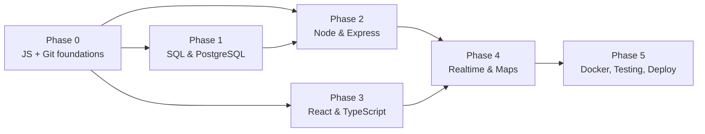
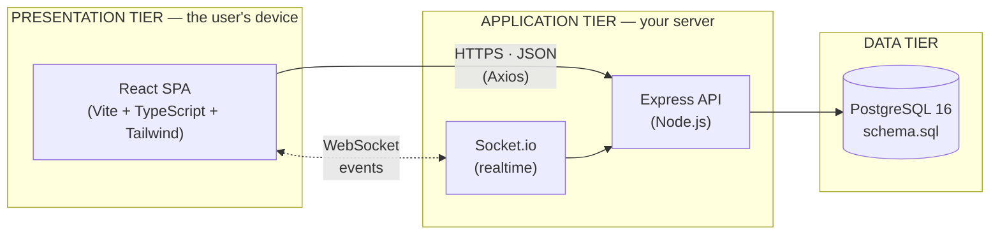
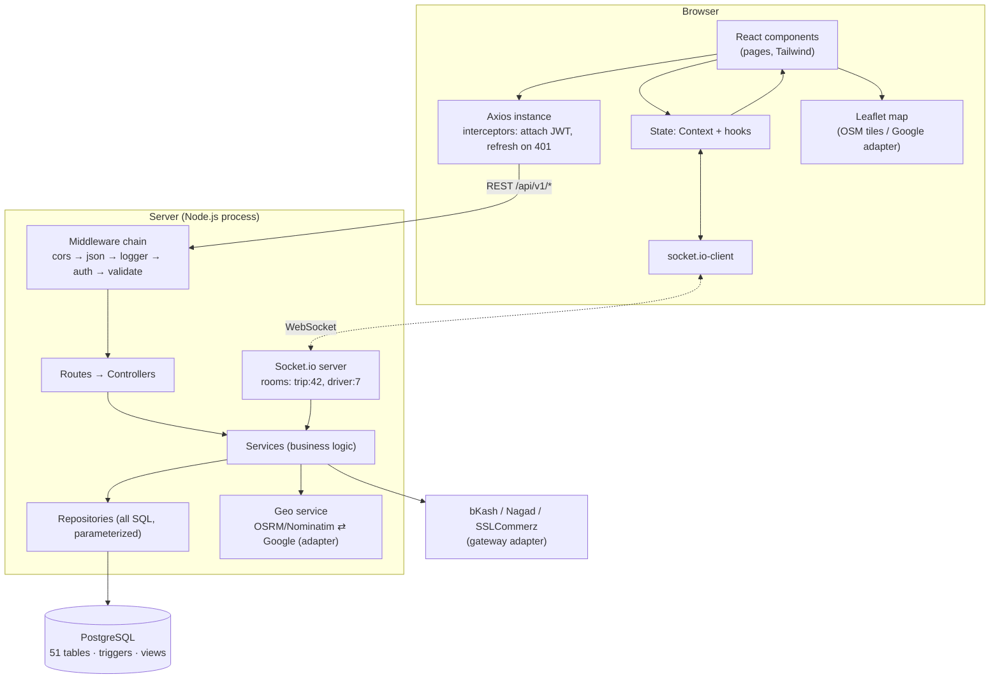
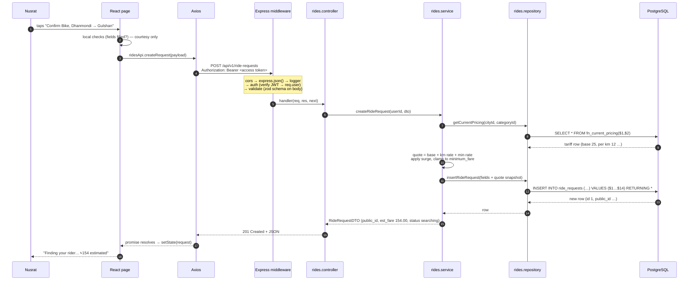
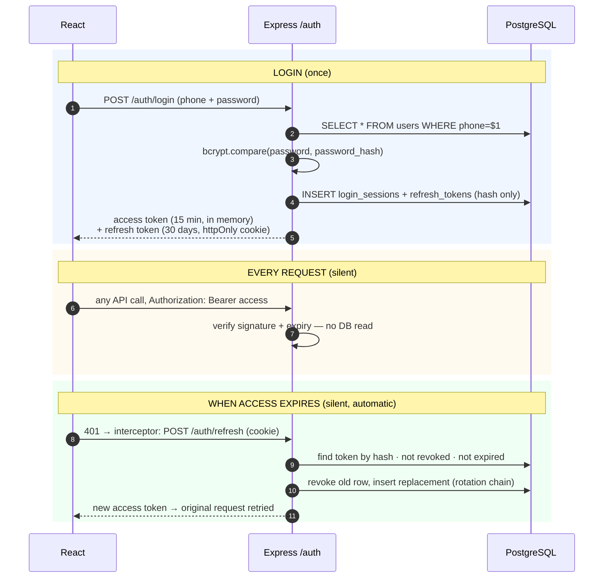
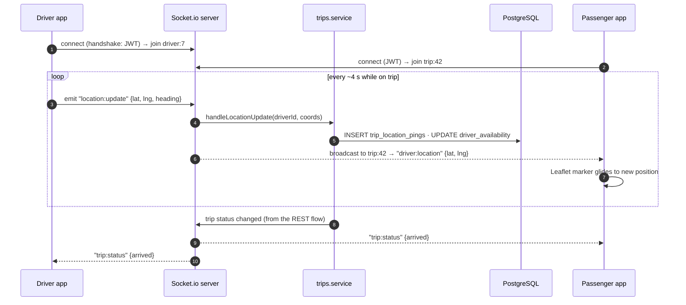
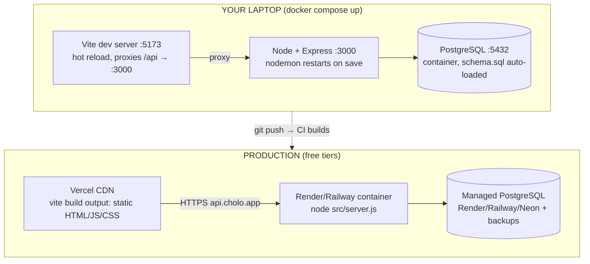

## Document 05 — Learning Roadmap

| | |
|---|---|
| **Document** | 05 — Learning Roadmap |
| **Version** | 1.0 — 14 July 2026 |
| **Who this is for** | A student building their first full-stack application, with DBMS course knowledge and basic programming experience |
| **Honest total** | ≈ 275–360 focused hours to competence across the whole stack. At 20 h/week that is 14–18 weeks — but you start *building* long before the end (see §10) |

---

## 1. How to Use This Roadmap

Three rules that separate people who finish from people who collect tutorials:

1. **Learn ~70%, then build.** Do not finish a whole course before touching Cholo. Learn enough to attempt the next milestone, hit a wall, and come back with a *specific* question. Walls are where learning happens; "tutorial hell" is where it goes to die.
2. **Every topic below ends with a checkpoint** — a small Cholo-specific task. If you can do the checkpoint without a tutorial open, you are ready to move on. If not, you know exactly what to re-study.
3. **Type everything.** Never copy-paste from a lesson. Your fingers are part of your memory.

**Difficulty scale:** 1 = a weekend · 3 = a solid week of evenings · 5 = will take a month to feel natural. **Hours** assume you are new to the topic; halve them where you have experience.

## 2. The Dependency Map

Arrows mean "learn this first." The two tracks after Phase 0 are independent — database and backend can be studied in parallel with frontend if you want variety.



---

## 3. Phase 0 — Foundations (≈ 60–80 h)

| Topic | What it is & why Cholo needs it | Diff. | Hours | Prereqs | Best free resources | Where it's used |
|---|---|---|---|---|---|---|
| **HTML & CSS essentials** | The skeleton and skin of every page. Tailwind is *shorthand for CSS* — it will make no sense without the real thing (box model, flexbox, grid, responsive units) | 2 | 15–20 | none | MDN "Learn web development"; web.dev *Learn CSS*; flexboxfroggy.com | Every screen; Tailwind classes in every component |
| **Modern JavaScript (ES6+)** | The one language of your whole stack. `let/const`, arrow functions, destructuring, spread, template literals, array methods (`map/filter/reduce`), modules, classes, `this` | 3 | 25–30 | none | **javascript.info** (parts 1–2 — the best free JS book); MDN JS Guide | Literally everything: React components, Express handlers, validators |
| **Asynchronous JavaScript** | How JS waits without freezing: event loop → callbacks → Promises → `async/await`, plus `fetch` and error handling with `try/catch`. **The #1 beginner wall** — respect it | 4 | 12–15 | Modern JS | javascript.info ch. 11; MDN "Using promises"; Jake Archibald's event-loop talk (JSConf) | Every DB query, every Axios call, every Express handler is `async` |
| **Git & GitHub** | Time machine + backup + the professional workflow: `init/add/commit/branch/merge`, remotes, `.gitignore`, pull requests | 2 | 8–10 | none | Pro Git book ch. 1–3 (free); learngitbranching.js.org; GitHub Skills | Daily; one commit per working feature from day one |
| **Terminal basics** | Navigating, running, killing processes; where PATH and env vars live | 1 | 3–5 | none | MDN "Command line crash course" | `npm run dev`, `psql`, `docker compose up` — all day |

**✅ Phase 0 checkpoints:** (a) from memory, write a function that takes the trips sample array and returns total earnings per driver using `reduce`; (b) explain why `console.log` after a `fetch` prints before the response; (c) create a repo, branch, commit, merge, and push without looking anything up.

## 4. Phase 1 — Database Track (≈ 35–45 h — *compressed: docs 01–04 already did the design*)

| Topic | What it is & why Cholo needs it | Diff. | Hours | Prereqs | Best free resources | Where it's used |
|---|---|---|---|---|---|---|
| **SQL fundamentals** | Talking to relational data: `SELECT`, `WHERE`, `JOIN` (inner/left), `GROUP BY`, aggregates, subqueries, `INSERT/UPDATE/DELETE` | 3 | 20–25 | none | **pgexercises.com** (do all of it); SQLBolt; postgresqltutorial.com | Every repository function; the 4 views in `schema.sql` |
| **PostgreSQL & psql** | Installing PG 16, creating databases, running scripts, `\d` inspection commands, reading error messages | 2 | 6–8 | SQL basics | PostgreSQL official tutorial (docs part I–II); our `schema.sql` header | Loading `schema.sql`; debugging every constraint error the app triggers |
| **Database design & normalization** | Entities, FDs, normal forms — *your course material* | 3 | 5 (review) | SQL | **Docs 01 & 02 of this blueprint** — written to be your textbook | Already designed; re-read before the viva |
| **Transactions, indexes, triggers** | Atomic multi-statement work, `FOR UPDATE` locking, why queries are fast, how the schema defends itself | 3 | 6–8 | SQL | **Doc 03**; postgres docs ch. 13 (concurrency) | T1/T2/T3 transactions in doc 03 §8; every booking |

**✅ Phase 1 checkpoints:** (a) load `schema.sql` into a fresh database yourself; (b) write the "driver daily earnings" query *without* peeking at `v_driver_daily_earnings`, then compare; (c) using two `psql` windows, demonstrate that `FOR UPDATE` makes the second transaction wait.

## 5. Phase 2 — Backend Track (≈ 60–75 h)

| Topic | What it is & why Cholo needs it | Diff. | Hours | Prereqs | Best free resources | Where it's used |
|---|---|---|---|---|---|---|
| **Node.js & npm** | JS outside the browser: the runtime, `package.json`, scripts, `node_modules`, semver, ESM imports | 2 | 8–10 | Async JS | nodejs.org "Learn Node.js" course; npm docs | `server/` is a Node project; every `npm install` |
| **Express fundamentals** | The minimal web framework: routing, `req`/`res`, middleware chain (the core mental model), routers, static serving | 3 | 15–18 | Node | expressjs.com Guide; MDN Express tutorial (parts 1–4) | `server/src/app.js`, all routes — doc 08 builds on this |
| **REST API design** | Resources, verbs, status codes, JSON bodies, versioning, pagination — the contract between your two apps | 2 | 6–8 | Express basics | MDN HTTP docs; restfulapi.net | The full endpoint catalog (doc 09) |
| **node-postgres (`pg`)** | The driver: `Pool`, parameterized queries (`$1` — your SQL-injection armor), transactions from JS | 2 | 6–8 | SQL + Node | **node-postgres.com** docs (short and excellent) | Every repository; `config/db.js` |
| **Auth: bcrypt + JWT + refresh tokens** | Password hashing (slow on purpose), signed stateless tokens, rotation — why sessions vs tokens, where tokens live | 4 | 12–15 | Express | jwt.io intro; OWASP Auth & Password-Storage cheat sheets | `middlewares/auth.js`, `auth.service.js`; doc 10 |
| **Validation & error handling** | Rejecting bad input at the door (zod schemas) and one central error handler instead of 200 try/catches | 2 | 5–7 | Express | zod.dev docs; Express error-handling guide | `validators/`, `middlewares/errorHandler.js` |
| **Environment variables** | Secrets and per-environment config outside code — `.env`, `dotenv`, `.env.example` | 1 | 2–3 | Node | 12factor.net/config | `config/env.js`; every deploy |

**✅ Phase 2 checkpoints:** (a) build a tiny Express app with two routes and a logging middleware, explaining the order `next()` runs; (b) `SELECT` the Dhaka tariff from Node using a parameterized query; (c) explain to a friend why we store a *hash* of the refresh token.

## 6. Phase 3 — Frontend Track (≈ 70–90 h)

| Topic | What it is & why Cholo needs it | Diff. | Hours | Prereqs | Best free resources | Where it's used |
|---|---|---|---|---|---|---|
| **React fundamentals** | UI as a function of state: components, JSX, props, `useState`, lists & keys, controlled forms, lifting state up | 4 | 25–30 | Modern JS | **react.dev "Learn React"** (official, superb — do *Thinking in React*) | Every screen in doc 12 |
| **Hooks beyond state** | `useEffect` (and when *not* to use it), `useRef`, `useMemo`, custom hooks — where logic lives | 4 | 10–12 | React basics | react.dev "Escape Hatches"; "You Might Not Need an Effect" | `useAuth`, `useRideTracking`, `useGeolocation` |
| **React Router** | Client-side routing: routes, params (`/trips/:id`), nested layouts, protected routes | 2 | 6–8 | React | reactrouter.com docs | `App.tsx` route table; role-gated dashboards |
| **Axios & API integration** | Promise-based HTTP with the killer feature: **interceptors** (attach JWT, auto-refresh on 401, central errors) | 2 | 5–7 | Async JS | axios-http.com docs | `client/src/api/client.ts` |
| **TypeScript (for React)** | Types on top of JS: interfaces, unions, generics-lite; typing props, state, API responses | 3 | 15–20 | Modern JS | TypeScript Handbook; react.dev TS guide; Total TypeScript free tutorials | `types/` — mirrors the DB: `User`, `Trip`, `RideRequest` |
| **Tailwind CSS** | Utility-first styling in JSX; responsive prefixes, dark mode, component extraction | 2 | 6–8 | CSS | tailwindcss.com docs (read "Core Concepts" fully) | All styling; the design system in doc 13 |
| **State management (Context)** | App-wide state without prop-drilling: auth user, socket connection. Context first; a store (Zustand) only if it hurts | 3 | 5–7 | Hooks | react.dev "Passing Data Deeply with Context" | `AuthContext`, `SocketContext` |

**✅ Phase 3 checkpoints:** (a) build a fare-estimate widget: two dropdowns (city, category) + km slider → fare from the doc 01 tariff table, typed, styled with Tailwind; (b) add an Axios interceptor that logs every request; (c) protect a route so guests are redirected to /login.

## 7. Phase 4 — Realtime & Maps (≈ 25–35 h)

| Topic | What it is & why Cholo needs it | Diff. | Hours | Prereqs | Best free resources | Where it's used |
|---|---|---|---|---|---|---|
| **Socket.io** | Two-way, server-push messaging over WebSocket: events, rooms, namespaces, auth handshake, reconnection | 3 | 12–15 | Express + React | socket.io official tutorial (build the chat) | Live tracking, dispatch offers, trip chat — doc 06 §7 |
| **Maps: Leaflet + OSM** | Rendering maps, markers, polylines; browser Geolocation API; geocoding (Nominatim) & routing (OSRM) — free stack | 3 | 10–14 | React | leafletjs.com tutorials; react-leaflet.js.org | Booking screen, live trip map; the geo abstraction in doc 06 §9 |
| **Google Maps (adapter)** | Same capabilities, better BD data, billed key — served through the *same* interface so it is a config switch | 2 | 4–6 | Maps concepts | Google Maps JS API docs | `geo/` provider adapters |

**✅ Phase 4 checkpoint:** a page showing your live position on an OSM map, updating a marker every 3 s — then send the same coordinates through a socket to a second browser tab and watch both move.

## 8. Phase 5 — Professional Practice (≈ 25–35 h)

| Topic | What it is & why Cholo needs it | Diff. | Hours | Prereqs | Best free resources | Where it's used |
|---|---|---|---|---|---|---|
| **Docker & docker-compose** | Reproducible environments: one command starts PG + API + client identically on any machine | 3 | 10–12 | Terminal | docker.com "Get started"; docker-curriculum.com | `docker-compose.yml`; deployment |
| **Testing basics** | Unit tests (Vitest/Jest) for services & fare math; API tests (supertest) against endpoints | 3 | 10–12 | Backend | vitest.dev; jestjs.io; supertest README | `server/tests/`; the testing strategy doc |
| **Deployment** | Static frontend (Vercel) + API container (Render/Railway) + managed PostgreSQL; env vars per environment | 2 | 5–8 | Docker | render.com & vercel.com docs | Going live; doc 06 §10 |

**✅ Phase 5 checkpoint:** `docker compose up` starts PostgreSQL with `schema.sql` auto-loaded and your API connected — on a friend's laptop.

## 9. Time Budget Summary

| Phase | Hours | Cumulative |
|---|---|---|
| 0 — Foundations | 60–80 | 60–80 |
| 1 — Database | 35–45 | 95–125 |
| 2 — Backend | 60–75 | 155–200 |
| 3 — Frontend | 70–90 | 225–290 |
| 4 — Realtime & Maps | 25–35 | 250–325 |
| 5 — Professional | 25–35 | **275–360** |

## 10. Suggested 14-Week Rhythm (≈ 22 h/week)

| Weeks | Study | Build (in parallel from week 3) |
|---|---|---|
| 1–2 | Phase 0 | — |
| 3–4 | Phase 1 | Load & explore the schema; write 20 practice queries against it |
| 5–7 | Phase 2 | Milestone: auth API + user module working in Postman |
| 8–10 | Phase 3 | Milestone: login/signup UI + passenger booking form (fake data) |
| 11–12 | Phase 4 | Milestone: real booking flow + live driver tracking |
| 13–14 | Phase 5 | Milestone: tests on money paths; dockerized; deployed demo |

*The build column is the actual development plan's skeleton — the full milestone document (with features, dependencies, and expected outcomes per milestone) comes later in this blueprint.*


---

## Document 06 — Software Architecture

| | |
|---|---|
| **Document** | 06 — Software Architecture |
| **Version** | 1.0 — 14 July 2026 |
| **What you will understand** | What each layer is *for*, the complete journey of one request, why the browser must never touch the database, how realtime works, and what changes between your laptop and production |

---

## 1. The Big Picture — Three Tiers

Every serious web application — Uber, Pathao, and Cholo — is the same three-tier shape. Memorize this before anything else:



| Tier | Runs on | Its one job | It must NOT |
|---|---|---|---|
| **Presentation** (React) | the user's browser | show state, collect input, *feel* instant | hold business truth, compute fares that count, keep secrets |
| **Application** (Express) | your server | enforce rules, decide, orchestrate | render HTML pages, trust anything the client sent |
| **Data** (PostgreSQL) | your server / managed host | remember the truth, defend it with constraints | contain application flow logic (beyond the invariant triggers of doc 03) |

## 2. The Trust Boundary — Why the Browser Never Talks to PostgreSQL

The single most important architectural fact, and a guaranteed viva question:

> **Everything that runs in the browser belongs to the user — including a hostile user.** They can read all your frontend code, edit it live in DevTools, and send any request they like. If the browser had database credentials, every user would have your entire database.

Consequences that shape the whole design:

1. The database accepts connections **only** from the API server. The browser doesn't know the DB exists.
2. Frontend validation is a **courtesy** (instant feedback); backend validation is the **law** (zod schemas re-check everything); database constraints are the **last line** (doc 03) — three fences, and only the last two count for security.
3. Fares are computed **server-side** from `pricing_rules`. The client shows the quote; it never gets to *assert* one. Any number arriving from a browser is a *claim*, not a fact.
4. Secrets (`JWT_SECRET`, `DATABASE_URL`, gateway keys) exist only in server env vars. Anything in React code — including `VITE_*` vars — ships to the public.

## 3. The Complete Stack Map — Who Talks to Whom



Read it top-to-bottom on each side: React never skips Axios; controllers never skip services; **SQL exists only inside repositories**. Every arrow you *don't* see (UI→DB, controller→DB, socket→DB directly) is a rule.

## 4. Anatomy of One Request — "Nusrat Books a Ride"

This is the core lesson of the document. One button tap, fifteen steps, every layer visited. When you understand this diagram you understand full-stack development; everything else is repetition.



Six things to notice — each is an exam answer:

1. **The token travels in a header** (`Authorization: Bearer …`), attached automatically by the Axios interceptor — no page passes tokens around by hand.
2. **Middleware runs in order, before any business code.** Auth rejects strangers with `401` and validation rejects garbage with `422` — the controller never sees either.
3. **The controller is thin** — it translates HTTP ⇄ function calls. The *service* holds the thinking (quote math, surge lookup). The *repository* holds the SQL. Three files, three reasons to change.
4. **`$1, $2` placeholders** are parameterized queries — user input is *data*, never spliced into SQL text. This single habit eliminates SQL injection.
5. **The quote is snapshotted into the INSERT** (doc 01 §13.7) — the fare promise survives any later tariff change.
6. **The response is a DTO** — a shaped, safe subset (public_id, not internal id; never password_hash). What leaves the API is a decision, not a table dump.

### 4.1 The same journey when things go wrong

| Failure | Caught by | Client sees |
|---|---|---|
| No/expired token | auth middleware | `401` → Axios interceptor silently calls `/auth/refresh`, retries once (doc 10) |
| `pickup_lat: "abc"` | zod validation middleware | `422` + field errors → form highlights the field |
| Passenger suspended | service rule | `403` + error code |
| DB constraint violated (e.g. CHECK) | PostgreSQL → repository throws | `500` from the **central error handler** — one place logs it; the client gets a safe generic message, never a stack trace |

One central `errorHandler` middleware is why controllers stay clean: anything thrown anywhere lands there, once.
## 5. The Layered Backend — Why Four Layers and Not One File

Everything server-side follows one direction: **route → controller → service → repository → database.** Never sideways, never skipping.

| Layer | Answers | Contains | Forbidden here |
|---|---|---|---|
| **Routes** | "which URL runs what?" | URL patterns, HTTP verbs, middleware attachment | any logic at all |
| **Controllers** | "how do I speak HTTP?" | read `req`, call one service, choose status code, send DTO | business rules, SQL |
| **Services** | "what are the rules?" | fare math, state transitions, permissions, orchestration, transactions | `req`/`res` objects, SQL strings |
| **Repositories** | "how is it stored?" | **all** SQL, parameterized; row ⇄ object mapping | business decisions |

Why bother? **(1) Testability** — services are plain functions, testable without HTTP or a browser. **(2) Single reason to change** — a new fare rule touches one service; a schema rename touches one repository. **(3) Readability** — a new developer (or examiner) finds anything in seconds because *kind* determines *location*. The full backend teaching document (doc 08) walks each layer with Cholo examples.

## 6. Authentication Flow — The 30-Second Version

Full document later (doc 10); the architecture needs just the shape:



The architectural point: **access tokens make normal requests stateless** (no DB hit to authenticate — just a signature check), while **refresh tokens are stateful rows** (`refresh_tokens` table) so they can be revoked, rotated, and audited. Fast path and safe path, cleanly separated.

## 7. Realtime with Socket.io — When Request/Response Isn't Enough

HTTP has a fatal limitation for a ride app: **the server can never speak first.** Nusrat's phone can *ask* "where is my driver?" — but polling every 2 seconds hammers the API and still feels laggy. WebSocket is a persistent two-way pipe; Socket.io wraps it with reconnection, fallbacks, and **rooms**.

**How it coexists with Express:** one Node process, one HTTP server — Express handles `/api/*` requests, Socket.io hijacks connections that ask to upgrade. They share the same port and the same JWT secret (the socket handshake carries the access token; an invalid token = no connection).

**The room model** — a room is a named channel you can broadcast to:

| Room | Who joins | What flows through it |
|---|---|---|
| `driver:7` | driver 7's device | dispatch offers ("new request 1.2 km away"), offer withdrawals |
| `trip:42` | the passenger + driver of trip 42 | live GPS positions, status changes, chat messages |
| `zone:gulshan` (later) | ops dashboard | supply/demand ticks for the admin heatmap |



Two rules keep realtime sane: **(1) Sockets carry *events*, REST carries *actions*** — booking, accepting, paying are POSTs (auditable request/response); "the world changed" notifications are socket emits. **(2) The socket layer calls the same services** — it is another *entrance*, never a second implementation of the rules.

## 8. The Geo Abstraction — One Interface, Two Providers

The maps decision (OSM now, Google when funded) becomes architecture: every geographic capability passes through one service interface, and providers are adapters behind it.

| Capability | Interface method | OpenStreetMap stack (free) | Google stack (billed) |
|---|---|---|---|
| Address → coordinates | `geocode(text)` | Nominatim | Geocoding API |
| Coordinates → address | `reverseGeocode(lat,lng)` | Nominatim | Geocoding API |
| Route + distance + ETA | `route(from, to)` | OSRM | Directions API |
| Map tiles (frontend) | `<MapView>` component prop | OSM tile server + Leaflet | Google Maps JS |

Switching provider = changing `GEO_PROVIDER=osm|google` in env — no business code changes. This works **because the database stores plain WGS-84 lat/lng** (doc 01 §13.14): the schema never married a vendor. The fare service consumes `route().distanceKm` and neither knows nor cares who measured it.

## 9. Development vs Production — The Same App, Two Worlds



| Concern | Development | Production |
|---|---|---|
| Frontend | Vite dev server, instant hot-reload | `vite build` → static files on a CDN — **no Node needed to serve React** |
| API base URL | Vite proxy makes `/api` same-origin (no CORS pain) | `VITE_API_URL=https://api.cholo.app`; CORS allows exactly that origin |
| Database | Docker container, disposable, seeded | managed instance: backups, TLS, connection limits — `DATABASE_URL` env var |
| Secrets | `.env` file (git-ignored) | platform dashboard env vars |
| Errors | stack traces on screen | logged server-side; client gets safe messages |

The deep insight: **React "runs" nowhere in production** — it compiles to static files; the *user's browser* is its runtime. Only Express and PostgreSQL are live processes you operate.

## 10. Where Each Rule Is Enforced — The Security Placement Map

| Rule | React (courtesy) | Express (law) | PostgreSQL (last line) |
|---|---|---|---|
| "phone looks valid" | instant field feedback | zod schema | `CHECK (phone ~ '^01[3-9]…')` |
| "only drivers accept offers" | hides the button | role check in middleware/service | FK to `driver_profiles` |
| "one success per trip payment" | — | service logic | **partial unique index** (proven in doc 03) |
| "fare math is honest" | displays quote | computes quote server-side | `chk_fare_identity` |
| "ledger never edited" | — | no code path does it | **trigger rejects UPDATE/DELETE** |

Presentation line: *"each rule is enforced at every layer that can enforce it — but only the server and the database are trusted."*

**Next:** doc 07 gives every file a home; docs 08–10 open the backend, API and auth in full depth.


---

## Document 07 — Professional Folder Structure

| | |
|---|---|
| **Document** | 07 — Folder Structure |
| **Version** | 1.0 — 14 July 2026 |
| **Principle** | *Kind determines location.* If you know what something **is** (a route, a rule, a query, a component), you know **where it lives** — and so does your examiner |

---

## 1. Why Structure Matters (the disease it prevents)

Every abandoned first project dies the same way: one `app.js` that grows to 2,000 lines where routes, SQL, validation and business rules interleave until no change is safe. Structure is not bureaucracy — it is **the layered architecture of doc 06 made physical**. The layers route → controller → service → repository become folders, and the rule "SQL only in repositories" becomes something you can *see* being violated.

Two conventions used throughout:

- **Layer-first, feature-named:** folders are layers (`controllers/`), files are features (`rides.controller.js`). At Cholo's size this beats feature-first folders; the naming keeps features greppable (`rides.*` finds the whole vertical).
- **`feature.layer.ext` file naming:** `auth.service.js`, `trips.repository.js`, `RideCard.tsx`. A filename alone tells you *what* and *which layer*.

## 2. The Monorepo Root

One repository, two applications, one database, one blueprint — everything versioned together so a single commit can change an endpoint and the screen that calls it.

```text
cholo/
├── client/                # React SPA (Vite + TypeScript + Tailwind)
├── server/                # Express API + Socket.io (Node.js)
├── database/              # schema.sql, migrations, seeds — the DB as code
├── docs/                  # this blueprint: documents 01–10+
├── docker-compose.yml     # one command: PostgreSQL + API + client
├── .gitignore             # node_modules, .env, dist, coverage
├── .env.example           # every env var the project needs, with fake values
└── README.md              # what this is, how to run it, where docs live
```

| Item | Why at the root | Never put here |
|---|---|---|
| `docker-compose.yml` | orchestrates *all* services — it belongs to no single app | app source code |
| `.env.example` | the contract of required configuration; committed **instead of** `.env` | real secrets — ever |
| `README.md` | the front door: 5-minute setup for any evaluator | full documentation (that's `docs/`) |

## 3. Backend — `server/`

```text
server/
├── src/
│   ├── server.js             # ENTRY: http server + Socket.io attach + listen()
│   ├── app.js                # Express assembly: middleware order + route mounting (no listen!)
│   ├── config/
│   │   ├── env.js            # reads process.env ONCE, validates, exports typed config
│   │   └── db.js             # the single pg Pool instance
│   ├── routes/
│   │   ├── index.js          # mounts every router under /api/v1
│   │   ├── auth.routes.js    # POST /register /login /refresh /logout
│   │   ├── rides.routes.js   # requests, offers, trips endpoints
│   │   ├── payments.routes.js
│   │   ├── drivers.routes.js
│   │   └── admin.routes.js
│   ├── controllers/          # HTTP in, HTTP out — thin
│   │   ├── auth.controller.js
│   │   ├── rides.controller.js
│   │   └── …
│   ├── services/             # THE BUSINESS LOGIC
│   │   ├── auth.service.js   # bcrypt, token issue/rotate
│   │   ├── fare.service.js   # quote math, surge application
│   │   ├── dispatch.service.js # offer fan-out, accept race (FOR UPDATE)
│   │   ├── rides.service.js
│   │   └── wallet.service.js # ledger writes, idempotency
│   ├── repositories/         # ALL SQL — parameterized, nothing else
│   │   ├── users.repository.js
│   │   ├── rides.repository.js
│   │   ├── pricing.repository.js
│   │   └── …
│   ├── middlewares/
│   │   ├── auth.js           # verify JWT → req.user
│   │   ├── requireRole.js    # requireRole('DRIVER')
│   │   ├── validate.js       # runs a zod schema against req.body/params/query
│   │   ├── errorHandler.js   # the ONE place errors become responses
│   │   └── rateLimit.js
│   ├── validators/           # zod schemas per module (shape of every request)
│   │   ├── auth.schema.js
│   │   └── rides.schema.js
│   ├── sockets/
│   │   ├── index.js          # io setup + JWT handshake auth
│   │   ├── rooms.js          # join/leave: driver:{id}, trip:{id}
│   │   └── location.handler.js
│   ├── jobs/                 # scheduled work (node-cron)
│   │   ├── expireRequests.job.js
│   │   └── documentExpiry.job.js
│   └── utils/                # pure, stateless helpers
│       ├── haversine.js
│       ├── formatBDT.js
│       └── tokens.js         # hash/generate helpers
├── tests/
│   ├── unit/                 # services with mocked repositories
│   └── api/                  # supertest against real routes + test DB
├── .env.example
└── package.json
```

### 3.1 Folder contracts (why · belongs · never)

| Folder | Why it exists | Belongs here | **Never** here |
|---|---|---|---|
| `config/` | configuration is read once, validated once — not scattered `process.env` reads | env parsing, pg Pool, constants | request handling, queries |
| `routes/` | the API's table of contents; reviewers read it like a menu | URL + verb + middleware chain + controller reference | logic, SQL, validation bodies |
| `controllers/` | the HTTP translator | `req` unpacking, one service call, status code, DTO response | business rules, SQL, multi-service orchestration beyond trivial |
| `services/` | the rules of Cholo live here — the most-tested code | fare math, transitions, permissions, **transactions** (BEGIN/COMMIT), calls to repositories/gateways | `req`/`res`, SQL strings, `res.send` |
| `repositories/` | one home for SQL = injection-proof by habit, schema changes localized | parameterized queries, row→object mapping | decisions ("if balance < …"), HTTP anything |
| `middlewares/` | cross-cutting steps every request may pass through | auth, role gate, validation runner, error handler, rate limit | feature-specific logic |
| `validators/` | request *shapes* as data (zod), reusable and testable | schemas: body/params/query per endpoint | DB checks (that's services) |
| `sockets/` | realtime entrance — parallel to routes | handshake auth, room management, event handlers **that call services** | a second copy of business logic |
| `jobs/` | time-triggered entrance — the third door | cron schedules calling services | logic that only jobs use (put it in services) |
| `utils/` | pure functions any layer may use | math, formatting, hashing helpers | anything importing db/config/req — then it's not a util |
| `tests/` | proof, mirrored by layer | unit + API tests | test files inside `src/` |

**The two-file entry trick** (`app.js` vs `server.js`): `app.js` builds and exports the Express app *without* listening; `server.js` imports it, attaches Socket.io, and calls `listen()`. Why: supertest can import `app.js` and test every route **without opening a port** — the structure itself makes the project testable.
## 4. Frontend — `client/`

```text
client/
├── index.html                # THE page (SPA = single page application)
├── vite.config.ts            # dev proxy: /api → localhost:3000 (kills CORS pain in dev)
├── tailwind.config.js        # design tokens: colors, fonts (doc 13's design system)
├── src/
│   ├── main.tsx              # ENTRY: mounts <App/> with Router + providers
│   ├── App.tsx               # the route table (React Router)
│   ├── api/                  # THE ONLY PLACE THAT TALKS HTTP
│   │   ├── client.ts         # axios instance: baseURL + interceptors (attach JWT, refresh on 401)
│   │   ├── auth.api.ts       # login(), register(), refresh()
│   │   ├── rides.api.ts      # createRequest(), getTrip(), cancelTrip()
│   │   └── wallet.api.ts
│   ├── pages/                # one folder per role, one component per SCREEN
│   │   ├── auth/             # LoginPage, RegisterPage, OtpPage
│   │   ├── passenger/        # BookRidePage, LiveTripPage, HistoryPage, WalletPage
│   │   ├── driver/           # DriverHomePage (offers), EarningsPage, DocumentsPage
│   │   ├── admin/            # DashboardPage, DriversApprovalPage, PricingPage
│   │   └── shared/           # ProfilePage, SupportPage, NotFoundPage
│   ├── components/
│   │   ├── ui/               # dumb & reusable: Button, Input, Card, Modal, Badge, Spinner
│   │   ├── map/              # MapView (Leaflet/Google adapter), DriverMarker, RoutePolyline
│   │   ├── ride/             # FareEstimateCard, CategoryPicker, TripStatusStepper
│   │   └── layout/           # Navbar, Sidebar, BottomTabs
│   ├── layouts/              # route shells with <Outlet/>: PassengerLayout, DriverLayout, AdminLayout, AuthLayout
│   ├── hooks/                # reusable stateful logic
│   │   ├── useAuth.ts        # current user, login/logout actions
│   │   ├── useGeolocation.ts # browser GPS with permission handling
│   │   └── useRideTracking.ts# subscribes to trip:{id} socket room
│   ├── context/              # app-wide state providers
│   │   ├── AuthContext.tsx
│   │   └── SocketContext.tsx # one socket connection for the whole app
│   ├── sockets/
│   │   └── socket.ts         # socket.io-client setup (token in handshake)
│   ├── types/                # TypeScript mirrors of API DTOs
│   │   ├── user.types.ts     # User, DriverProfile
│   │   ├── ride.types.ts     # RideRequest, Trip, TripStatus
│   │   └── api.types.ts      # ApiResponse<T>, ApiError
│   ├── utils/                # formatBDT.ts, distance.ts, datetime.ts
│   ├── config/               # env.ts — reads import.meta.env.VITE_* once
│   └── assets/               # logo, category icons, illustrations
├── .env.example              # VITE_API_URL, VITE_GEO_PROVIDER (NO secrets — all public!)
└── package.json
```

### 4.1 Folder contracts

| Folder | Why it exists | Belongs here | **Never** here |
|---|---|---|---|
| `api/` | one HTTP doorway → tokens, errors, retries handled once | axios instance, typed endpoint functions | components calling `axios` directly — the cardinal sin |
| `pages/` | screens = routes; the app's sitemap in folder form | composition of components + hooks per screen | reusable widgets (→ `components/`), fetch logic details (→ `api/`) |
| `components/ui/` | the design system: consistent look, built once | prop-driven presentational pieces, no data fetching | anything importing from `api/` |
| `components/<feature>/` | feature widgets shared across pages | FareEstimateCard, TripStatusStepper | full screens |
| `layouts/` | shared chrome per role (nav, guards) | shells with `<Outlet/>`, ProtectedRoute logic | page content |
| `hooks/` | stateful logic reused across screens | `useX` functions composing state/effects/context | JSX (hooks return data, not UI) |
| `context/` | state genuinely global (who am I, the socket) | small providers | everything ("global by default" = spaghetti) |
| `types/` | one vocabulary with the backend's DTOs | interfaces/enums mirroring API responses | runtime code |
| `utils/` | pure helpers | formatters, math | hooks, fetches, JSX |
| `config/` | env access in one file | `import.meta.env` reads + defaults | secrets (VITE_* vars ship to the public bundle!) |

## 5. Database & Docs Folders

```text
database/
├── schema.sql               # the validated DDL (docs 03) — source of truth
├── migrations/              # numbered, append-only changes AFTER first deploy
│   ├── 0001_init.sql        #   = schema.sql at go-live
│   └── 0002_add_x.sql       #   never edit old migrations; add new ones
├── seeds/
│   ├── seed.reference.sql   # roles, cities, categories, tariffs (required)
│   └── seed.dev.sql         # Nusrat/Rafiq demo world (dev only)
└── tools/
    └── gen_dict.py          # regenerates doc 04 from a live DB

docs/
├── 01-er-diagram-and-database-architecture.md
├── 02-normalization.md
├── 03-sql-design.md
├── 04-data-dictionary.md
├── 05-learning-roadmap.md
├── 06-architecture.md
├── 07-folder-structure.md   # ← you are here
└── …                        # 08 backend · 09 REST API · 10 auth · 11+ frontend/UX/plan
```

The migration idea in one sentence: **`schema.sql` describes the database at birth; migrations describe every change after** — numbered, run in order, never edited retroactively, so any teammate (or grader) can rebuild the exact current database from an empty server.

## 6. "Where Does X Go?" — The Decision Table

Pin this above your desk. When unsure, find the row:

| You just wrote… | It goes in | Because |
|---|---|---|
| an SQL query | `server/src/repositories/` | the only SQL home |
| "drivers under 4.0 rating can't take Premium" | `server/src/services/` | it's a business rule |
| a status code / `res.json(...)` | `server/src/controllers/` | HTTP translation |
| the shape of a request body | `server/src/validators/` | shapes are data (zod) |
| JWT verification | `server/src/middlewares/auth.js` | cross-cutting gate |
| a socket event handler | `server/src/sockets/` → calls a service | second entrance, same rules |
| an axios call | `client/src/api/` | the only HTTP doorway |
| a screen | `client/src/pages/` | screens = routes |
| a reusable button | `client/src/components/ui/` | design system |
| "am I logged in?" logic | `client/src/hooks/useAuth.ts` (+ AuthContext) | reusable stateful logic |
| the `Trip` interface | `client/src/types/` | shared vocabulary |
| ৳ money formatting for UI | `client/src/utils/formatBDT.ts` | pure display helper |
| fare **calculation** | `server/src/services/fare.service.js` — *never the client* | doc 06 §2: the client displays, the server decides |
| `JWT_SECRET`, `DATABASE_URL` | `server/.env` (git-ignored) + platform env vars | secrets never enter git or the client |
| a new table / column | `database/migrations/` | schema changes are code too |

## 7. What Never Enters Git

```gitignore
node_modules/        # reinstallable from package-lock.json — never commit
.env                 # SECRETS. The #1 catastrophic beginner mistake
dist/ build/         # generated output; the source generates it
coverage/            # test artifacts
*.log
.DS_Store
```

The `.env` discipline: commit **`.env.example`** with every variable name and a fake value (`JWT_SECRET=change-me`). A new machine copies it to `.env` and fills real values. If a secret ever lands in a commit — even deleted in the next one — **it lives in history forever**; rotate the secret immediately.

## 8. Naming Conventions Summary

| Thing | Convention | Examples |
|---|---|---|
| Backend files | `feature.layer.js` | `rides.service.js`, `auth.routes.js` |
| React components & files | PascalCase | `FareEstimateCard.tsx`, `LiveTripPage.tsx` |
| Hooks | `useX` camelCase | `useRideTracking.ts` |
| Non-component TS files | camelCase / `feature.kind.ts` | `rides.api.ts`, `ride.types.ts` |
| URL paths | kebab-case, plural resources | `/api/v1/ride-requests` |
| DB objects | snake_case (doc 01 §1.5) | `ride_requests`, `idx_trips_driver` |
| Env vars | SCREAMING_SNAKE | `DATABASE_URL`, `VITE_API_URL` |
| Git branches | `type/short-name` | `feat/driver-offers`, `fix/fare-rounding` |

**Next:** doc 08 opens `server/src/` file by file — the Express teaching document — followed by the complete REST API catalog (09) and the authentication deep-dive (10).
