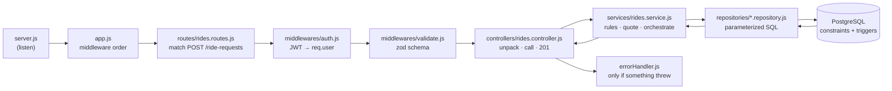
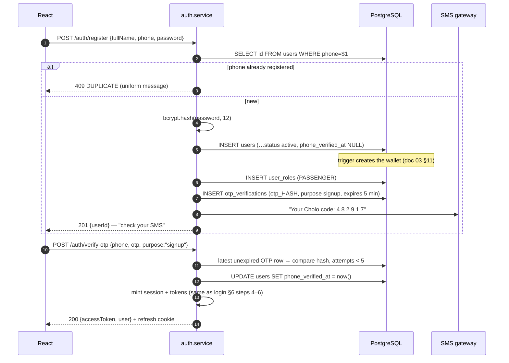
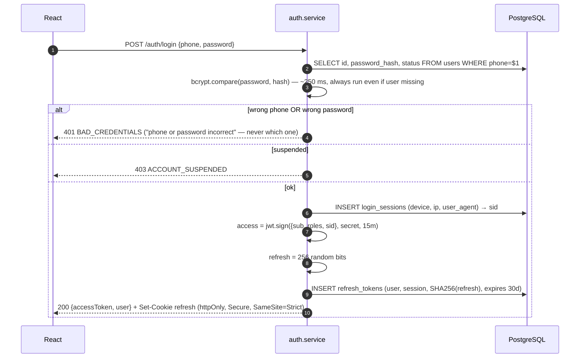

## Document 08 — Backend: Node.js & Express From Zero

| | |
|---|---|
| **Document** | 08 — Backend (Express) |
| **Version** | 1.0 — 14 July 2026 |
| **Code policy** | Snippets here are *teaching devices* — short enough to understand fully, real enough to adapt. You will write the actual implementation yourself, and it will be better for it |
| **Builds on** | Doc 06 (the request lifecycle) and doc 07 (where every file lives) — this document opens those files |

---

## 1. What Node.js Actually Is

Node.js is **JavaScript running outside the browser** — Chrome's V8 engine, unhooked from any web page, given access to files, networks, and processes. Two facts explain everything about how you'll write server code:

**Fact 1 — one thread.** Node runs your JavaScript on a *single thread*. There is one cook in the kitchen.

**Fact 2 — non-blocking I/O.** Whenever that thread would have to *wait* (a database answering, a network packet arriving), Node doesn't wait — it registers a callback and moves to the next task. The **event loop** cycles forever: *"anything finished? run its continuation."*

The restaurant analogy: a waiter (your thread) takes table 1's order, hands it to the kitchen (PostgreSQL), and **immediately** takes table 2's order instead of standing at the kitchen window. When dish 1 is ready, a bell rings (the event loop) and the waiter delivers it. One waiter serves fifty tables — *as long as no single table demands they stand still* (a CPU-heavy loop would freeze everyone; an API like Cholo is almost all I/O, which is why Node fits it perfectly).

This is why `async/await` is everywhere in your backend:

```js
// "await" = hand the order to the kitchen, serve other tables until the bell
const { rows } = await pool.query('SELECT * FROM cities WHERE is_active = true');
```

**npm** is the package registry and `package.json` is your project manifest: `dependencies` (express, pg, zod, bcrypt, jsonwebtoken, socket.io) ship to production; `devDependencies` (nodemon, vitest) are development tools; `scripts` name your commands (`npm run dev`); `package-lock.json` pins exact versions so every machine installs identical code — commit it.

## 2. What Express Is

Node's built-in `http` module gives you one raw event: *"a request arrived, here's the text."* Express is a thin, unopinionated layer that adds the three things every API needs: **routing** (URL + verb → function), a **middleware pipeline**, and **request/response conveniences** (`req.params`, `res.json()`). That's genuinely all it is — which is why understanding the pipeline *is* understanding Express.

## 3. Middleware — The One Mental Model

A middleware is any function with the signature `(req, res, next)`. Express holds a **list** of them; a request enters at the top and flows down until something responds.

```js
// app.js — the assembly line, IN ORDER
app.use(cors(corsOptions));        // 1. is this browser origin allowed?
app.use(express.json());           // 2. parse JSON body → req.body
app.use(requestLogger);            // 3. log method + path + duration
app.use('/api/v1', apiRouter);     // 4. hand off to the route table
app.use(notFound);                 // 5. nothing matched → 404
app.use(errorHandler);             // 6. anything thrown lands here (4 args)
```

Each middleware does exactly one of three things:

1. **pass along** — do its job, call `next()` (logger, body parser)
2. **respond** — end the journey with `res.json(...)` (controllers are just the final middleware)
3. **reject** — call `next(err)`, which *skips everything* and jumps to the error handler

```js
// middlewares/auth.js — a gate in ~10 lines
export function auth(req, _res, next) {
  const token = req.headers.authorization?.split(' ')[1];   // "Bearer xyz"
  if (!token) return next(new AppError(401, 'AUTH_REQUIRED'));
  try {
    const claims = jwt.verify(token, env.JWT_SECRET);        // throws if invalid/expired
    req.user = { id: Number(claims.sub), roles: claims.roles, sessionId: claims.sid };
    next();                                                  // ✅ continue down the chain
  } catch {
    next(new AppError(401, 'TOKEN_EXPIRED'));                // ❌ jump to errorHandler
  }
}
```

**Why order matters** (a classic exam question): put `auth` *before* the routes it protects and `express.json()` *before* anything reading `req.body`; put `errorHandler` **last** — it can only catch what was thrown above it. Route-level chains compose gates per endpoint:

```js
router.post('/ride-requests', auth, requireRole('PASSENGER'),
            validate(createRequestSchema), ridesController.createRequest);
//           └ gate 1  └ gate 2            └ gate 3            └ finally, the work
```

## 4. Routes & Routers — The API's Table of Contents

An Express `Router` is a mini-app you mount at a prefix. Each module gets one file; `routes/index.js` assembles them:

```js
// routes/rides.routes.js — wiring ONLY, no logic (doc 07 contract)
const router = Router();
router.post('/quote',              auth, validate(quoteSchema),   rides.quote);
router.post('/ride-requests',      auth, requireRole('PASSENGER'),
                                   validate(createRequestSchema), rides.createRequest);
router.get ('/ride-requests/:id',  auth, rides.getRequest);       // :id → req.params.id
router.get ('/trips',              auth, rides.listMyTrips);      // ?page=2 → req.query.page
export default router;
```

Three ways data arrives, and where Express puts each: **path params** (`/trips/:id` → `req.params`), **query string** (`?page=2&limit=20` → `req.query`, always strings!), **JSON body** (`req.body`, only after `express.json()`).

## 5. Controllers — The HTTP Translators

A controller knows HTTP and *nothing else*: unpack the request, call **one** service, choose the status code, shape the response. If a controller exceeds ~15 lines, logic is leaking in.

```js
// controllers/rides.controller.js
export const createRequest = asyncHandler(async (req, res) => {
  const request = await ridesService.createRideRequest(req.user.id, req.body);
  res.status(201).json({ success: true, data: request });   // 201 = created
});
```

`asyncHandler` is a 3-line wrapper that forwards a rejected promise to `next(err)` — without it, a thrown error inside an `async` route **hangs the request forever** (Express 4 doesn't catch async throws; the single most common beginner bug):

```js
export const asyncHandler = (fn) => (req, res, next) =>
  Promise.resolve(fn(req, res, next)).catch(next);
```
## 6. Services — Where Cholo's Rules Live

Services are plain functions that speak *business*, not HTTP. They take clean values, return domain objects, and `throw AppError` when a rule is violated. All decisions, all orchestration, all transactions — here.

```js
// services/rides.service.js (educational skeleton)
export async function createRideRequest(passengerId, dto) {
  const passenger = await usersRepo.getPassenger(passengerId);
  if (!passenger) throw new AppError(403, 'NOT_A_PASSENGER');

  const tariff = await pricingRepo.getCurrent(dto.cityId, dto.categoryId);   // fn_current_pricing
  if (!tariff) throw new AppError(422, 'NO_TARIFF_FOR_MARKET');

  const route = await geoService.route(dto.pickup, dto.dropoff);             // OSRM or Google — adapter
  const surge = await pricingRepo.activeSurge(dto.pickupZoneId, dto.categoryId);
  const estFare = fareMath.quote(tariff, route, surge);                      // pure function → unit-testable

  return ridesRepo.insertRequest({ ...dto, passengerId,
    estDistanceKm: route.distanceKm, estDurationMin: route.durationMin,
    estFare, surgeMultiplier: surge?.multiplier ?? 1.0 });                   // snapshot the quote (doc 01 §13.7)
}
```

Notice what is **absent**: no `req`, no `res`, no SQL text. This function can be unit-tested with fake repositories in milliseconds — the layering is what makes the test possible.

## 7. Repositories & the `pg` Pool — Talking to PostgreSQL

**The Pool.** Opening a DB connection is expensive (~tens of ms). A `Pool` keeps ~10 warm connections and lends them per query. Create it **once** (`config/db.js`), import it everywhere.

**Parameterized queries — non-negotiable.** User input goes in `$1, $2` placeholders; PostgreSQL treats it as *data*, never as SQL. This single habit makes injection impossible:

```js
// repositories/rides.repository.js
export async function insertRequest(r) {
  const { rows } = await pool.query(
    `INSERT INTO ride_requests (passenger_id, city_id, category_id,
        pickup_lat, pickup_lng, pickup_address, dropoff_lat, dropoff_lng, dropoff_address,
        est_distance_km, est_duration_min, est_fare, surge_multiplier, payment_intent, status)
     VALUES ($1,$2,$3,$4,$5,$6,$7,$8,$9,$10,$11,$12,$13,$14,'searching')
     RETURNING id, public_id, est_fare, status, requested_at`,
    [r.passengerId, r.cityId, r.categoryId, r.pickup.lat, r.pickup.lng, r.pickup.address,
     r.dropoff.lat, r.dropoff.lng, r.dropoff.address,
     r.estDistanceKm, r.estDurationMin, r.estFare, r.surgeMultiplier, r.paymentIntent]);
  return rows[0];
}
```

**Transactions need one connection.** `pool.query` may use a *different* connection per call — useless for BEGIN/COMMIT. Check out a client and release it in `finally`, always:

```js
// services/dispatch.service.js — the accept race (doc 03 §8, T1) in real code
export async function acceptOffer(driverId, requestId) {
  const client = await pool.connect();
  try {
    await client.query('BEGIN');
    await client.query(`SET LOCAL app.user_id = $1`, [String(driverId)]);          // trigger attribution
    const { rows } = await client.query(
      `SELECT status FROM ride_requests WHERE id = $1 FOR UPDATE`, [requestId]);   // 🔒 second driver waits here
    if (rows[0]?.status !== 'searching') throw new AppError(409, 'ALREADY_TAKEN');
    // … UPDATE request, UPDATE offer, INSERT trip, UPDATE availability …
    await client.query('COMMIT');
  } catch (e) { await client.query('ROLLBACK'); throw e; }
  finally    { client.release(); }                                                  // NEVER skip — leaks kill the pool
}
```

## 8. Validation with zod — Rejecting Garbage at the Door

A zod schema is the request's shape **as data**: declarative, reusable, testable. One `validate` middleware factory runs any schema:

```js
// validators/rides.schema.js
export const createRequestSchema = z.object({
  cityId: z.number().int().positive(),
  categoryId: z.number().int().positive(),
  pickup:  z.object({ lat: z.number().min(-90).max(90),
                      lng: z.number().min(-180).max(180),
                      address: z.string().min(3).max(300) }),
  dropoff: z.object({ lat: z.number().min(-90).max(90),
                      lng: z.number().min(-180).max(180),
                      address: z.string().min(3).max(300) }),
  paymentIntent: z.enum(['cash','wallet','bkash','nagad','card']),
  womenOnly: z.boolean().default(false),
  scheduledFor: z.string().datetime().optional(),
  promoCode: z.string().trim().toUpperCase().optional(),
});

// middlewares/validate.js
export const validate = (schema) => (req, _res, next) => {
  const result = schema.safeParse(req.body);
  if (!result.success)
    return next(new AppError(422, 'VALIDATION_FAILED', result.error.issues));
  req.body = result.data;              // parsed + defaults applied + coerced
  next();
};
```

Note how the ranges **mirror the database CHECKs** (doc 03): the same rule at both fences. zod gives friendly per-field errors; the CHECK guarantees nothing slips past a future buggy code path.

## 9. Error Handling — One Class, One Handler

Two pieces make error handling boring (which is the goal):

```js
// utils/AppError.js — every intentional failure in the app
export class AppError extends Error {
  constructor(status, code, details) {
    super(code); this.status = status; this.code = code; this.details = details;
  }
}

// middlewares/errorHandler.js — the ONLY place errors become HTTP (4 args = error middleware)
export function errorHandler(err, req, res, _next) {
  if (err instanceof AppError)
    return res.status(err.status).json({ success: false,
      error: { code: err.code, message: MESSAGES[err.code] ?? err.code, details: err.details } });

  if (err.code === '23505')   // PostgreSQL unique_violation — constraint as API contract
    return res.status(409).json({ success: false,
      error: { code: 'DUPLICATE', message: 'That value already exists.' } });

  logger.error(err);          // full stack trace server-side ONLY
  res.status(500).json({ success: false,
    error: { code: 'INTERNAL', message: 'Something went wrong on our side.' } });
}
```

The taxonomy every layer shares: **expected failures** are `AppError`s with a status and a machine-readable code; **database rejections** (unique violation `23505`, FK violation `23503`, check violation `23514`) are translated to 409/422; **everything else** is a bug — logged loudly, reported blandly. The client never sees a stack trace; the log always does.

## 10. Environment Variables — Fail Fast at Boot

```js
// config/env.js — read process.env ONCE, validate, export frozen config
const envSchema = z.object({
  NODE_ENV: z.enum(['development','test','production']).default('development'),
  PORT: z.coerce.number().default(3000),
  DATABASE_URL: z.string().url(),
  JWT_SECRET: z.string().min(32),          // refuse weak secrets structurally
  JWT_ACCESS_TTL: z.string().default('15m'),
  REFRESH_TTL_DAYS: z.coerce.number().default(30),
  GEO_PROVIDER: z.enum(['osm','google']).default('osm'),
});
export const env = Object.freeze(envSchema.parse(process.env));  // ← crashes NOW, not at 3 a.m.
```

A missing `JWT_SECRET` should kill the server **at startup with a clear message**, not throw its first error when a user tries to log in. Validation-at-boot is the difference.

## 11. One Request Through the Files

The doc 06 sequence diagram, restated as the file path a request actually walks — trace it with your finger:



And remember the **three entrances** (doc 07): HTTP routes, socket handlers, and cron jobs are different doors into the *same* services. Business rules exist exactly once.

## 12. Express Beginner Mistakes (each one is a war story)

1. **Async error vanishes** → request hangs forever. Fix: `asyncHandler` everywhere (§5).
2. **Forgetting `return` before `res.json()`** in a guard → "headers already sent" crash when the code below also responds.
3. **`await` forgotten** → you stored a `Promise` in the database response and sent `{}` to the user. If a value looks empty but shouldn't be, look for a missing `await`.
4. **Blocking the event loop** (a giant synchronous loop, `bcrypt.hashSync`) → *every* user freezes. Use async variants; keep CPU work out of the API.
5. **`pool.connect()` without `finally { client.release() }`** → after ~10 leaked clients, the whole API silently stops answering.
6. **Reading `req.query` numbers without coercion** — `"2" + 1 === "21"`. zod's `z.coerce` exists for this.
7. **Trusting `req.body.userId`** → authorization bypass. Identity comes from the *token* (`req.user.id`), never the body.
8. **`SELECT *` in repositories** → password hashes riding along into API responses. Name your columns; shape your DTOs.

**Next:** doc 09 — the complete endpoint catalog this backend exposes.


---

## Document 09 — REST API: The Complete Endpoint Catalog

| | |
|---|---|
| **Document** | 09 — REST API |
| **Version** | 1.0 — 14 July 2026 |
| **Scope** | ~95 endpoints across 13 modules — every one with method, path, auth, body, success and error responses. Conventions first; they are 80% of good API design |

---

## 1. Conventions — Decide Once, Apply Everywhere

**Base URL & versioning.** Everything lives under `/api/v1`. The `v1` is insurance: when a breaking change is unavoidable, `v2` runs beside it instead of breaking every installed app.

**Resources are plural nouns; verbs come from HTTP.** `GET /trips` (list), `GET /trips/:id` (one), `POST /ride-requests` (create), `PATCH /me` (partial update), `DELETE /me/places/:id`. Lifecycle *actions* that don't map to CRUD become explicit sub-resources: `POST /trips/:id/complete`, `POST /driver/offers/:id/respond` — readable, auditable, no fake PUTs.

**The response envelope** — every response, no exceptions, so every client handler looks identical:

```json
// success                                   // failure
{ "success": true,                           { "success": false,
  "data": { … },                               "error": {
  "meta": { "page": 1, "limit": 20,              "code": "VALIDATION_FAILED",
            "total": 137 } }                     "message": "Pickup latitude is out of range.",
                                                 "details": [ { "field": "pickup.lat", "issue": "max 90" } ] } }
```

**Error code registry** (machine-readable; the message is for humans, the code is for `if` statements):

| Code | Meaning | Typical status |
|---|---|---|
| `AUTH_REQUIRED` / `TOKEN_EXPIRED` | no/expired access token | 401 |
| `REFRESH_INVALID` / `REFRESH_REUSED` | bad or replayed refresh token | 401 |
| `FORBIDDEN_ROLE` / `NOT_OWNER` | authenticated but not allowed | 403 |
| `NOT_FOUND` | resource doesn't exist *or isn't yours to see* | 404 |
| `CONFLICT` family: `ALREADY_TAKEN`, `ALREADY_PAID`, `ALREADY_RATED`, `DUPLICATE`, `BAD_TRANSITION`, `ACTIVE_REQUEST_EXISTS` | valid request, impossible state | 409 |
| `VALIDATION_FAILED` | body/params failed zod | 422 |
| `INSUFFICIENT_FUNDS`, `NO_TARIFF_FOR_MARKET`, `PROMO_NOT_APPLICABLE` | domain rules | 422 |
| `RATE_LIMITED` | too many attempts | 429 |
| `INTERNAL` | our bug; details only in server logs | 500 |

**Status code usage:** `200` OK · `201` created (POST that made a row) · `204` done, nothing to say (logout, delete) · `401` *who are you?* · `403` *I know you, and no* · `404` not found (also used instead of 403 for resources whose existence is private) · `409` state conflict · `422` understood but invalid · `429` slow down · `500` our fault.

**Pagination:** `?page=1&limit=20` (limit capped at 100) → `meta.total`. **Sorting/filtering:** documented per endpoint (`?status=pending`, `?from=2026-07-01`).

**IDs:** externally-visible, guessable-sensitive resources travel by **UUID `public_id`** (ride requests, trips, payments, withdrawals). Owner-scoped subresources (your vehicles, your saved places) use integer ids — every access re-checks ownership server-side, so ids reveal nothing usable.

**Money is a string** — `"387.80"` with `"currency": "BDT"` — because JSON numbers are floats and floats corrupt money (doc 03 §3). Parse to decimal on the client for display only; never do money math client-side. **Dates:** ISO-8601 UTC (`"2026-07-14T06:07:50Z"`); Dhaka time is a display concern.

**Auth header:** `Authorization: Bearer <access token>` on everything not marked *public*. The refresh token travels only in an httpOnly cookie, only to `/auth/refresh` (doc 10).

## 2. Auth Module — `/api/v1/auth`

| Method | Path | Auth | Purpose · body | Success | Key errors |
|---|---|---|---|---|---|
| POST | `/auth/register` | public | Create account, send OTP · `fullName, phone, password, gender?, referralCode?` | 201 `{userId}` + OTP sent | 409 `DUPLICATE` (phone) · 422 |
| POST | `/auth/verify-otp` | public | Confirm phone · `phone, otp, purpose` — signup purpose returns tokens | 200 tokens + user | 401 `OTP_INVALID` · 410 expired · 429 |
| POST | `/auth/resend-otp` | public | New OTP · `phone, purpose` | 204 | 429 `RATE_LIMITED` (SMS costs money) |
| POST | `/auth/login` | public | `phone, password` → access + refresh cookie + user | 200 | 401 `BAD_CREDENTIALS` · 403 suspended |
| POST | `/auth/refresh` | cookie | Rotate refresh, mint access (doc 10 §7) | 200 `{accessToken}` | 401 `REFRESH_INVALID` / `REFRESH_REUSED` |
| POST | `/auth/logout` | bearer | Revoke this session's tokens | 204 | — |
| POST | `/auth/logout-all` | bearer | Revoke every session | 204 | — |
| POST | `/auth/forgot-password` | public | `phone` → reset OTP/link | **204 always** (no account enumeration) | 429 |
| POST | `/auth/reset-password` | public | `token, newPassword` — single use | 204 + all sessions revoked | 410 `TOKEN_EXPIRED` |

## 3. Me & Profile — `/api/v1/me`

| Method | Path | Auth | Purpose · body | Success | Key errors |
|---|---|---|---|---|---|
| GET | `/me` | bearer | Current user + profiles + roles + wallet summary | 200 | — |
| PATCH | `/me` | bearer | `fullName?, email?, photoUrl?, preferredLanguage?` | 200 updated user | 409 email taken · 422 |
| POST | `/me/change-password` | bearer | `currentPassword, newPassword` → revokes other sessions | 204 | 401 wrong current |
| GET | `/me/sessions` | bearer | Active devices (login_sessions) | 200 list | — |
| DELETE | `/me/sessions/:id` | bearer | Log out one device | 204 | 404 |
| DELETE | `/me` | bearer | Soft-delete account · `password` | 204 | 409 `ACTIVE_TRIP` · 422 unsettled wallet |
| GET | `/me/referrals` | bearer | My code, invitees and reward status | 200 | — |

## 4. Places, Contacts & Favorites

| Method | Path | Auth | Purpose · body | Success | Key errors |
|---|---|---|---|---|---|
| GET | `/me/places` | bearer | Saved places | 200 | — |
| POST | `/me/places` | bearer | `label, addressText, lat, lng, isDefault?` | 201 | 409 label exists · 422 |
| PATCH | `/me/places/:id` | bearer (owner) | any subset | 200 | 404 |
| DELETE | `/me/places/:id` | bearer (owner) | remove | 204 | 404 |
| GET | `/me/emergency-contacts` | bearer | SOS list | 200 | — |
| POST | `/me/emergency-contacts` | bearer | `name, phone, relationship?, priority?` | 201 | 409 duplicate phone · 422 |
| PATCH | `/me/emergency-contacts/:id` | bearer (owner) | any subset | 200 | 404 |
| DELETE | `/me/emergency-contacts/:id` | bearer (owner) | remove | 204 | 404 |
| GET | `/me/favorite-drivers` | bearer | Favorites with driver cards | 200 | — |
| PUT | `/me/favorite-drivers/:driverId` | PASSENGER | Idempotent add (PUT: same call twice = same state) | 204 | 404 driver |
| DELETE | `/me/favorite-drivers/:driverId` | PASSENGER | Remove | 204 | 404 |

## 5. Rides — Passenger Side

| Method | Path | Auth | Purpose · body | Success | Key errors |
|---|---|---|---|---|---|
| POST | `/rides/quote` | PASSENGER | Fare estimate before booking · `cityId, categoryId, pickup{lat,lng}, dropoff{lat,lng}` | 200 quote per category | 422 `NO_TARIFF_FOR_MARKET` |
| POST | `/ride-requests` | PASSENGER | Book (worked example §10.1) | 201 request `searching` | 409 `ACTIVE_REQUEST_EXISTS` · 422 |
| GET | `/ride-requests/:publicId` | owner | Poll status (`searching/matched/expired`) + trip id when matched | 200 | 404 |
| DELETE | `/ride-requests/:publicId` | owner | Cancel while searching | 200 `{status:"cancelled"}` | 409 `ALREADY_MATCHED` |
| GET | `/trips` | bearer | My trips (role-aware), `?page&status&from&to` | 200 + meta | — |
| GET | `/trips/:publicId` | participant | Full detail: parties, vehicle, fare breakdown, receipt link | 200 | 404 |
| GET | `/trips/:publicId/track` | participant | Latest driver position (REST fallback; live = socket) | 200 `{lat,lng,heading,at}` | 404 |
| GET | `/trips/:publicId/messages` | participant | Chat history | 200 | 404 |
| POST | `/trips/:publicId/messages` | participant | `body, messageType?` (also emitted on socket) | 201 | 409 trip closed |
| POST | `/trips/:publicId/rating` | participant | `score 1–5, comment?, tags?` | 201 | 409 `ALREADY_RATED` · 409 not completed |
| POST | `/trips/:publicId/sos` | participant | Panic · `lat, lng` → alerts ops + contacts | 201 alert | — (never rate-limited) |
| POST | `/trips/:publicId/cancel` | participant | `reasonCode, reasonText?` → fee rules applied server-side | 200 + fee if any | 409 `BAD_TRANSITION` (already in_progress for passenger) |
## 6. Driver Module — `/api/v1/driver` + trip lifecycle

| Method | Path | Auth | Purpose · body | Success | Key errors |
|---|---|---|---|---|---|
| POST | `/driver/apply` | bearer | Become a driver · `nidNumber, licenseNumber, licenseExpiry` | 201 profile `pending` | 409 `ALREADY_DRIVER` · 409 NID/license taken |
| GET | `/driver/status` | DRIVER | Verification + per-document status | 200 | — |
| POST | `/driver/documents` | DRIVER | `docType, fileUrl, docNumber?, issueDate?, expiryDate?` | 201 `pending` | 422 |
| GET | `/driver/documents` | DRIVER | All uploads with review outcomes | 200 | — |
| POST | `/driver/vehicles` | DRIVER | `categoryId, registrationNo, brand?, model?, modelYear?, color?, seat…` | 201 `pending` | 409 `DUPLICATE` reg no |
| GET | `/driver/vehicles` | DRIVER | My vehicles | 200 | — |
| PATCH | `/driver/vehicles/:id` | DRIVER (owner) | Editable fields | 200 | 404 |
| DELETE | `/driver/vehicles/:id` | DRIVER (owner) | Shelf vehicle, clear it if on duty | 204 | 404 · 409 `ON_TRIP` |
| POST | `/driver/vehicles/:id/documents` | DRIVER (owner) | Upload vehicle KYC metadata | 201 `pending` | 404 · 422 |
| GET | `/driver/vehicles/:id/documents` | DRIVER (owner) | Vehicle document review history | 200 | 404 |
| PUT | `/driver/vehicles/:id/activate` | DRIVER (owner) | Set as the on-duty vehicle | 200 | 409 vehicle not approved |
| PUT | `/driver/availability` | DRIVER | `status: online\|offline\|break` (+ first GPS fix) | 200 | 409 `DOCS_NOT_APPROVED` · 409 `ON_TRIP` |
| GET | `/driver/offers` | DRIVER | Pending offers (push arrives via socket; this is the pull) | 200 | — |
| POST | `/driver/offers/:id/respond` | DRIVER (offeree) | `response: accepted\|rejected` (worked example §10.2) | 200 trip when accepted | 409 `ALREADY_TAKEN` · 410 expired |
| POST | `/trips/:publicId/arrived` | DRIVER (of trip) | At pickup → notifies passenger | 200 | 409 `BAD_TRANSITION` |
| POST | `/trips/:publicId/start` | DRIVER (of trip) | Ride begins | 200 | 409 `BAD_TRANSITION` |
| POST | `/trips/:publicId/complete` | DRIVER (of trip) | `waitingMin?` — server computes distance from pings and the full fare | 200 fare breakdown (§10.3) | 409 `BAD_TRANSITION` |
| GET | `/driver/earnings` | DRIVER | `?from&to` → daily aggregates + per-trip rows | 200 | — |

*Status transitions are validated server-side against the doc 01 state machine (`assigned → arrived → in_progress → completed`); any skip = `409 BAD_TRANSITION`. Live GPS during a trip flows over the socket (`location:update`), not REST.*

## 7. Wallet, Payments & Promos

| Method | Path | Auth | Purpose · body | Success | Key errors |
|---|---|---|---|---|---|
| GET | `/wallet` | bearer | Balance + status | 200 | — |
| GET | `/wallet/transactions` | bearer | The ledger, paginated | 200 + meta | — |
| POST | `/wallet/topup` | bearer | `amount, method: bkash\|nagad\|card` → gateway session | 201 `{payment, redirectUrl}` | 422 min/max amount |
| POST | `/trips/:publicId/pay` | PASSENGER (of trip) | `method, paymentMethodId?` — wallet settles instantly; gateways return a redirect | 201 payment | 409 `ALREADY_PAID` · 422 `INSUFFICIENT_FUNDS` |
| GET | `/payments/:publicId` | payer | Attempt status (poll after gateway redirect) | 200 | 404 |
| POST | `/webhooks/payments/:gateway` | signature | Gateway server→server confirmation (§10.4) — **idempotent** | 200 always after processing | 401 `BAD_SIGNATURE` |
| GET | `/payment-methods` | bearer | Saved instruments (masked) | 200 | — |
| POST | `/payment-methods` | bearer | Finish gateway tokenization → save token + mask | 201 | 422 |
| PUT | `/payment-methods/:id/default` | bearer (owner) | Switch default | 200 | 404 |
| DELETE | `/payment-methods/:id` | bearer (owner) | Soft-delete (receipts keep the label) | 204 | 404 |
| POST | `/promos/validate` | bearer | `code, cityId, categoryId, estFare` → discount preview | 200 `{discount, finalFare}` | 404 unknown · 409 used up · 422 `PROMO_NOT_APPLICABLE` |
| GET | `/promos/available` | bearer | Active campaigns for my city | 200 | — |

## 8. Payouts, Notifications, Support & Safety

| Method | Path | Auth | Purpose · body | Success | Key errors |
|---|---|---|---|---|---|
| GET | `/driver/payout-accounts` | DRIVER | My bKash/Nagad/bank destinations | 200 | — |
| POST | `/driver/payout-accounts` | DRIVER | `accountType, accountName, accountNo, bankName?` → stored masked | 201 | 422 |
| DELETE | `/driver/payout-accounts/:id` | DRIVER (owner) | Remove | 204 | 409 pending withdrawal uses it |
| POST | `/driver/withdrawals` | DRIVER | `amount, payoutAccountId` | 201 `requested` | 422 `INSUFFICIENT_BALANCE` · 409 account unverified |
| GET | `/driver/withdrawals` | DRIVER | History + statuses | 200 | — |
| GET | `/notifications` | bearer | `?unread=true&page` | 200 + meta | — |
| PATCH | `/notifications/:id/read` | bearer (owner) | Mark read | 200 | 404 |
| POST | `/notifications/read-all` | bearer | Clear the badge | 204 | — |
| POST | `/support/tickets` | bearer | `category, subject, description, tripId?` | 201 with `ticketNo` | 422 |
| GET | `/support/tickets` | bearer | My tickets | 200 | — |
| GET | `/support/tickets/:id` | bearer (owner) | Ticket + thread (internal notes filtered out) | 200 | 404 |
| POST | `/support/tickets/:id/messages` | bearer (owner) | `body, attachmentUrl?` | 201 | 409 ticket closed |
| POST | `/disputes` | bearer | `tripPublicId, disputeType, description, disputedAmount?` | 201 with `disputeNo` | 409 duplicate open dispute |
| GET | `/disputes` | bearer | Mine + statuses | 200 | — |

## 9. Admin Module — `/api/v1/admin` (role ADMIN; access level re-checked per action)

| Method | Path | Purpose | Success | Key errors |
|---|---|---|---|---|
| GET | `/admin/stats` | Dashboard KPIs: trips today, active drivers, revenue (v_city_monthly_revenue) | 200 | — |
| GET | `/admin/drivers?status=pending` | Verification queue | 200 | — |
| POST | `/admin/drivers/:id/approve` · `/reject` | KYC decision · `reason` on reject → audit-logged | 200 | 409 docs incomplete |
| POST | `/admin/documents/:id/review` | Review driver document · `status: approved\|rejected, reason?` | 200 | 409 already reviewed |
| POST | `/admin/vehicle-documents/:id/review` | Review vehicle document · `status: approved\|rejected, reason?` | 200 | 409 already reviewed |
| POST | `/admin/vehicles/:id/approve` · `/reject` | Vehicle KYC decision after document review → audit-logged | 200 | 409 docs incomplete |
| GET | `/admin/users?search=&status=` | User management list | 200 | — |
| POST | `/admin/users/:id/suspend` · `/reinstate` | `reason` → revokes sessions, audit-logged | 200 | 403 (needs `ops`+) |
| GET · POST | `/admin/pricing-rules` | View / publish new effective-dated tariff (never edits old) | 200 · 201 | 409 overlapping window |
| POST | `/admin/surge` | `zoneId, categoryId?, multiplier, reason, startsAt, endsAt` | 201 | 422 multiplier bounds |
| GET · POST · PATCH | `/admin/zones` | Manage geofences | 200/201 | 409 name exists |
| POST | `/admin/commission-rules` | New effective-dated commission | 201 | 409 overlap |
| POST · PATCH | `/admin/promos` | Create / toggle campaigns | 201/200 | 422 |
| GET | `/admin/withdrawals?status=requested` | Payout queue | 200 | — |
| POST | `/admin/withdrawals/:id/approve` · `/reject` | Finance action (`finance` level) → gateway disbursement | 200 | 409 wrong state |
| GET | `/admin/disputes` · POST `/admin/disputes/:id/resolve` | `status, resolutionNote, refundAmount?` → may create refund payment | 200 | 409 closed |
| GET | `/admin/reports` · POST `/admin/reports/:id/action` | Moderation queue | 200 | — |
| GET | `/admin/sos` · POST `/admin/sos/:id/acknowledge` · `/resolve` | Live safety board | 200 | — |
| GET | `/admin/audit-logs?entityType=&actorId=` | The paper trail (read-only, always) | 200 | — |

## 10. Worked Examples — Full Request/Response

### 10.1 Book a ride — `POST /api/v1/ride-requests`

```json
// REQUEST  (Authorization: Bearer eyJ…)
{ "cityId": 1, "categoryId": 3,
  "pickup":  { "lat": 23.746000, "lng": 90.376000, "address": "House 27, Road 27, Dhanmondi" },
  "dropoff": { "lat": 23.792000, "lng": 90.407000, "address": "Gulshan 2 Circle" },
  "paymentIntent": "bkash", "promoCode": "WELCOME50", "womenOnly": false }

// RESPONSE 201
{ "success": true, "data": {
    "publicId": "5f0c2e6a-9d1b-4c47-9a3e-2f8f4a7b1c90",
    "status": "searching",
    "quote": { "estFare": "437.80", "estDiscount": "50.00", "estPayable": "387.80",
               "currency": "BDT", "estDistanceKm": 12.4, "estDurationMin": 38,
               "surgeMultiplier": "1.00" },
    "requestedAt": "2026-07-14T06:02:11Z", "expiresAt": "2026-07-14T06:07:11Z" } }
```

### 10.2 Driver accepts — `POST /api/v1/driver/offers/18/respond`

```json
// REQUEST                              // RESPONSE 200 (the FOR UPDATE race — doc 08 §7 — already won)
{ "response": "accepted" }              { "success": true, "data": {
                                            "trip": { "publicCode": "JT-2026-000142", "status": "assigned",
                                                      "pickup": { "lat": 23.746, "lng": 90.376,
                                                                  "address": "House 27, Road 27, Dhanmondi" },
                                                      "passenger": { "name": "Nusrat J.", "rating": "5.00" } } } }

// RESPONSE 409 — the OTHER driver, 300 ms later
{ "success": false, "error": { "code": "ALREADY_TAKEN",
                               "message": "This request was accepted by another driver." } }
```

### 10.3 Complete the trip — `POST /api/v1/trips/JT-2026-000142/complete`

```json
// REQUEST (driver)                     // RESPONSE 200 — fare computed SERVER-side from pings + tariff snapshot
{ "waitingMin": 2 }                     { "success": true, "data": {
                                            "status": "completed",
                                            "fare": { "base": "60.00", "distance": "272.80", "time": "95.00",
                                                      "waiting": "0.00", "surge": "0.00", "bookingFee": "10.00",
                                                      "discount": "50.00", "total": "387.80", "currency": "BDT" },
                                            "payment": { "method": "bkash", "status": "pending_redirect" } } }
```

### 10.4 Gateway webhook — `POST /api/v1/webhooks/payments/bkash`

The gateway's server calls **your** server (no browser involved). Two rules make it safe: **verify the signature** (shared secret proves it's really bKash) and **be idempotent** — gateways retry on timeouts, so the same event may arrive twice. The `payments.gateway_txn_id UNIQUE` and the ledger's `idempotency_key` turn duplicates into harmless no-ops (proven in doc 03 §11):

```json
// REQUEST (from bKash servers, signed)
{ "trxID": "BKA-8827", "merchantInvoice": "5f0c2e6a-…", "amount": "387.80", "status": "Completed" }

// Server: verify signature → find payment by public_id → already succeeded? return 200 (idempotent)
// else in ONE transaction: payment → succeeded · trip → paid · earning row · commission ledger entry
// RESPONSE 200 { "received": true }
```

## 11. Validation Reference — the richest body (`POST /ride-requests`)

| Field | zod rule | Mirrors DB constraint |
|---|---|---|
| `cityId`, `categoryId` | int > 0, must exist (service) | FKs `ride_requests.city_id/category_id` |
| `pickup.lat` / `lng` | −90…90 / −180…180 | `CHECK` ranges (doc 03) |
| `pickup.address` | string 3–300 | `varchar(300)` |
| `paymentIntent` | enum of 5 | `pay_method_type` enum |
| `promoCode` | trim → UPPERCASE, optional | `chk_promo_upper` + validated in service |
| `scheduledFor` | ISO datetime ≥ now+15min, optional | `scheduled_for timestamptz` |
| `womenOnly` | boolean, default false | `women_only boolean` |

Every rule exists **twice by design** (zod = friendly 422 with field pointers; CHECK/FK = unbypassable floor) — the two-fence principle of doc 06 §2.

**Next:** doc 10 — how the `Bearer` token in every one of these calls actually works.


---

## Document 10 — Authentication: Passwords, JWTs, Rotation & RBAC

| | |
|---|---|
| **Document** | 10 — Authentication Deep-Dive |
| **Version** | 1.0 — 14 July 2026 |
| **Schema it animates** | `users`, `login_sessions`, `refresh_tokens`, `otp_verifications`, `password_reset_tokens`, `roles`, `user_roles` — designed in doc 01, now brought to life |

---

## 1. Authentication vs Authorization — Two Different Questions

- **Authentication (authN):** *who are you?* — proving identity. The bouncer checking your ID at the door.
- **Authorization (authZ):** *what may you do?* — checking permission. The bouncer checking whether your name is on the VIP list.

They fail differently on purpose: `401 Unauthorized` really means *unauthenticated* ("I don't know who you are — log in"); `403 Forbidden` means *unauthorized* ("I know exactly who you are, and no"). Cholo authenticates with **JWT access tokens** and authorizes with **roles + ownership checks**.

## 2. Password Storage — Why bcrypt, Specifically

Walk the failure ladder; each rung is a real historical breach pattern:

| Approach | Why it fails |
|---|---|
| Store plaintext | one DB leak = every password, and users reuse passwords everywhere |
| Encrypt them | encryption is *reversible* — the key lives on the same server the attacker just breached |
| Fast hash (MD5/SHA-256) | irreversible, but a GPU tries **billions** of guesses/second; rainbow tables precompute common passwords |
| Fast hash + salt | kills rainbow tables, but billions-per-second brute force still works |
| **bcrypt** ✅ | salted **and deliberately slow**, with a tunable cost |

A bcrypt hash carries its whole recipe — decode ours from `users.password_hash`:

```text
$2b$12$LJ3m4X9qYzW8kF2vGx0FVOA7cUqm1n5hZ8eRt6yTsK3wPbNdEjMuS
 │   │  └──────── 22-char salt ────────┘└──────── 31-char hash ────────┘
 │   └─ cost 12  → 2¹² = 4,096 internal rounds  (~250 ms per attempt)
 └─ algorithm version
```

That ~250 ms is imperceptible to Nusrat logging in once — and catastrophic for an attacker who needs billions of attempts. The salt lives *inside* the hash, so `bcrypt.compare(password, hash)` needs no separate salt column, and two users with the same password still get different hashes. Rules: **async** `bcrypt.hash(pw, 12)` (never `hashSync` — it blocks the event loop, doc 08 §12), never log passwords, never put length caps below 64 chars.

## 3. JWT — A Signed, Readable Note

A JSON Web Token is three base64url parts joined by dots: `header.payload.signature`.

```text
eyJhbGciOiJIUzI1NiJ9 . eyJzdWIiOiIxIiwicm9sZXMiOlsiUEFTU0VOR0VSIl0sInNpZCI6NywiaWF0IjoxNzg0MTgxNjAwLCJleHAiOjE3ODQxODI1MDB9 . 4vX…

// header (decoded)          // payload (decoded) — OUR claims
{ "alg": "HS256",            { "sub": "1",                 ← users.id (subject)
  "typ": "JWT" }               "roles": ["PASSENGER"],     ← from user_roles, for cheap authZ
                               "sid": 7,                   ← login_sessions.id (device binding)
                               "iat": 1784181600,          ← issued at
                               "exp": 1784182500 }         ← expires (15 min later)
```

Three facts to internalize — each is a common misconception destroyed:

1. **base64url is encoding, not encryption.** Anyone can read a JWT's payload (paste one into any decoder). Therefore: *no secrets in tokens* — no phone numbers, no balances. Identity and roles only.
2. **The signature is the security.** `signature = HMAC-SHA256(header + "." + payload, JWT_SECRET)`. Change one character of the payload (say, `"roles":["ADMIN"]`) and the signature no longer matches; the server's `jwt.verify()` rejects it instantly. Only a holder of `JWT_SECRET` can *mint* valid tokens — and that secret never leaves the server (doc 08 §10).
3. **Verification is stateless.** No database read: recompute the HMAC, compare, check `exp`. That is *why* every API call can be authenticated in microseconds (doc 06 §6) — and it is also JWT's weakness: **a signed token cannot be un-signed.** Until `exp`, it is valid even if the user logged out. The fix is the next section.

## 4. Access + Refresh — The Two-Token Compromise

The fundamental tension: stateless tokens are *fast but irrevocable*; database sessions are *revocable but slow*. The industry answer is a pair:

| | Access token | Refresh token |
|---|---|---|
| Lifetime | **15 minutes** | **30 days** |
| Nature | stateless JWT | opaque random 256-bit string |
| Server keeps | nothing | **SHA-256 hash** in `refresh_tokens` (a DB leak leaks nothing usable) |
| Sent | `Authorization: Bearer` on every API call | **only** to `/auth/refresh` |
| Revocable? | no — but it dies in 15 min | yes — it's a row (`revoked_at`) |
| If stolen | 15-minute exposure window | rotation detection catches replay (§7) |

**Where tokens live in the browser** — the decision beginners get wrong:

| Storage | XSS steals it? | CSRF risk? | Survives refresh? | Verdict |
|---|---|---|---|---|
| `localStorage` | **yes — any injected script reads it** | no | yes | ❌ never for tokens |
| JS memory (variable) | only while running | no | no (that's fine) | ✅ access token |
| **httpOnly cookie** | **no — JS cannot read it** | mitigated by `SameSite=Strict` + CORS | yes | ✅ refresh token |

Cholo's choice: **access token in a JS variable** (dies with the tab — the silent refresh restores it), **refresh token in an httpOnly, Secure, SameSite=Strict cookie scoped to `/api/v1/auth`**. XSS can't read either from storage; CSRF can't ride the cookie cross-site; and the UX is "stay logged in for 30 days" with a 15-minute blast radius.
## 5. Registration Flow — Phone-First With OTP

Bangladesh is a phone-first market (doc 01 §13.13): the phone number *is* the identity, verified by SMS OTP before the account is usable.



Design notes: the OTP itself is **hashed** in `otp_verifications.otp_hash` — a database read never reveals a valid code; `attempts` caps guessing at 5; resend is rate-limited because **SMS costs real taka** (a resend-spam attack is a billing attack).

## 6. Login Flow



Two subtleties worth saying aloud in a viva: **(a)** the error never distinguishes "no such phone" from "wrong password" — that distinction is an *account-enumeration oracle*; **(b)** `bcrypt.compare` runs against a dummy hash even when the user doesn't exist, so response *timing* doesn't leak existence either.

## 7. Silent Refresh & Rotation — With Theft Detection

Every refresh **rotates**: the old token is revoked, a new one is issued, and the old row's `replaced_by` points at the new row (the chain lives in `refresh_tokens`). That chain is a burglar alarm:

```mermaid
sequenceDiagram
    autonumber
    participant R as React (Axios interceptor)
    participant A as auth.service
    participant DB as refresh_tokens

    R->>A: API call → 401 TOKEN_EXPIRED
    R->>A: POST /auth/refresh (cookie travels automatically)
    A->>DB: SELECT by SHA256(cookie value)
    alt token valid, not revoked, not expired
        A->>DB: UPDATE old SET revoked_at=now(), replaced_by=new
        A->>DB: INSERT new token row (same session)
        A-->>R: 200 new access + Set-Cookie new refresh
        R->>A: original request retried — user noticed nothing
    else token already REVOKED (replay!)
        Note over A,DB: Someone is using a token that was already rotated.<br/>Either the user's copy or the thief's copy — can't tell which.<br/>So: kill the WHOLE session family.
        A->>DB: revoke every token of that session; end login_session
        A-->>R: 401 REFRESH_REUSED → full re-login required
    end
```

This is the professional pattern (RFC 6819 refresh-token rotation): a stolen refresh token works **once at most**, and its *second* use — by thief or victim — burns the entire session, capping damage at minutes instead of a month.

## 8. Logout, Password Reset

**Logout** (`POST /auth/logout`): revoke this session's refresh tokens + mark `login_sessions.logged_out_at`; the access token simply ages out within 15 minutes. **Logout-all**: same across every session — the "stolen phone" button. **Change password**: verify current, re-hash, revoke *other* sessions.

**Password reset** (`/forgot-password` → `/reset-password`): generate a random token, store only its **hash** in `password_reset_tokens` (expiry 15 min, `used_at` single-use), send via SMS/email. The response to `/forgot-password` is `204` **whether or not the phone exists** — no enumeration. On success: set the new hash, mark token used, revoke all sessions (whoever requested the reset now holds the only keys).

## 9. RBAC — Role-Based Access Control

Identity answers *who*; roles answer *what kind of who*. Roles come from `user_roles` at login and ride inside the JWT (`roles: ["PASSENGER","DRIVER"]` — one human, both hats, one account: doc 01 §13.2).

**The two-layer check, and why both layers exist:**

1. **Route layer — role gates** (cheap, declarative): `requireRole('DRIVER')` just reads the verified claim.

```js
export const requireRole = (...allowed) => (req, _res, next) =>
  allowed.some(r => req.user.roles.includes(r))
    ? next()
    : next(new AppError(403, 'FORBIDDEN_ROLE'));
```

2. **Service layer — ownership checks** (the one beginners skip): being *a* driver doesn't make offer #18 *your* offer. Every service re-checks object ownership — `offer.driver_id === req.user.id` — otherwise any driver could accept any offer by guessing ids. This failure mode has a name, **IDOR** (Insecure Direct Object Reference), and it is the most common real-world API vulnerability.

**Permission matrix** (route-level; ✅ = allowed, ○ = own resources only):

| Endpoint group | Guest | PASSENGER | DRIVER | ADMIN |
|---|---|---|---|---|
| `/auth/*` | ✅ | ✅ | ✅ | ✅ |
| `/rides/quote`, `/ride-requests` | — | ✅ | — | — |
| `/trips/:id` lifecycle actions | — | ○ (cancel, rate, pay) | ○ (arrived/start/complete) | ✅ view |
| `/driver/*` | — | — | ○ | ✅ view |
| `/wallet`, `/payment-methods` | — | ○ | ○ | — |
| `/admin/*` | — | — | — | ✅ (+ `access_level` per action) |

Admin actions add a second dimension: `admin_profiles.access_level` (`finance` approves withdrawals, `ops` suspends users) — checked in services, and every decision lands in `audit_logs` with the actor (doc 01 domain 7).

## 10. Socket Authentication

The WebSocket handshake carries the access token (`io(url, { auth: { token } })`); the server verifies it exactly like the HTTP middleware **before** the connection is accepted, then joins the socket to its identity rooms (`driver:7` or `trip:42` after membership checks). Expired mid-connection? The next sensitive emit re-checks and forces a reconnect — sockets get no permanent free pass.

## 11. The Threat Table — Attack → Our Defense

| Threat | Defense (and where it lives) |
|---|---|
| Brute-force login | bcrypt cost 12 (~250 ms/try) + rate limit per phone+IP (`middlewares/rateLimit`) |
| Credential stuffing | same + OTP step-up on new devices (login_sessions knows devices) |
| Stolen access token | 15-min expiry — the blast radius is the design |
| Stolen refresh token | rotation + reuse detection kills the session family (§7) |
| XSS stealing tokens | nothing readable in JS-accessible storage; refresh is httpOnly; access lives in memory |
| CSRF riding the cookie | `SameSite=Strict` + CORS allowlist + cookie scoped to `/auth` |
| Token tampering (role escalation) | HMAC signature — one changed byte invalidates (§3) |
| Account enumeration | uniform errors + uniform timing (§6, §8) |
| OTP guessing / SMS bombing | hashed OTPs, 5-attempt cap, expiry, resend rate limits (§5) |
| DB leak | bcrypt hashes, SHA-256 token hashes, tokenized payment refs — the DB holds no reusable secrets |
| IDOR (guessing ids) | UUID public ids + ownership re-checks in every service (§9) |

## 12. Implementation Checklist (tape this to your monitor)

- [ ] `JWT_SECRET` ≥ 32 random chars, only in env, validated at boot (doc 08 §10)
- [ ] `bcrypt.hash(pw, 12)` async; never `hashSync`; never log passwords
- [ ] Access 15 min in memory · refresh 30 d in httpOnly Secure SameSite=Strict cookie
- [ ] Refresh rotation with `replaced_by` chain + reuse ⇒ revoke session family
- [ ] Store only hashes: refresh tokens, reset tokens, OTPs
- [ ] Uniform 401s; dummy bcrypt compare on unknown users
- [ ] `requireRole` on routes **and** ownership checks in services (IDOR)
- [ ] Rate limits: login, OTP send/verify, forgot-password
- [ ] Revoke sessions on: logout, logout-all, password change/reset, suspension
- [ ] Socket handshake verifies the same JWT; rooms joined only after membership checks

**Next:** the frontend batch — React concepts mapped to Cholo's screens, then UI/UX planning for every page.
