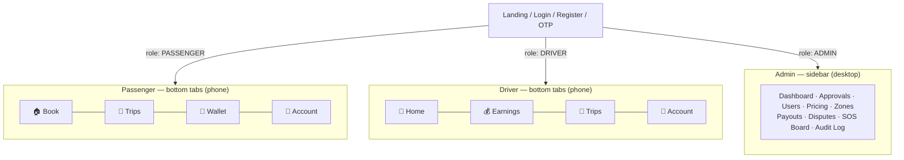
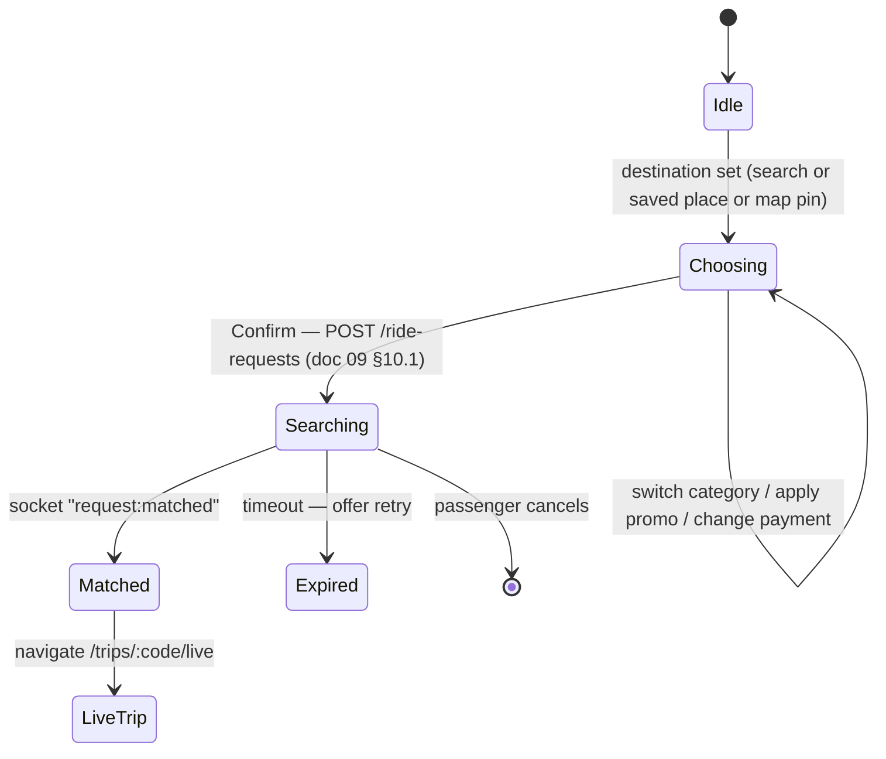

## Document 11 — Frontend: React, Explained Through the App

| | |
|---|---|
| **Document** | 11 — Frontend (React + TypeScript) |
| **Version** | 1.0 — 14 July 2026 |
| **Approach** | Every concept lands on a real Cholo screen. Snippets are TypeScript, short, and educational — you write the real thing |
| **Builds on** | Doc 06 (trust boundary, request lifecycle), doc 07 (`client/` structure), doc 09 (the API these screens call) |

---

## 1. What React Actually Is

One equation: **UI = f(state).** You never command the page ("append a div, change that text") — you *describe* what the screen should look like for the current data, and React makes the browser match. When the data changes, React re-runs your description and updates only what differs.

Why this matters for Cholo specifically: a live trip screen shows a moving driver marker, a status stepper, an updating ETA, and a chat badge — all changing every few seconds. In vanilla JS you would hand-wire dozens of DOM updates and their interactions (this is how spaghetti is born). In React you hold one piece of state — `trip` — and one description of the screen; every socket event just updates the state, and the whole screen follows. **State is the single source of truth; the screen is its shadow.**

## 2. Components & JSX

A component is a function that returns markup. JSX is that markup — HTML-looking syntax with three rules: `{expression}` embeds any JavaScript, attributes are camelCase (`className`, `onClick`), and a component returns one parent element.

```tsx
// components/ride/FareEstimateCard.tsx — a real Cholo component
interface FareEstimateProps {
  categoryName: string;
  estFare: string;              // money is a STRING from the API (doc 09 §1)
  etaMin: number;
  surge: number;                // 1.0 = none
  selected: boolean;
  onSelect: () => void;         // child→parent communication (§9)
}

export function FareEstimateCard({ categoryName, estFare, etaMin, surge, selected, onSelect }: FareEstimateProps) {
  return (
    <button onClick={onSelect}
      className={`w-full rounded-xl border p-4 text-left transition
                  ${selected ? 'border-emerald-600 bg-emerald-50' : 'border-gray-200'}`}>
      <div className="flex items-center justify-between">
        <span className="font-semibold">{categoryName}</span>
        <span className="font-bold">৳{estFare}</span>
      </div>
      <p className="text-sm text-gray-500">{etaMin} min away
        {surge > 1 && <span className="ml-2 text-amber-600">↑ {surge}× surge</span>}
      </p>
    </button>
  );
}
```

Components compose like LEGO: `BookRidePage` renders a `MapView`, a `LocationSearchInput`, four `FareEstimateCard`s and a `PrimaryButton`. Each piece is small enough to understand alone — that is the entire point.

## 3. Props — Data Flows Down

Props are a component's *arguments*: the parent decides, the child displays. Two laws: **props flow one way (down)** and **props are read-only** — a child never modifies what it received; it *asks* the parent via a callback (`onSelect` above). The TypeScript interface on props is your contract: forget `estFare` at a call-site and the compiler — not a user in Uttara — catches it.

## 4. State — Data That Lives and Changes

`useState` gives a component memory that survives re-renders:

```tsx
// pages/auth/LoginPage.tsx (essentials)
const [phone, setPhone] = useState('');
const [password, setPassword] = useState('');
const [submitting, setSubmitting] = useState(false);

<input value={phone} onChange={(e) => setPhone(e.target.value)}
       inputMode="numeric" placeholder="01XXXXXXXXX" />
```

Three rules that prevent 90% of beginner confusion:

1. **Setting state = requesting a re-render.** `setPhone('017…')` doesn't change `phone` *now* — it schedules a re-run of the component where `phone` has the new value. State is a *snapshot per render*.
2. **Never mutate.** `trips.push(newTrip)` changes the array in place — React can't see it. Always produce a new value: `setTrips([newTrip, ...trips])`.
3. **Controlled inputs** (value from state + onChange into state) make the form data instantly available for validation, submission and disabling the button — every Cholo form works this way.

## 5. Lists & Conditional Rendering

```tsx
// TripHistoryPage — the two workhorse patterns together
{trips.length === 0
  ? <EmptyState title="No trips yet" hint="Your completed rides will appear here" />
  : trips.map(trip => <TripRow key={trip.publicCode} trip={trip} />)}
```

The `key` tells React *which row is which* across re-renders — use a stable identity (`publicCode`), **never the array index** (rows get recycled wrongly when the list reorders, and your driver photo appears on the wrong trip).

## 6. useEffect — Synchronizing With the Outside World

Rendering must be pure (same state → same JSX). Anything *outside* that — fetching, timers, socket subscriptions, the browser GPS — is a **side effect**, and `useEffect` is its home:

```tsx
// pages/passenger/LiveTripPage.tsx — subscribe to the trip room (doc 06 §7)
useEffect(() => {
  socket.emit('trip:join', tripCode);
  socket.on('driver:location', setDriverPos);      // every 4 s → state → marker glides
  socket.on('trip:status',     setStatus);

  return () => {                                   // CLEANUP — runs on unmount / tripCode change
    socket.emit('trip:leave', tripCode);
    socket.off('driver:location', setDriverPos);
    socket.off('trip:status',     setStatus);
  };
}, [tripCode]);                                    // dependency array: re-run only when this changes
```

The three-part contract: **effect** (subscribe), **cleanup** (unsubscribe — forget it and every visit to the page stacks another listener), **dependencies** (when to redo it). And the pro rule from the React docs: *you might not need an effect* — deriving data (`payable = fare - discount`) is just a variable during render, not an effect + state.

## 7. Custom Hooks — Packaging Logic for Reuse

Any function starting with `use` that calls other hooks is a custom hook: **logic without UI**, reusable across screens. This is where Cholo's cross-cutting behaviors live (doc 07: `client/src/hooks/`):

```tsx
// hooks/useRideTracking.ts — the LiveTripPage effect, extracted and shareable
export function useRideTracking(tripCode: string) {
  const [driverPos, setDriverPos] = useState<LatLng | null>(null);
  const [status, setStatus] = useState<TripStatus>('assigned');
  useEffect(() => { /* …the subscribe/cleanup block from §6… */ }, [tripCode]);
  return { driverPos, status };
}

// Any screen, one line:
const { driverPos, status } = useRideTracking(tripCode);
```

Cholo's core custom hooks: `useAuth()` (current user + login/logout — wraps AuthContext), `useGeolocation()` (browser GPS with permission states), `useRideTracking(tripCode)` (above), `useCountdown(deadline)` (the driver's 15-second offer timer). Notice each hook has *one job* and a screen composes several.
## 8. React Router — Screens Become URLs

An SPA has one HTML page; the router fakes many. Three pieces: a **route table**, **`<Link>`/`useNavigate`** for moving, **`useParams`** for reading URL data — plus the layout trick that keeps role chrome in one place:

```tsx
// App.tsx — the sitemap as code (matches doc 12's page catalog)
<Routes>
  <Route element={<AuthLayout />}>
    <Route path="/login" element={<LoginPage />} />
    <Route path="/register" element={<RegisterPage />} />
  </Route>

  <Route element={<ProtectedRoute roles={['PASSENGER']}><PassengerLayout /></ProtectedRoute>}>
    <Route path="/" element={<BookRidePage />} />
    <Route path="/trips" element={<TripHistoryPage />} />
    <Route path="/trips/:code" element={<TripDetailPage />} />   {/* useParams().code */}
    <Route path="/wallet" element={<WalletPage />} />
  </Route>

  <Route path="/driver" element={<ProtectedRoute roles={['DRIVER']}><DriverLayout /></ProtectedRoute>}>
    <Route index element={<DriverHomePage />} />
    <Route path="earnings" element={<EarningsPage />} />
  </Route>
</Routes>
```

`PassengerLayout` renders the bottom tab bar and an `<Outlet />` where the child page appears — navbars are written once, not per page. And the guard:

```tsx
// components/layout/ProtectedRoute.tsx — UX, not security (the API is the security — doc 06 §2)
export function ProtectedRoute({ roles, children }: { roles: Role[]; children: ReactNode }) {
  const { user, loading } = useAuth();
  if (loading) return <FullScreenSpinner />;
  if (!user) return <Navigate to="/login" replace />;
  if (!roles.some(r => user.roles.includes(r))) return <Navigate to="/" replace />;
  return children;
}
```

## 9. Calling the API — The Tri-State Pattern

Every data-driven screen juggles the same three questions: *loading? failed? here's the data.* Make the triple explicit and every screen becomes boring (good):

```tsx
// pages/passenger/TripHistoryPage.tsx
const [trips, setTrips]     = useState<Trip[]>([]);
const [loading, setLoading] = useState(true);
const [error, setError]     = useState<string | null>(null);

useEffect(() => {
  ridesApi.listMyTrips()                         // from api/rides.api.ts — NEVER axios in a component
    .then(res => setTrips(res.data))
    .catch(() => setError('Could not load trips'))
    .finally(() => setLoading(false));
}, []);

if (loading) return <TripListSkeleton />;
if (error)   return <ErrorState message={error} onRetry={refetch} />;
return trips.length ? <TripList trips={trips} /> : <EmptyState … />;
```

Remember the doc 07 contract: components import from `api/`, and `api/client.ts` owns the base URL and the interceptors that attach the access token and silently refresh on 401 (doc 10 §7). A page never sees a token.

## 10. Component Communication — The Four Patterns

| Relationship | Pattern | Cholo example |
|---|---|---|
| Parent → child | **props** | `BookRidePage` passes `estFare` into `FareEstimateCard` |
| Child → parent | **callback prop** | card calls `onSelect()` → page updates `selectedCategory` |
| Siblings | **lift state up** to the shared parent | `LocationSearchInput` and `MapView` both reflect `pickup` owned by `BookRidePage` |
| Distant / app-wide | **Context** | any screen asks `useAuth()` who is logged in; `SocketContext` shares the one socket |

```tsx
// context/AuthContext.tsx — the shape (details are yours to write)
const AuthContext = createContext<AuthValue | null>(null);
export function AuthProvider({ children }: { children: ReactNode }) {
  const [user, setUser] = useState<User | null>(null);
  const [loading, setLoading] = useState(true);
  useEffect(() => { authApi.me().then(r => setUser(r.data)).finally(() => setLoading(false)); }, []);
  const login  = async (phone: string, pw: string) => setUser((await authApi.login(phone, pw)).data.user);
  const logout = async () => { await authApi.logout(); setUser(null); };
  return <AuthContext.Provider value={{ user, loading, login, logout }}>{children}</AuthContext.Provider>;
}
export const useAuth = () => useContext(AuthContext)!;
```

## 11. State Management — A Decision Ladder, Not a Library

Climb only as high as the pain requires:

1. **Local `useState`** — form fields, open/closed sheets. *Most state lives here. Leave it here.*
2. **Lifted state** — two siblings need it → their parent owns it.
3. **Context** — genuinely app-wide: `AuthContext`, `SocketContext`. Cholo needs exactly these two.
4. **A store (Zustand/Redux)** — many unrelated screens writing shared client state. *Cholo does not need this*; adding Redux here is résumé-driven development.

One reframe that prevents architecture mistakes: most "state" on your screens is really **server state** — a cached copy of PostgreSQL truth (trips, wallet, offers). Your job is *fetch, show, refetch when stale* — not to maintain a second database in the browser. Keep server data in page-level state (or later, a fetch-cache library like TanStack Query — noted as an upgrade, not a requirement), and keep client state (which sheet is open) separate.

## 12. TypeScript in Practice — Types Mirror the API

`client/src/types/` is the frontend's copy of the doc 09 DTOs — one vocabulary end to end:

```ts
// types/ride.types.ts
export type TripStatus = 'assigned' | 'arrived' | 'in_progress' | 'completed' | 'cancelled';

export interface Trip {
  publicCode: string;                 // "JT-2026-000142"
  status: TripStatus;
  fare: { total: string; currency: 'BDT' };   // strings! (doc 09 §1)
  driver: { name: string; rating: string; vehicle: string };
  completedAt: string | null;         // ISO, null = not yet (NULL semantics from doc 04)
}
```

The payoff moments: a union type + `switch (status)` warns you when a fifth status appears in the enum but not in your UI; `res.data.fare.totall` is a compile error, not a blank screen in production.

## 13. Tailwind — Just Enough Theory

Tailwind is CSS *written as class names*: `p-4 rounded-xl bg-emerald-600 text-white`. Why it wins for a solo student project: no naming debates, no orphan stylesheets, the style is visible where the markup is, and **the design system is enforced by the config** (doc 12 defines the palette as Tailwind tokens — you physically can't use an off-brand green). Two habits: mobile-first responsive prefixes (`grid-cols-1 md:grid-cols-2` — base is phone, `md:` upgrades), and the **rule of three**: the third time you paste the same class string, extract a component (`<PrimaryButton>`), not an `@apply` stylesheet.

## 14. React Beginner Mistakes (the greatest hits)

1. **Mutating state** (`trips.push(...)`) → screen doesn't update. New arrays/objects, always.
2. **`key={index}`** → recycled rows show wrong data when lists reorder.
3. **useEffect infinite loop** — effect sets state that's in its own dependency array without a guard.
4. **`async` directly on useEffect** (`useEffect(async () => …)`) — effects must return a cleanup, not a Promise; define an inner async function.
5. **Forgetting cleanup** → duplicate socket listeners; the chat shows every message twice after revisiting.
6. **Storing derived data in state** (`payable`) → two sources of truth drift. Compute during render.
7. **Stale closure in timers** — a `setInterval` reads the `phone` from the render it was born in. Use functional updates (`setCount(c => c+1)`) or refs.
8. **axios inside components** → tokens, retries and errors handled 30 different ways. The `api/` layer exists for a reason (doc 07 §4.1).
9. **Context for everything** → every keystroke re-renders the whole app. Context is for *slow-changing, global* values.
10. **Testing the happy path only** — every list screen has four states (loading/empty/error/data). Doc 12 §8 makes them mandatory.

**Next:** doc 12 — what these components actually build: every screen, every flow, and the design system.


---

## Document 12 — UI/UX: Every Screen, Every Flow, the Design System

| | |
|---|---|
| **Document** | 12 — UI/UX Planning |
| **Version** | 1.0 — 14 July 2026 |
| **Reality it designs for** | Phones first — mostly mid-range Androids on patchy Dhaka mobile data, often in sunlight, often one-handed while standing on a roadside |

---

## 1. Design Principles (each one shapes real screens)

1. **The map is the canvas; the sheet is the conversation.** Passenger and driver screens are a full-bleed map with a *bottom sheet* carrying the current question — the pattern every rider on earth already knows. Never bury the map under chrome.
2. **One primary action per screen.** Every screen has exactly one obvious next step, rendered as the single large primary button pinned above the thumb.
3. **Status must be glanceable.** A ride is a state machine (doc 01); the UI wears the state as a colored badge + stepper everywhere a trip appears.
4. **Thumb-first.** Primary actions in the bottom 40% of the screen; touch targets ≥ 44 px; destructive actions (cancel ride) require a confirm sheet.
5. **Design for the worst network.** Every fetch shows a skeleton; every failure offers retry; the booking flow survives a 3-second stall without the user panicking (§8).
6. **Bangla is a first-class citizen.** Every label ships in `bn` and `en` (`users.preferred_language`); layouts are tested with Bangla strings, which run ~20% longer.

## 2. The Design System

### 2.1 Color palette — "Rickshaw Modern"

Deep green for trust and motion, marigold for energy — drawn from Dhaka's streets, not from a template. Defined once in `tailwind.config.js` as tokens, so an off-brand color is a compile-time impossibility.

| Token | Hex | Usage |
|---|---|---|
| `cholo-700` (primary) | `#0E7A5F` | primary buttons, active tab, links, driver-online state |
| `cholo-800` | `#0A5C48` | button hover/pressed |
| `cholo-50` | `#E9F5F1` | selected-card wash, success backgrounds |
| `ink-900` | `#0B1F2E` | headings, body text |
| `ink-500` | `#5A6B7A` | secondary text, captions |
| `marigold-500` (accent) | `#F5A623` | surge chips, star ratings, promo highlights |
| `danger-600` | `#DC2626` | cancellations, SOS, destructive buttons |
| `info-600` | `#2563EB` | assigned status, informational banners |
| surfaces | `#FFFFFF` / `#F5F7F9` / border `#E3E8EE` | cards / app background / dividers |

**Semantic status colors** (used by the `<StatusBadge>` everywhere a trip/request appears):

| Status | Color | Feel |
|---|---|---|
| `searching` | marigold pulse | working on it |
| `assigned` / `arrived` | info blue | driver inbound |
| `in_progress` | cholo green | moving |
| `completed` | green ✓ | done |
| `cancelled` / `expired` | red / gray | closed |

### 2.2 Typography

| Role | Font | Notes |
|---|---|---|
| Latin UI | **Inter** | 400 / 500 / 600 / 700 |
| Bangla UI | **Noto Sans Bengali** | loaded via `font-family` fallback chain — one CSS declaration serves both scripts |
| Numbers (fares, codes) | Inter + `tabular-nums` | digits align in columns and tickers |

Scale (Tailwind): `text-xs` captions · `text-sm` secondary · `text-base` body · `text-lg` card titles · `text-2xl` fares & page titles · `text-4xl` the big fare on the receipt. Never more than two weights per screen.

### 2.3 Shape, spacing, elevation

4-px spacing scale (`p-4` = 16 px rhythm) · radius: `rounded-xl` cards, `rounded-2xl` sheets, `rounded-full` pills/FABs · shadows only on *floating* things (sheets, modals, FABs — `shadow-lg`); flat cards use borders. Dark mode is out of scope for v1 (noted in Future Scope).

### 2.4 Core component inventory (build once — `components/ui/`)

| Component | Variants / states | Used by |
|---|---|---|
| `Button` | primary / secondary / ghost / danger · loading (spinner) / disabled | everywhere — the only button |
| `Input` | text / phone (numeric, `01…` mask) / password (visibility toggle) · error state with message | all forms |
| `Card` | flat / interactive (pressable) | lists, dashboards |
| `StatusBadge` | the semantic table above | trips, requests, documents, withdrawals |
| `BottomSheet` | snap points: peek / half / full · drag handle | booking flow, trip actions, confirmations |
| `Modal` | center dialog (desktop/admin) | admin actions, confirmations |
| `Stepper` | trip progress (assigned → arrived → riding → done) | live trip, trip detail |
| `Skeleton` | line / card / map-placeholder | every loading state |
| `EmptyState` / `ErrorState` | icon + title + hint (+ retry) | every list (§8) |
| `Toast` | success / error / info, auto-dismiss | after every mutation |
| `MapView` | markers, polyline, recenter FAB — wraps Leaflet or Google (doc 06 §8) | booking, live trip, driver home |
| `OtpInput` | 6 boxes, auto-advance, paste support | registration, payout confirm |
| `RatingStars` | display / input modes | ratings everywhere |

## 3. Navigation Architecture



Rules: after login, users land on their role's home (multi-role users get a switcher in Account). Deep screens (trip detail, ticket) push *over* tabs with a back arrow. The SOS button floats over every live-trip screen — never inside a menu.

## 4. Guest & Auth Screens

| Page | Route | Purpose | Key components | Layout & responsive |
|---|---|---|---|---|
| Landing | `/welcome` | 3-slide value pitch → Register/Login | illustration carousel, two Buttons | full-screen, phone-first; desktop shows centered card |
| Register | `/register` | name + phone + password (+ referral) | `Input(phone)`, password strength hint | single column, one screen, no scroll |
| OTP Verify | `/verify` | 6-digit SMS code, resend countdown | `OtpInput`, resend timer (30 s) | auto-submits on 6th digit |
| Login | `/login` | phone + password | inputs + forgot link | biometric note deferred to future scope |
| Reset password | `/reset` | OTP → new password | `OtpInput`, `Input(password)` | same shell as register |

*Flow: Register → OTP → (role PASSENGER granted, wallet auto-created — doc 03 trigger) → Book screen. Registration to first booking must be under 90 seconds.*

## 5. Passenger Screens

| Page | Route | Purpose | Key components | Layout & responsive |
|---|---|---|---|---|
| **Book a ride** ★ | `/` | the flagship — see §5.1 | MapView, BottomSheet, FareEstimateCards, saved-place chips | map full-bleed; sheet stages below |
| **Live trip** ★ | `/trips/:code/live` | track driver, act | MapView + moving marker, Stepper, driver card (photo, plate, rating, call/chat), SOS FAB, cancel (pre-start only) | sheet peek shows status + ETA; chat opens as full sheet |
| Trip history | `/trips` | past + active rides | filter chips, `TripRow` list, four-state pattern | infinite scroll; desktop = table |
| Trip detail / receipt | `/trips/:code` | fare breakdown, receipt, actions | fare table (doc 01 snapshot!), map thumbnail of route, RatingStars, "report issue" → dispute/ticket | printable; share receipt |
| Wallet | `/wallet` | balance + ledger | balance hero card, topup Button, `wallet_transactions` list with running balance | ledger rows mirror doc 04 sample |
| Payment methods | `/wallet/methods` | saved bKash/Nagad/cards | masked method cards, set-default, add flow (gateway redirect) | — |
| Promos | `/promos` | available campaigns | promo cards with validity, copy-code | — |
| Saved places | `/account/places` | Home/Work/custom CRUD | list + map-pick sheet | label uniqueness errors inline |
| Account | `/account` | profile, language, contacts, logout | avatar block, `bn/en` toggle, emergency contacts list, sessions ("logout all devices") | — |
| Support | `/support` | tickets + new ticket | ticket list with `StatusBadge`, thread view (chat-style) | internal notes never shown (doc 09 §8) |

### 5.1 Flagship anatomy — Book a Ride

The screen is a **conversation in one bottom sheet** that walks four stages over a constant map:

```text
┌─────────────────────────────┐
│  ⛰  MAP (full bleed)        │   Stage A  IDLE
│      ◉ you                  │   sheet(peek): [ Where to? ______________ ]
│                             │                [🏠 Home] [🏢 Office] [＋]
│                             │
│                             │   Stage B  CHOOSE  (pickup/dropoff pins set)
│ ┌─────────────────────────┐ │   sheet(half):  🏍 Bike     ৳154   3 min ●selected
│ │ ▤ sheet                 │ │                 🛺 CNG      ৳228   5 min
│ │                         │ │                 🚗 Car      ৳388   6 min
│ │                         │ │                 [ promo? WELCOME50 ✓ −50 ]
│ │      (stage content)    │ │                 [ 💵 Cash ▾ ]  [ Confirm Bike ]
│ │                         │ │
│ └─────────────────────────┘ │   Stage C  SEARCHING
└─────────────────────────────┘   sheet(half): radar pulse ৳154 · [Cancel request]
                                   Stage D  MATCHED → auto-navigate to Live Trip
```



Design notes worth defending: the **quote is shown before booking** (est_fare snapshot — doc 01); surge appears as an explicit marigold chip, never hidden in the total; the confirm button names the choice ("Confirm Bike — ৳154") because labeled buttons kill mis-taps; searching state always offers escape (cancel).
## 6. Driver Screens

| Page | Route | Purpose | Key components | Layout & responsive |
|---|---|---|---|---|
| Apply (wizard) | `/driver/apply` | become a driver: NID + license → docs → vehicle | 3-step wizard with progress, file upload cards | each step saves independently; resumable |
| Documents | `/driver/documents` | upload & track review | per-doc cards with `StatusBadge` + rejection reasons + expiry warnings | re-upload creates new row (doc 01) — history shown |
| Vehicles | `/driver/vehicles` | manage vehicles, set active | vehicle cards, "on duty" radio, add form | activate disabled until approved |
| **Home** ★ | `/driver` | go online, receive offers | map + big Online/Offline switch, today's earnings strip, **OfferSheet** (§6.1) | the screen a driver stares at all day — big text, high contrast for sunlight |
| Active trip | `/driver/trip` | drive the current job | map w/ route, passenger card (name, rating, call/chat), one sliding action button that morphs: *Arrived → Start → Complete* | slide-to-confirm prevents pocket-taps |
| Earnings | `/driver/earnings` | daily/weekly income | date-range chips, summary cards (gross/commission/net — `v_driver_daily_earnings`), per-trip rows | desktop = table with totals |
| Withdrawals | `/driver/withdrawals` | cash out | balance card, payout-account picker, amount input, history with `StatusBadge` | fee shown before confirm |
| Trip history | `/driver/trips` | past jobs | same `TripRow` component as passenger (reuse!) | — |
| Account | `/driver/account` | profile, payout accounts, sessions | — | — |

### 6.1 Flagship anatomy — the Offer Sheet

The most time-critical UI in the product: a driver has **15 seconds** to decide, possibly while stopped in traffic.

```text
┌──────────────────────────────────┐
│ ▓▓▓▓▓▓▓▓▓▓▓░░░░  0:09            │  ← countdown bar (useCountdown), amber → red at 5 s
│                                  │
│   NEW RIDE  ·  Bike              │
│   ৳154   ·  12.4 km trip         │  ← what I earn & how far — the decision numbers, HUGE
│                                  │
│   ⬆ pickup  1.2 km away          │
│   Dhanmondi 27                   │
│   ⬇ drop    Gulshan 2            │
│   ★ 5.00 passenger               │
│                                  │
│  [   REJECT   ] [  ✓ ACCEPT   ]  │  ← accept is 2× wider; both ≥ 56 px tall
└──────────────────────────────────┘
```

Arrives via socket (`offer:new` → room `driver:7`), renders over everything, plays a distinct sound. Accept → `POST /driver/offers/:id/respond`; a `409 ALREADY_TAKEN` (the race — doc 09 §10.2) shows a 2-second "Too late" toast and dismisses — never an error screen; losing a race is normal traffic, not a failure.

## 7. Admin Screens (desktop-first, sidebar layout)

| Page | Route | Purpose | Key components | Notes |
|---|---|---|---|---|
| Dashboard | `/admin` | today at a glance | KPI cards (trips, active drivers, gross — `v_city_monthly_revenue`), city filter, live trend chart | auto-refresh 60 s |
| Driver approvals | `/admin/drivers` | KYC queue | table (`status=pending` default), side-panel detail with all documents, Approve/Reject with reason | decision → audit log (doc 01) |
| Document review | `/admin/documents` | per-document review | image viewer + doc metadata + approve/reject | keyboard shortcuts A/R for queue speed |
| Users | `/admin/users` | search, suspend, reinstate | search table, user drawer (trips, wallet, reports against), suspend modal w/ reason | suspension revokes sessions (doc 10) |
| Pricing & surge | `/admin/pricing` | tariffs + surge windows | current tariff cards per city×category, "publish new tariff" form (**effective-dated — never edits**, doc 01 §13.7), surge creator with zone picker | history timeline visible |
| Zones | `/admin/zones` | geofence management | map with polygons, zone list | GeoJSON editor is future scope; v1 = draw + name |
| Withdrawals | `/admin/payouts` | finance queue | requested table, account details (masked), Approve→gateway / Reject+reason | `finance` access level only |
| Disputes & reports | `/admin/disputes` | resolve money contests & moderation | dispute detail: trip snapshot, fare breakdown, GPS trail link, resolution form (refund amount) | resolution may create refund payment (doc 01 §100) |
| SOS board | `/admin/sos` | live safety alerts | red alert cards w/ map, acknowledge/resolve, contact buttons | audible alarm; never auto-dismisses |
| Audit log | `/admin/audit` | the paper trail | filterable table (actor, entity, action, diff viewer for old/new JSONB) | read-only, always |

## 8. The Four-States Rule (project-wide policy)

**Every screen that loads data must design all four states** — this is a *deliverable requirement*, not a nicety:

| State | Treatment | Example |
|---|---|---|
| Loading | skeletons shaped like the real content (never a lone spinner for lists) | `TripListSkeleton` — 3 gray rows |
| Empty | friendly icon + one-line meaning + the action that fixes it | "No trips yet — book your first ride" → Button |
| Error | what happened (plainly) + **Retry** | "Couldn't load wallet. Check your connection." |
| Data | the actual content | — |

Plus two mutation rules: every button that fires a request shows its **loading state and disables** (double-tap = double booking otherwise), and every success/failure lands a **Toast**.

## 9. Responsive Strategy

| Breakpoint | Passenger/Driver | Admin |
|---|---|---|
| base (<768) | the design target: bottom tabs, sheets, full-bleed map | usable but secondary: sidebar collapses to drawer, tables scroll |
| `md:` 768+ | comfortable phone-landscape/tablet: sheet becomes side panel next to map | sidebar visible |
| `lg:` 1024+ | booking = map left + panel right (Uber web pattern); history = tables | full layout: sidebar + content + detail panel |

Mobile-first in code (`class="grid-cols-1 lg:grid-cols-[1fr_380px]"`): base styles are the phone; larger screens *add*.

## 10. Accessibility & Bangladesh-Specific UX

- **Touch & vision:** targets ≥ 44 px; text contrast ≥ 4.5:1 (the palette passes — ink-900 on white = 14:1, white on cholo-700 = 5.2:1); driver screens use larger type (sunlight, vibration).
- **Semantics:** real `<button>`/`<label>`; focus-visible rings (`focus-visible:ring-2`); OTP inputs announce position; status conveyed by **badge text + color**, never color alone (color-blind riders).
- **Bangla:** `lang` attribute switches with preference; Noto Sans Bengali subset preloaded; all layouts tested with the longer script; numerals stay Latin for fares (matches receipts).
- **Network reality:** map tiles cached; booking sheet tolerates 3G (optimistic sheet transitions, server confirms); socket reconnection shows a quiet "reconnecting…" pill, not a modal.
- **Motion:** `prefers-reduced-motion` disables the radar pulse and marker animations.

## 11. Screen-by-Screen Build Checklist (how to use this document)

For every page you build, walk this list: **1)** route + layout registered (doc 11 §8) · **2)** page composed from `ui/` components only — no raw one-off styling · **3)** data via `api/` + tri-state (doc 11 §9) · **4)** all four states designed · **5)** buttons have loading/disabled · **6)** works one-handed at 360 px width · **7)** Bangla strings fit · **8)** status uses `StatusBadge` semantics · **9)** errors map doc 09 codes to human messages · **10)** navigation in and out matches the §3 map.

**Next:** the final batch — development plan, exact build order with reasoning, and the complete best-practices compendium; then everything ships as one packaged blueprint.
