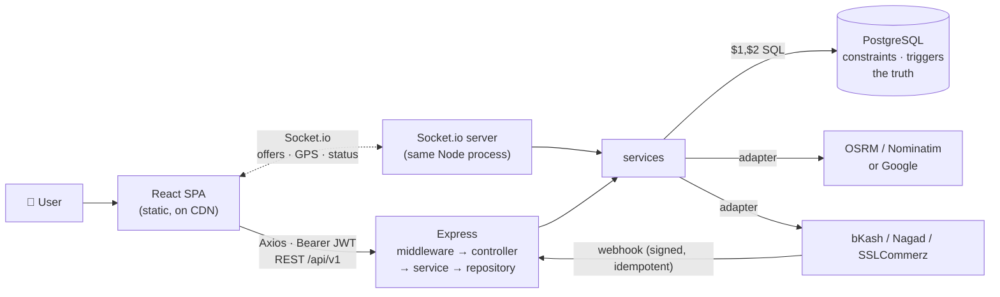

## Document 13 — Development Plan: Nine Milestones

| | |
|---|---|
| **Document** | 13 — Development Plan |
| **Version** | 1.0 — 14 July 2026 |
| **Shape** | 9 milestones (M0–M8) mapped to the 14-week rhythm of doc 05 §10. Every milestone ends with something you can **demo** — to a teacher, a friend, or yourself. If a milestone's outcome can't be shown on a screen or in Postman, it isn't done |

---

## 1. How to Run This Plan

- **One milestone at a time, in order.** Each depends on the previous; jumping ahead creates half-built layers that rot.
- **The demo is the definition of done.** Each milestone lists its demo script — rehearse it before moving on.
- **Track with GitHub Issues + a 3-column board** (Todo / Doing / Done). One issue per feature, one branch per issue (`feat/dispatch-offers`), merge on green.
- **When behind schedule, cut scope — never cut milestones.** §11's guardrails say exactly what to drop.

## 2. Milestone M0 — Foundation (weeks 2–3, alongside Phase 0/1 study)

| | |
|---|---|
| **Goal** | A repo any examiner can clone and run in 5 minutes |
| **Features** | monorepo skeleton (doc 07 §2) · `.gitignore` + `.env.example` · `docker-compose.yml` with PostgreSQL 16 auto-loading `schema.sql` · README quickstart |
| **Knowledge** | Git, terminal, Docker basics (doc 05 phases 0, 5-lite) |
| **Depends on** | nothing — this is day one |
| **Demo** | `git clone && docker compose up` → `psql` shows 54 tables; the doc 03 §11 verification queries pass |
| **Done when** | ☐ fresh clone boots on another machine ☐ no secrets in git ☐ README explains every command |

## 3. Milestone M1 — Server Skeleton & Infrastructure (week 5)

| | |
|---|---|
| **Goal** | A running Express app with the *plumbing* every feature will reuse |
| **Features** | `app.js`/`server.js` split (doc 07 §3) · `config/env.js` fail-fast validation · pg Pool + `GET /health` (checks DB) · `errorHandler`, `AppError`, `asyncHandler`, `validate(zod)` scaffolds · request logger · CORS |
| **Knowledge** | doc 08 §1–5, §8–10 |
| **Depends on** | M0 |
| **Demo** | `/health` → `{db:true}`; a deliberately bad request returns the doc 09 error envelope with a 422 |
| **Done when** | ☐ boot fails loudly on missing env ☐ thrown async errors reach the handler ☐ envelope shape matches doc 09 §1 exactly |

**Why infrastructure before features:** every feature you write afterwards inherits validation, error shapes and logging for free. Building features first means retrofitting all of this into working code — the classic time sink.

## 4. Milestone M2 — Auth & Accounts (weeks 5–6)

| | |
|---|---|
| **Goal** | The complete doc 10 identity system — the gate every later feature stands behind |
| **Features** | register → OTP (SMS mocked to console) → verify · login with uniform errors · refresh **rotation + reuse detection** · logout / logout-all · `GET/PATCH /me` · change password · `auth` + `requireRole` middleware · rate limits on auth routes |
| **Knowledge** | doc 10 entire; doc 08 §3 |
| **Depends on** | M1 |
| **Demo** | full Postman cycle; then the theft-detection party trick: refresh twice with the same old cookie → second call kills the session family (doc 10 §7) |
| **Done when** | ☐ only hashes in DB (`users`, `refresh_tokens`, `otp_verifications`) ☐ wallet auto-created on register (trigger) ☐ 401 vs 403 used correctly |

## 5. Milestone M3 — Driver Onboarding & Fleet (weeks 6–7)

| | |
|---|---|
| **Goal** | A human can become an approved, on-duty driver end to end |
| **Features** | `POST /driver/apply` · driver + vehicle document upload records · vehicle CRUD + activate · availability online/offline with the doc 03 business gate (approved only) · minimal admin endpoints: list pending, review documents, approve driver + vehicle |
| **Knowledge** | docs 09 §6, 01 domain 2 |
| **Depends on** | M2 (roles) |
| **Demo** | Postman story: apply → upload → admin approves → driver goes online → `v_active_drivers` shows them |
| **Done when** | ☐ un-approved drivers get 409 on going online ☐ every admin decision lands in `audit_logs` ☐ availability row auto-created (trigger) |

## 6. Milestone M4 — Pricing, Dispatch & the Ride Core (weeks 7–8) ⚠ the hardest

| | |
|---|---|
| **Goal** | The doc 01 ride lifecycle working over REST — the heart of the product |
| **Features** | geo service with OSRM/Nominatim adapter (doc 06 §8) · `fn_current_pricing`-backed quote endpoint · create request (snapshot the quote) · dispatch service: fan-out offers to nearby online drivers · **accept with `FOR UPDATE` race protection** (doc 08 §7) · trip lifecycle: arrived/start/complete with `BAD_TRANSITION` guards · fare computation at completion (identity CHECK must pass) · cancellation with fee rules |
| **Knowledge** | docs 08 §6–7, 03 §8, 09 §5–6 |
| **Depends on** | M3 (an approved driver must exist) |
| **Demo** | the full Postman ride: quote → book → offer appears → accept (and a second accept gets `409 ALREADY_TAKEN`) → arrive → start → complete → `trip_status_history` shows the whole journey |
| **Done when** | ☐ two-terminal race test passes ☐ fare breakdown satisfies the CHECK ☐ unfulfilled requests expire via the `jobs/` cron |

## 7. Milestone M5 — Frontend Foundation (weeks 8–9)

| | |
|---|---|
| **Goal** | The React shell every screen will snap into |
| **Features** | Vite + TS + Tailwind with the doc 12 tokens · `ui/` kit (Button, Input, Card, StatusBadge, BottomSheet, Skeleton, Toast, EmptyState) · router + role layouts + `ProtectedRoute` · `api/client.ts` with attach/refresh interceptors · AuthContext · auth pages (register/OTP/login) working against M2 |
| **Knowledge** | docs 11 §1–9, 12 §2–4 |
| **Depends on** | M2 (auth API); parallel with M4 is fine |
| **Demo** | register → OTP → land on the (placeholder) Book tab; refresh the page — still logged in (silent refresh) |
| **Done when** | ☐ design tokens in `tailwind.config.js`, zero raw hex in components ☐ guards redirect correctly per role ☐ 401→refresh→retry proven in the network tab |

## 8. Milestone M6 — The Two Apps (weeks 9–11)

| | |
|---|---|
| **Goal** | The visual product: booking sheet, offer sheet, live tracking |
| **Features** | MapView (Leaflet + OSM) · booking flow stages A–D (doc 12 §5.1) · Socket.io both ends with JWT handshake · driver Home: online switch + OfferSheet with countdown (doc 12 §6.1) · live trip: gliding marker, stepper, chat · trip history + detail/receipt screens |
| **Knowledge** | docs 11 §6–7, 06 §7, 12 §5–6 |
| **Depends on** | M4 + M5 |
| **Demo** | **the two-browser show**: passenger books in window A; offer pops in window B; accept; watch the marker move in A while B "drives" — this is your presentation centerpiece |
| **Done when** | ☐ four-states rule on every list ☐ socket reconnect survives a server restart ☐ losing the accept race shows a toast, not an error page |

## 9. Milestone M7 — Money (weeks 11–12)

| | |
|---|---|
| **Goal** | Every taka accounted for, doubly |
| **Features** | wallet screen + ledger list · cash-trip completion (commission debit via ledger) · wallet payment (T3) · one gateway sandbox (bKash or SSLCommerz) topup + trip payment + **idempotent webhook** · earnings screen (`v_driver_daily_earnings`) · payout accounts + withdrawal request · admin payout queue · promo validate/redeem · receipt row on completion |
| **Knowledge** | docs 09 §7–8 + §10.4, 03 §8 T2–T3, 01 domain 5 |
| **Depends on** | M6 |
| **Demo** | complete a cash trip → show `payments`, `driver_earnings`, `wallet_transactions` rows and that `fn_wallet_balance_audit` = cached balance; replay the webhook → prove the no-op |
| **Done when** | ☐ one-success-per-trip index verified from the app ☐ ledger UPDATE rejected (trigger) ☐ withdrawal needs `finance` admin |

## 10. Milestone M8 — Admin, Hardening & Launch (weeks 12–14)

| | |
|---|---|
| **Goal** | Operable, tested, deployed, demo-ready |
| **Features** | admin console: dashboard KPIs, approval queue, users, pricing publisher, payouts, disputes, SOS board, audit viewer · support tickets + SOS trigger · tests: fare-math unit suite, auth/booking/payment API suites (supertest) · rate limiting everywhere sensitive · full docker-compose · deploy (Vercel + Render/Railway + managed PG) · demo seed script (the Nusrat/Rafiq world) · viva rehearsal against doc 01 §14 |
| **Knowledge** | docs 05 phase 5, 06 §9 |
| **Depends on** | M7 |
| **Demo** | live URL on your phone + the two-browser show + test suite green in one command |
| **Done when** | ☐ money-path tests pass ☐ `.env` story clean in prod ☐ a stranger completes a ride using only your README |

## 11. Scope Guardrails — What to Cut When (and What Never to Cut)

| Priority | Features |
|---|---|
| **MUST (the degree)** | auth with rotation · driver onboarding + approval · quote → book → dispatch → accept race → trip lifecycle → fare snapshot · live tracking · cash + wallet money with ledger integrity · basic admin approvals · the two-browser demo |
| **SHOULD (the grade-lifter)** | one real gateway sandbox + webhook idempotency · earnings + withdrawals · ratings · trip chat · receipts · admin pricing publisher |
| **COULD (cut first, guilt-free)** | promos UI (keep API) · scheduled rides UI (the column exists — say so in the viva) · multi-stop UI · favorites/referrals UI · SOS SMS fan-out (log + red banner is enough) · PDF receipts (HTML is fine) · admin zone polygon editor (seed zones in SQL) |

## 12. Risk Register

| Risk | Likelihood | Mitigation |
|---|---|---|
| **M4 dispatch swallows weeks** | high | build it REST-only first (poll offers); sockets arrive in M6. The race test is the exit criterion, not UI polish |
| Gateway sandbox pain (bKash approval delays) | medium | mock gateway module behind the same adapter interface; swap when sandbox arrives — the architecture already allows it (doc 06 §8) |
| Map tiles/geocoding rate limits (free Nominatim/OSRM) | medium | cache geocodes; throttle; demo runs on seeded coordinates — no live geocoding needed on stage |
| Socket complexity spirals | medium | exactly two events each way to start (`offer:new`, `location:update`, `trip:status`); resist inventing more |
| Scope creep ("just one more feature") | certain | §11 is the contract with yourself; new ideas go to the Future Scope list, not the sprint |
| Laptop dies before the demo | low, catastrophic | everything in git + deployed URL + the docs zip — rehearse the demo from the deployed app, not localhost |

**Next:** doc 14 — the exact order to build in, why that order, and the consolidated best-practices compendium.

---

## Document 14 — Build Order, The Grand Connection & Best Practices

| | |
|---|---|
| **Document** | 14 — Build Order & Best Practices |
| **Version** | 1.0 — 14 July 2026 |
| **Role** | The last document — it sequences everything the other thirteen designed, then hands you the habits to build it well |

---

## 1. The Exact Build Order (and the reason for every position)

Twenty-four steps. Each line: **what → why it must come *here* and not later/earlier.**

| # | Build | Why now |
|---|---|---|
| 1 | Repo, `.gitignore`, `.env.example`, README | version control before the first file worth losing |
| 2 | `docker-compose.yml` with PostgreSQL + auto-loaded `schema.sql` | **the database is the foundation** — everything else exists to talk to it, and yours is already designed & validated (docs 01–04) |
| 3 | Explore the schema in `psql` (20 practice queries) | you cannot build an API over tables you can't query by hand |
| 4 | `server.js`/`app.js` split + `config/env.js` + `/health` | a running skeleton makes every later step observable |
| 5 | pg Pool + first repository (`cities`) | prove the app↔DB pipe with the simplest table before betting features on it |
| 6 | `AppError` + `errorHandler` + `asyncHandler` + `validate(zod)` | **infrastructure before features** — retrofitting error handling into 30 endpoints is a week; building it first is an hour |
| 7 | Auth module (doc 10, complete) | it's the gate: every subsequent endpoint needs `req.user` to exist |
| 8 | `/me` + profiles module | smallest possible consumer of auth — proves the whole gate cheaply |
| 9 | Driver onboarding + admin approval endpoints | dispatch (step 12) is untestable without an approved, online driver |
| 10 | Geo adapter (OSRM/Nominatim) + pricing repo + `/rides/quote` | the quote is a pure read — no state machine yet; validates fare math in isolation |
| 11 | Create ride request (quote snapshot) | first write of the ride story; still no concurrency |
| 12 | Dispatch: offer fan-out + **accept with `FOR UPDATE`** | the hardest logic, tackled with everything below it already solid; REST-only (poll) — sockets later |
| 13 | Trip lifecycle: arrived/start/complete + fare finalization | finishes the state machine; the identity CHECK becomes your free test |
| 14 | Cancellation + request-expiry cron (`jobs/`) | closes the unhappy paths while the state machine is fresh |
| 15 | Socket.io layer: handshake auth, rooms, 3 events | **after** REST works — sockets are a *notification* layer over proven actions (doc 06 §7), never the logic |
| 16 | Frontend scaffold: Vite + Tailwind tokens + `ui/` kit + router + guards + axios interceptors | the shell every screen snaps into; interceptors first so no page ever handles tokens |
| 17 | Auth screens wired to step 7 | first full-stack loop — the moment it "becomes an app" |
| 18 | Booking flow UI (stages A–D) | consumes steps 10–12; the flagship screen |
| 19 | Driver Home + OfferSheet | the other half of the marketplace |
| 20 | Live trip: sockets on both screens | the two-browser demo is born here |
| 21 | Money: wallet, cash completion, gateway sandbox + webhook, earnings, withdrawals | money *after* rides exist — every payment needs a trip to pay for |
| 22 | History/detail/receipt/profile screens + admin console | breadth work — fast now because every pattern exists |
| 23 | Tests: fare-math unit + auth/booking/payment API suites | written while behavior is fresh; money paths are non-negotiable |
| 24 | Deploy + seed demo world + rehearse | ship, then practice the show |

Three sequencing principles worth quoting: **database → backend → frontend** (each layer is testable only against a working layer below); **infrastructure before features** (steps 4–6 pay rent forever); **REST before realtime** (a socket event you can't replay in Postman is a debugging nightmare).

## 2. How Everything Connects — The Grand Tour

### 2.1 One ride through all fourteen documents

The deepest proof the blueprint is *one system*: trace trip `JT-2026-000142` and watch every document take its turn.

| Moment | Designed in |
|---|---|
| Nusrat taps **Confirm Bike — ৳154** on the booking sheet (stage B) | **12** §5.1 |
| The button disables, shows a spinner; page state updates | **11** §4, §9 |
| `POST /ride-requests` leaves with a Bearer token attached by the interceptor | **09** §10.1 |
| The token's signature is verified statelessly in microseconds | **10** §3 |
| cors → json → auth → validate → controller → service → repository | **08** §3–7, files from **07** §3 |
| The service reads `fn_current_pricing`, applies surge, **snapshots the quote** | **03** §11, principle from **01** §13.7 |
| `INSERT INTO ride_requests` — every column documented | **04** (dictionary) |
| Offers fan out; Rafiq's phone gets `offer:new` in room `driver:7` | **06** §7 |
| Rafiq accepts; a rival driver's accept dies on `FOR UPDATE` + the unique guard | **08** §7, **03** T1, modeled in **01** §13.3–13.4 |
| `trips` row minted; status history **writes itself** | **03** trigger 4 |
| GPS pings stream into the monthly partition; the marker glides on Nusrat's map | **03** §10, **11** §6 |
| bKash payment `BKA-8827` succeeds — a second success is *unrepresentable* | **03** partial unique, webhook contract **09** §10.4 |
| Earning ৳329.63 recorded with the 15% **frozen**, ledger stamps `balance_after` | **01** §13.7–13.8, sample rows in **04** |
| Nusrat's 5★ updates Rafiq's profile aggregate | **03** trigger 7, registered in **02** §9 |
| Every table this touched is BCNF over its natural keys | **02** §8 |
| And the person who built it learned each piece in order | **05**, sequenced by **13/14** |

*That table is your closing slide.*
## 3. Best Practices & Common Mistakes — The Compendium

Consolidated from every document; per technology, the habits that matter and the mistakes that cost real days. Deep-dives live where cited.

### 3.1 Git & workflow

| Practice | The mistake it prevents |
|---|---|
| Commit per working feature; message = `type: what` (`feat: offer accept race guard`) | the 3,000-line "final changes" commit no one can review or revert |
| Branch per feature; merge only when the demo works | half-broken main the night before the viva |
| `.env` never committed; `.env.example` always current | leaked secrets live in history forever (doc 07 §7) — rotate immediately if it happens |
| Push daily — the repo is the backup | the dead-laptop catastrophe (doc 13 §12) |
| Tag milestone completions (`m4-ride-core`) | "it worked last week" with no way back |

### 3.2 PostgreSQL & SQL

| Practice | Prevents |
|---|---|
| Parameterized queries **only** — `$1`, never string concat | SQL injection (doc 08 §7) |
| Business invariants as constraints (CHECK/UNIQUE/FK), not just app code | the bug that writes impossible data at 3 a.m. (doc 03 §4) |
| `NUMERIC` for money, `TIMESTAMPTZ` for time | poisha drift; the 6-hour Dhaka bug (doc 03 §3) |
| Index FK + filter columns; **read `EXPLAIN` when slow** | the app that dies at 10,000 rows |
| Transactions around multi-write stories; `FOR UPDATE` on contended rows | double-booked drivers, half-recorded money (doc 03 §8) |
| Never edit ledgers/history — append compensating rows | audit trails you can't trust (doc 01 §13.8) |
| Migrations numbered, append-only after go-live | "works on my database" (doc 07 §5) |

### 3.3 Node & Express

| Practice | Prevents |
|---|---|
| `asyncHandler` on every async route | silently hanging requests — the #1 Express bug (doc 08 §5) |
| One `errorHandler`; `AppError` for expected failures; translate pg error codes | 200 inconsistent try/catches; stack traces leaking to users |
| Validate at the door (zod), re-check ownership in services | garbage inputs; IDOR (doc 10 §9) |
| Config read once, validated at boot | the 3 a.m. missing-env crash (doc 08 §10) |
| `client.release()` in `finally`, always | pool exhaustion — API freezes with no error |
| Identity from `req.user`, **never** from the body | authorization bypass (doc 08 §12) |
| Log requests + errors with enough context to replay | undebuggable production mysteries |

### 3.4 React & TypeScript

| Practice | Prevents |
|---|---|
| New arrays/objects on every state update | the screen that silently doesn't update (doc 11 §14) |
| Stable `key`s (`publicCode`, never index) | recycled rows showing the wrong trip |
| Effects = subscribe + **cleanup** + honest deps | doubled socket listeners; infinite loops (doc 11 §6) |
| Derive during render; don't store what you can compute | two sources of truth drifting |
| All HTTP through `api/`; interceptors own tokens | 30 screens each reinventing auth (doc 07 §4.1) |
| Types mirror API DTOs in `types/` | `fare.totall` shipping to users as a blank screen |
| Four states on every list; loading+disabled on every mutating button | double bookings; blank-screen confusion (doc 12 §8) |

### 3.5 Socket.io

| Practice | Prevents |
|---|---|
| JWT verified in the handshake; rooms joined only after membership checks | strangers in `trip:42` (doc 10 §10) |
| Sockets notify; REST acts; handlers call the same services | two divergent implementations of the rules (doc 06 §7) |
| Design for reconnection: rejoin rooms, re-fetch state on `connect` | ghost screens after tunnel/elevator dead zones |
| Few, named, versionable events (`trip:status`) | event soup nobody can trace |

### 3.6 Docker & deployment

| Practice | Prevents |
|---|---|
| Compose file = the documented dev environment | "works on my machine" |
| Secrets via platform env vars; same code, different config per environment | prod credentials in git |
| Health endpoint + platform health checks | silently dead API behind a live frontend |
| Managed PostgreSQL with automatic backups in prod | losing the only copy of the truth |

### 3.7 Security top ten (the doc 22-style recap, each already built in)

1. bcrypt(12) passwords · 2. hashed tokens & OTPs · 3. 15-min access + rotating refresh with reuse detection · 4. httpOnly SameSite cookie, nothing in localStorage · 5. zod + DB constraints (two fences) · 6. parameterized SQL only · 7. role gates + ownership checks (IDOR) · 8. rate limits on auth/OTP/SOS-adjacent routes · 9. uniform errors + timing (no enumeration) · 10. append-only audit/ledger + `app.user_id` attribution.

### 3.8 Performance quick wins (in order of real impact)

Paginate every list (cap 100) → hit the doc 03 indexes (verify with `EXPLAIN`) → socket instead of polling for live data → skeletons make waits *feel* fast → `vite build` code-splitting per role route → memoize only what you've *measured* to be slow.

## 4. Universal Habits

- **The 30-minute rule.** Stuck for 30 minutes → write the problem as a question (what I expected / what happened / what I tried), read it once — half solve themselves; the rest are now ready to be asked well.
- **Definition of done for any feature:** demoable · validated at the door · errors envelope-shaped · four UI states · committed on a branch · one sentence in the README changelog.
- **Read your own diff before every merge.** You will catch one embarrassing thing per review. Everyone does.
- **Keep a `DECISIONS.md`.** One line per choice ("cash+wallet first, gateway sandbox mocked — 12 Aug"). Your viva self will thank your building self.
- **Rehearse the demo out loud, twice.** The two-browser show (doc 13 M6) fails only when unrehearsed.

## 5. Final Words

You now hold what most student projects never have: a **complete, internally consistent blueprint** — 51 tables proven on a live PostgreSQL, ~100 endpoints under one contract, 34 screens with a design system, an authentication system with theft detection, and a build order where every step stands on the one before it.

The documents were written to be *outgrown*. The day you catch yourself disagreeing with one of them — "this endpoint should paginate differently", "this screen needs another state" — is the day they've done their job: that disagreement is you, thinking like the architect.

**Now go run `git init`. M0 is waiting. চলো শুভ হোক — may the journey be good.**
