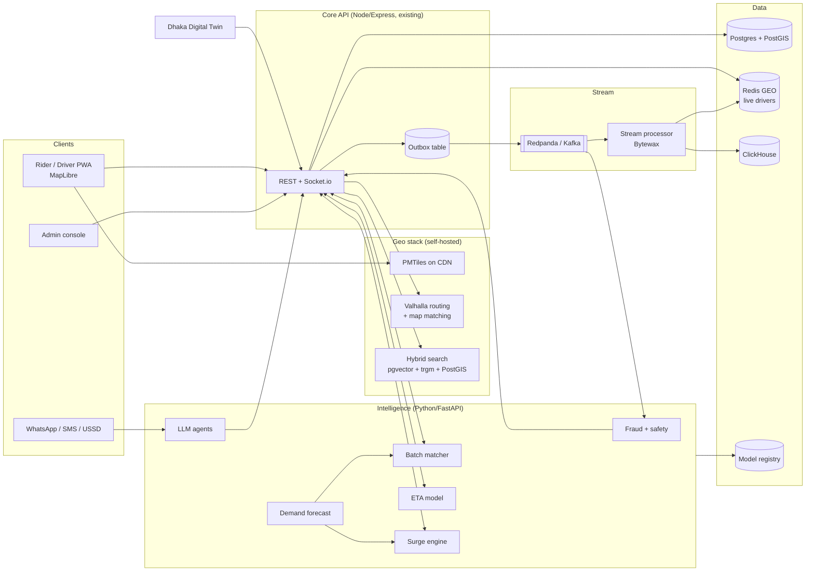
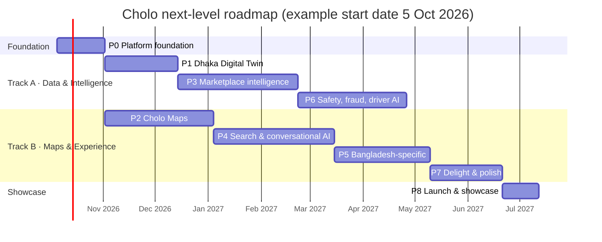
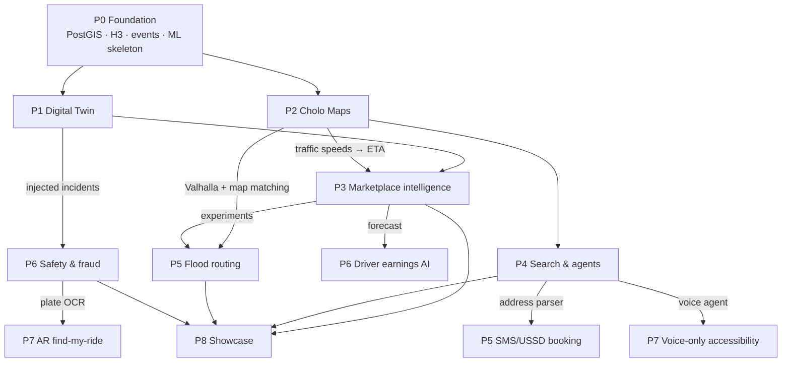

# Cholo — Complete Roadmap to an AI-Native Mobility Platform

This roadmap is the execution plan for [next-level-features.md](next-level-features.md). Feature codes like **(5.1)** or **(S3)** refer to sections in that document.

- **Duration:** 52 weeks for one full-time developer. With 2–3 people, tracks A and B below run in parallel and it drops to roughly 7–8 months.
- **Rule:** every phase ends with something you can **demo** and something you can **measure**.

---

## 1. Where Cholo is today

| Area | Current state | Limitation |
|------|---------------|-----------|
| Dispatch | `fanOutOffers` in [dispatch.service.js](../server/src/services/dispatch.service.js): nearest drivers by haversine distance, radius grows 5 → 10 km, offers time out after 15 s | Greedy: each request is matched on its own. No forecasting or batching. |
| Routing | Public OSRM demo server (`OSRM_BASE_URL`) | Rate-limited, no traffic data, not allowed for production use |
| Geocoding | Public Nominatim + Photon | Weak on Bangla/Banglish and informal addresses. Rate-limited. |
| Map | Leaflet raster tiles | No custom style, no smooth vehicle animation, no 3D |
| Location data | `trip_location_pings`, partitioned by month in Postgres | Pings are stored only during trips, and nothing analyzes them |
| Spatial | Latitude/longitude columns with haversine math in JS | No PostGIS, no spatial index, no H3 |
| Surge | Admins create it by hand in the marketplace controller | Reacts late and can't explain itself |
| Infra | Render free tier, Supabase Postgres, Vercel | Can't run Kafka, ML services, a routing engine or tile builds |
| AI | None | — |

---

## 2. Target architecture



**Repository layout at the end:**

```
cholo/
├── client/          # existing React PWA (Leaflet → MapLibre)
├── server/          # existing Express API (gets outbox, flags, ML clients)
├── ml/              # NEW  Python FastAPI: dispatch, eta, forecast, pricing, risk
├── agents/          # NEW  LLM agents: booking, support, ask-cholo
├── sim/             # NEW  Dhaka Digital Twin
├── maps/            # NEW  tile build, map style, Valhalla config, GTFS
├── stream/          # NEW  stream processors (pings → traffic, metrics)
├── infra/           # NEW  docker compose / k8s, Grafana dashboards, k6 scripts
├── database/        # existing migrations (+ PostGIS, H3, pgvector)
└── docs/design/     # NEW  one design doc per major system
```

---

## 3. Timeline



| Phase | Weeks (solo, sequential) | Headline deliverable |
|-------|--------------------------|----------------------|
| P0 Foundation | 1–4 | PostGIS, H3, event bus, ML service skeleton, observability |
| P1 Digital Twin | 5–10 | 5,000 simulated cars on a live dashboard and a baseline metrics report |
| P2 Cholo Maps | 11–19 | Custom map, own routing, own traffic layer |
| P3 Marketplace intelligence | 20–29 | Batched dispatch, forecasting, ML ETA, explainable surge, A/B platform |
| P4 Search & conversational AI | 30–37 | Banglish/landmark search, Bangla voice booking agent, AI support agent |
| P5 Bangladesh-specific | 38–42 | Flood routing, multimodal planner, fair-fare meter, Lite/USSD |
| P6 Safety, fraud, driver AI | 43–47 | Anomaly detection, fraud graph, liveness, earnings forecaster |
| P7 Delight & polish | 48–50 | Design system, trip recap, Cholo Wrapped, accessibility |
| P8 Showcase | 51–52 | Demo video, blog posts, open-source libraries, open data portal |

With a team, run Track A (P1 → P3 → P6) and Track B (P2 → P4 → P5 → P7) at the same time.

---

## 4. Phases in detail

Each phase lists its **milestones** (checkbox tasks), **deliverables**, **exit criteria** (measurable) and **risks**.

---

### P0 — Platform foundation (weeks 1–4)

**Goal:** make the codebase able to hold everything that comes later. Nothing user-visible yet, but every later phase depends on this.

#### M0.1 Infrastructure move (week 1)
- [ ] Move from the Render free tier to one VPS (e.g. Hetzner CX42 / DigitalOcean 8 GB) running Docker Compose. Keep Vercel for the client.
- [ ] Put `infra/docker-compose.yml` services in place: postgres(+PostGIS), redis, redpanda, clickhouse, grafana, prometheus, otel-collector, ml, valhalla (added in P2).
- [ ] Update `.github/workflows/ci.yml`: build and test the `ml/` and `sim/` Python services, then deploy through SSH or GHCR images.
- [ ] Nightly `pg_dump` backup to object storage (extend the existing `backup.yml`).

#### M0.2 Spatial database (week 1–2)
- [ ] Migration `0014_postgis.sql`: `CREATE EXTENSION postgis`, add `geography(Point)` columns to drivers, ride requests, trips and saved places, with GiST indexes.
- [ ] Migration `0015_h3.sql`: install the `h3` + `h3_postgis` extensions and add `h3_r8` / `h3_r9` generated columns on requests and trips.
- [ ] Replace the haversine filter in `fanOutOffers` with `ST_DWithin` in `offersRepo.findEligibleDrivers`, and keep the same behavior.
- [ ] Store live driver positions in **Redis GEO** (`GEOADD drivers:online`) in addition to Postgres. `recordLocationPing` writes to Redis on every ping and to Postgres every Nth ping.
- [ ] Record pings while drivers are **online without a trip** too (a separate `driver_location_pings` table, partitioned by month), because traffic and demand models need them.

#### M0.3 Event backbone (week 2–3)
- [ ] **Outbox pattern:** an `outbox_events` table written in the same transaction as each state change (ride requested, offer sent/accepted/declined, trip status, payment, rating). A relay worker publishes the events to Redpanda.
- [ ] Topic list and schemas in `stream/schemas/`: `ride.requested`, `offer.*`, `trip.*`, `ping.driver`, `payment.*`, `rating.created`.
- [ ] Sink into ClickHouse: raw event tables and materialized views for per-hour, per-H3-cell metrics.

#### M0.4 ML service skeleton (week 3)
- [ ] `ml/` FastAPI app with `/health` and one stub endpoint per model (`/eta`, `/dispatch/batch`, `/forecast`, `/surge`, `/risk/trip`).
- [ ] The Node API calls it through `server/src/services/ml.client.js` with a timeout and a **fallback to the current logic** if the ML service is down.
- [ ] MLflow for experiment tracking and the model registry.

#### M0.5 Feature flags and observability (week 4)
- [ ] Feature flags table + admin UI (percentage rollout, per city, per user), so every AI feature ships behind a flag.
- [ ] OpenTelemetry in Express and Socket.io. Grafana dashboards for API p50/p95/p99, socket connections, dispatch latency, and match rate.
- [ ] SLOs defined: *p99 time from request to first offer < 3 s*, *API availability 99.5%*.

**Deliverables:** migrations 0014–0016, `infra/`, `ml/` skeleton, Grafana dashboards, `docs/design/00-platform.md`.

**Exit criteria**
- All existing server tests pass on PostGIS-based dispatch.
- Every ride lifecycle event is visible in ClickHouse within 5 s.
- Killing the ML container doesn't break booking (the fallback works).

**Risks:** Supabase may not allow the `h3` extension. Mitigation: self-host Postgres on the VPS, or compute H3 in the app with `h3-js`.

---

### P1 — Dhaka Digital Twin (weeks 5–10)  · feature 0

**Goal:** a city-scale simulator that exercises the real system, creates training data, and measures every algorithm afterwards.

#### M1.1 World model (week 5)
- [ ] `sim/world/`: load the Dhaka road graph with `osmnx` and cache it as GraphML.
- [ ] Zone definitions: residential, commercial and transit hubs across Dhaka's H3 r8 cells, tagged from OSM land use and POIs.
- [ ] Calendar: weekdays/weekend (Fri–Sat), prayer times, public holidays, Ramadan hours, Eid.

#### M1.2 Demand generator (week 6)
- [ ] Origin-destination matrix: gravity model between zones, with time-of-day profiles (morning peak toward offices, evening peak back).
- [ ] Non-homogeneous Poisson arrivals per cell, with modifiers for rain (×1.6 demand, ×0.6 supply), events and hartals.
- [ ] Rider behavior: price elasticity (probability of accepting a surge), wait tolerance before canceling.

#### M1.3 Driver agents (week 7)
- [ ] Driver shift patterns (morning/evening/full-day), home locations, and acceptance probability as a function of pickup distance and fare.
- [ ] Movement: follow Valhalla/OSRM routes with speed noise and emit pings every 4 s through the **real socket API**.
- [ ] Idle behavior: stay put, drift toward home, or follow repositioning hints (used in P3).

#### M1.4 Runner and control (week 8)
- [ ] Discrete-event engine with a simulated clock (1×–60×) and a fixed random seed for reproducibility.
- [ ] Runs against a disposable Cholo stack: `make sim-up` starts a fresh DB, seeds 5,000 drivers, and runs the scenario.
- [ ] Scenario files in YAML: `weekday_normal`, `monsoon_evening`, `eid_exodus`, `cricket_match_mirpur`.

#### M1.5 Metrics and dashboard (week 9–10)
- [ ] Metrics read from ClickHouse: match rate, rider wait time (p50/p90), pickup ETA, driver utilization, idle km, cancellation rate, revenue, and driver earnings per hour.
- [ ] Live dashboard (`sim/dashboard`, deck.gl + MapLibre): moving cars, request dots, H3 heatmaps, and a metrics sidebar.
- [ ] **A/B mode:** run policy A and policy B on the same seed and produce a comparison report (Markdown + charts).
- [ ] **Baseline report** for the current greedy fan-out dispatch. This is the number every later phase has to beat.
- [ ] k6 load test using simulated traffic. Record the max sustained pings/s and requests/s.

**Deliverables:** `sim/` package, 4 scenarios, a dashboard, `docs/design/01-digital-twin.md`, `reports/baseline-dispatch.md`, and a 30-second screen recording.

**Exit criteria**
- 5,000 drivers and 20,000 trips per simulated hour on a single VPS.
- The same seed reproduces the same metrics within ±1%.
- ≥ 10 million pings and ≥ 1 million trips stored for training.

**Risks:** Socket.io may not handle 5k emitters from one process. Mitigation: shard the sim across worker processes and add the Socket.io Redis adapter (worth doing anyway).

---

### P2 — Cholo Maps (weeks 11–19)  · features 2.1–2.6, S1

**Goal:** own the whole map stack: tiles, style, routing, geocoding and traffic.

#### M2.1 Vector tiles and custom style (week 11–12)
- [ ] `maps/tiles/`: build Bangladesh tiles with `planetiler` from the Geofabrik extract, output `bangladesh.pmtiles`, and upload to a CDN (Cloudflare R2).
- [ ] Monthly rebuild through a GitHub Action.
- [ ] `maps/style/`: Cholo light and dark styles designed in Maputnik. Bangla-first labels (`name:bn`, falling back to `name`), Noto Sans Bengali glyphs, and 3D building extrusion at zoom ≥ 15.
- [ ] Automatic dark mode at local sunset.

#### M2.2 MapLibre migration (week 12–13)
- [ ] Replace Leaflet with **MapLibre GL JS** behind one shared `<CholoMap>` component. Migrate each page: passenger booking, live trip, driver home, admin zones, admin SOS board.
- [ ] Rebuild the zone editor (polygon drawing) with `maplibre-gl-draw` / Terra Draw.
- [ ] Remove the `leaflet` dependency once every page is migrated.

#### M2.3 Vehicle rendering (week 13)
- [ ] Interpolate between pings (tweening over the ping interval) and dead-reckon for up to 8 s when pings stop.
- [ ] Rotate icons to bearing. SVG sprites per vehicle category.
- [ ] Draw the route line in with an animation, fade the traveled portion, and pulse the pickup marker.
- [ ] Snap the vehicle to the route geometry while on a trip.

#### M2.4 Self-hosted routing and geocoding (week 14–15)
- [ ] Run **Valhalla** in Docker with Bangladesh tiles. Profiles: `auto`, `motorcycle`, and a custom `cng` (speed cap 50 km/h, no expressways).
- [ ] Point `OSRM_BASE_URL` / the geo provider at Valhalla by adding `server/src/services/providers/valhalla.provider.js` next to the existing `osm.provider.js`.
- [ ] Self-host Photon (or Pelias) and stop depending on public Nominatim.

#### M2.5 Map matching and traffic layer (week 16–17)
- [ ] `stream/traffic/`: consume `ping.driver`, run Valhalla's `trace_attributes` (Meili HMM map matching) on 60 s windows per driver, and emit `(edge_id, speed, timestamp)`.
- [ ] Aggregate speeds per edge per 15-minute bucket in ClickHouse (live) and build historical profiles (weekday × 15 min).
- [ ] Publish the live traffic layer as a GeoJSON/MVT endpoint and show green/yellow/red roads on the map.
- [ ] Feed historical speed profiles into Valhalla (custom traffic tiles) so routes and ETAs account for traffic.

#### M2.6 Smart pickup points and map self-healing (week 18–19)
- [ ] Pickup point mining: DBSCAN on actual pickup locations per H3 r10 cell, scored by success rate and wait time. Suggest the nearest good spot when a rider drops a pin.
- [ ] Missing-road detection: cluster pings that don't map-match (distance > 25 m from any edge), turn the clusters into candidate road polylines, and list them in the admin **Map QA** page.
- [ ] One-way error detection: flag edges often traversed against their direction.

**Deliverables:** `maps/` (tiles, style, Valhalla config), `<CholoMap>`, a traffic stream processor, the admin Map QA page, `docs/design/02-cholo-maps.md`.

**Exit criteria**
- No external map service is called on the critical path (tiles, routing and geocoding are all self-hosted).
- Map first render < 1.5 s on a mid-range Android on 4G. 60 fps car animation.
- Traffic-aware routing ETA error (MAPE) at least 15% lower than public OSRM in the simulator.

**Risks:** Valhalla tile builds need about 8 GB RAM, so build them in CI and ship the artifact. OSM coverage of Bangla names is partial, so fall back to transliteration.

---

### P3 — Marketplace intelligence (weeks 20–29)  · features 5.1–5.8, S4, S8

**Goal:** replace every hand-tuned marketplace rule with a model that is measured in the simulator and rolled out through experiments.

#### M3.1 Experimentation platform (week 20–21) — build first, so everything after it can be measured
- [ ] `experiments` table: variants, allocation unit (user / driver / **H3 cell × time block**), start and end dates.
- [ ] **Switchback assignment:** randomize by (city cell, 30-minute block), because marketplace changes affect both variants when randomized per user.
- [ ] Analysis job: difference in means, **CUPED** variance reduction, confidence intervals, and guardrail metrics (cancellations, driver earnings).
- [ ] Admin Experiments page: create, monitor and stop experiments, and read the results.

#### M3.2 ML ETA (week 21–23)
- [ ] Training set from simulated and real trips: routing ETA, distance, H3 origin and destination, hour, weekday, rain, and live traffic index → actual duration.
- [ ] Model: LightGBM that predicts the **residual** on top of Valhalla's ETA. Later, a small transformer in the style of DeepETA.
- [ ] Serve through `/eta`. Show pickup and trip ETAs with an uncertainty range ("12–15 min").
- [ ] An admin chart of ETA MAPE per day.

#### M3.3 Demand forecasting (week 23–25)
- [ ] Target: requests per H3 r8 cell per 15 minutes for the next 15, 30 and 60 minutes.
- [ ] Features: lags, rolling means, calendar, prayer times, weather (Open-Meteo API) and events.
- [ ] v1 LightGBM → v2 spatiotemporal GNN (Graph WaveNet / STGCN over the H3 adjacency graph).
- [ ] Scheduled job writes forecasts to Redis every 5 minutes. Admin heatmap shows forecast vs actual.

#### M3.4 Batched dispatch (week 25–27)
- [ ] `ml/dispatch/`: collect open requests and available drivers every 2 s (configurable) and build a cost matrix of **ETA from the P3.2 model** plus penalties (driver rating, favorites, women-only constraint, commission debt).
- [ ] Solve with the Hungarian algorithm (`scipy.optimize.linear_sum_assignment`) or OR-Tools min-cost flow.
- [ ] Integrate into `dispatch.service.js`: behind a feature flag, `fanOutOffers` sends a single targeted offer from the batch result. The current fan-out stays as the fallback and the control variant.
- [ ] v2: add a **future value** term for each driver's drop-off cell (learned by temporal-difference learning over simulated histories, DiDi style).
- [ ] Simulator A/B against the P1 baseline, then a switchback experiment.

#### M3.5 Repositioning and explainable surge (week 27–28)
- [ ] Supply-demand gap per cell = forecast demand − expected available drivers.
- [ ] Driver app: a "Hot zones" heatmap layer and a nudge card ("Gulshan 1 · ~12 requests in 20 min · 8 min away").
- [ ] Automatic surge: multiplier = f(gap), spatially smoothed across neighboring cells, capped (e.g. 2.0×), with hysteresis so it doesn't flicker. Admin manual surge remains as an override.
- [ ] **Explanation string** stored with each quote ("1.3× · rain + 45% fewer drivers nearby") and shown on the fare card.
- [ ] Fairness check: surge frequency per area compared with income proxies, reported in admin.

#### M3.6 Pool and multi-stop (week 28–29)
- [ ] Cholo Pool: an insertion heuristic. Match a new request into an active pooled trip if every rider's detour is ≤ 30% and ≤ 8 min. Split the fare by distance share.
- [ ] Multi-stop optimizer: OR-Tools TSP for up to 5 stops, "Optimize order" button on the booking screen.
- [ ] Guaranteed upfront fare: quote at the P80 of the predicted cost distribution and track platform margin.

**Deliverables:** `ml/` models (eta, forecast, dispatch, surge), Experiments admin page, driver hot-zone layer, `docs/design/03-marketplace.md`, `reports/dispatch-v1-vs-baseline.md`.

**Exit criteria (all measured in the simulator, same seed)**
- Average pickup ETA **≥ 15% lower** than the baseline.
- Match rate **≥ 5 points higher** during monsoon evenings.
- ETA MAPE **< 15%**.
- Demand forecast 30-minute WAPE **< 25%** at H3 r8.
- Batch solve time p99 **< 300 ms** for 2,000 × 2,000.

**Risks:** batching adds up to 2 s of latency. Mitigation: shorter windows when demand is low and immediate dispatch when only one candidate exists.

---

### P4 — Search and conversational AI (weeks 30–37)  · features 3.x, 4.x, S2, S3

**Goal:** Cholo understands how people in Bangladesh actually describe places and talk.

#### M4.1 Banglish and phonetic search (week 30)
- [ ] `packages/bangla-search` (to be open-sourced): Unicode normalization, Bangla ↔ Latin transliteration (Avro rules), and a phonetic key (a custom Bangla Metaphone).
- [ ] Postgres: `pg_trgm` index on the normalized and phonetic keys of places and landmarks.

#### M4.2 Landmark database and hybrid search (week 31–32)
- [ ] `landmarks` table: name variants (bn/en/banglish), geography, category, popularity, and source (OSM / drivers / riders).
- [ ] `pgvector` embeddings (a multilingual embedding model) of names and descriptions.
- [ ] Hybrid ranker: `score = w1·trigram + w2·vector + w3·geo_proximity + w4·popularity`. Start with hand-tuned weights, then learn them from click logs.
- [ ] Feedback loop: the actual drop-off location updates the landmark's position (a running median).

#### M4.3 LLM address parser (week 32–33)
- [ ] Parse free text into `{area, road, landmark, relation: near|behind|opposite|beside, floor, gate}` with a small LLM call (e.g. `claude-haiku-4-5`) using a strict JSON schema.
- [ ] Resolve: landmark lookup, then apply the relation offset with a road-side heuristic, and return candidates with confidence scores.
- [ ] An evaluation set of 500 real-style Dhaka addresses with ground-truth pins. Report top-1 accuracy within 100 m.

#### M4.4 Cholo Codes and predictive destinations (week 33–34)
- [ ] `address_codes`: short code, pin, entrance photo, voice note, and instructions. Share link plus QR code.
- [ ] Next-destination model per user (LightGBM over time, day, location and history), shown as the first card on the home screen.
- [ ] Intent/semantic POI search: retrieve candidates, then have the LLM re-rank them against the user's intent.

#### M4.5 Booking agent (week 34–36)
- [ ] `agents/booking/`: Claude with tool use (`claude-sonnet-5`). Tools map onto existing endpoints: `search_place`, `get_fare_estimates`, `create_ride_request`, `cancel_ride`, `add_stop`, `share_trip`, `get_trip_status`.
- [ ] Guardrails: explicit confirmation before any action that spends money, a per-session spending cap, and the tool call log saved to the audit log.
- [ ] In-app chat UI (text) → **voice**: Bangla speech-to-text, text-to-speech playback, and push-to-talk.
- [ ] Channel adapters: WhatsApp Cloud API and Messenger webhook → the same agent.
- [ ] An evaluation suite of 200 scripted conversations in Bangla, English and Banglish, measuring task success rate and wrong-action rate.

#### M4.6 Support agent and "Ask Cholo" (week 36–37)
- [ ] `agents/support/`: tools to read the trip trace, fare breakdown and route deviation, and to issue a refund within policy (≤ ৳300 automatically, anything above goes to a human). It writes the dispute summary for admins.
- [ ] `agents/analyst/`: text-to-SQL over a **read-only ClickHouse user**. The semantic layer (metric definitions YAML) is given in the prompt. It returns SQL, a chart spec and an explanation.
- [ ] Driver hands-free copilot (voice intents: accept, arrived, call rider, today's earnings).
- [ ] Translated in-trip chat (bn ↔ en).

**Deliverables:** `packages/bangla-search`, landmark DB, `agents/` (booking, support, analyst), chat and voice UI, WhatsApp integration, eval reports, `docs/design/04-search.md`, `docs/design/05-agents.md`.

**Exit criteria**
- Address resolution top-1 accuracy within 100 m **≥ 80%** on the evaluation set (versus Nominatim's baseline, which you also report).
- Booking agent task success **≥ 90%** and wrong-action rate **< 1%**.
- Support agent resolves **≥ 60%** of simulated fare disputes without a human.

**Risks:** LLM cost and latency. Mitigation: Haiku for parsing and routing, Sonnet only for multi-step turns, prompt caching, and a response cache for common queries.

---

### P5 — Bangladesh-specific innovation (weeks 38–42)  · features 6.x, S5, S6

#### M5.1 Flood-aware routing (week 38–39)
- [ ] Signals: (a) fleet speed collapse on an edge while it's raining (from the P2.5 traffic stream, with Open-Meteo precipitation), (b) one-tap "waterlogged" reports from drivers, (c) a list of historically flood-prone roads.
- [ ] A per-edge flood score that decays over time. Valhalla routes with high costs on flooded edges.
- [ ] Map: a blue flood overlay and a "Route avoids 2 waterlogged roads" note.
- [ ] Simulator scenario `monsoon_evening` compared with and without flood routing.

#### M5.2 Multimodal planner (week 39–41)
- [ ] `maps/gtfs/`: hand-build GTFS for **Dhaka Metro MRT-6** (stations, headways, fares) and 10–20 major bus routes. Validate with `gtfs-validator`. This feed gets open-sourced.
- [ ] RAPTOR router (e.g. OpenTripPlanner, or implement RAPTOR in `ml/transit`) plus Cholo first-mile/last-mile legs.
- [ ] UI: compare options side by side ("Car ৳320 · 55 min" vs "Bike + Metro ৳140 · 30 min") and book the Cholo leg with one tap.

#### M5.3 Fair-fare meter, women-safe mode, festival mode (week 41)
- [ ] Fair fare: P25–P75 fare range for this origin-destination, vehicle type and time, computed from trip data, shared as a card or image.
- [ ] Women-safe: extend the existing `womenOnly` dispatch flag with automatic trip sharing and a night-time safe-route mode (weighted toward busier, lit roads).
- [ ] Festival mode: an admin toggle that loads the forecast adjustments, enables intercity booking, and shows event-aware ETAs.

#### M5.4 Lite mode, SMS and USSD (week 42)
- [ ] Lite client route: text-first, a static map image, and socket updates in a compact binary format.
- [ ] SMS booking (`RIDE <from> TO <to>`) through an SMS gateway, parsed by the P4 address parser.
- [ ] USSD menu flow through an aggregator sandbox.

**Deliverables:** flood layer and routing, Dhaka GTFS feed, multimodal UI, fair-fare card, Lite mode, SMS/USSD, `docs/design/06-bangladesh.md`.

**Exit criteria**
- In the monsoon scenario, flood routing cuts stuck trips (speed < 3 km/h for more than 5 min) by **≥ 30%**.
- The multimodal planner returns a result in **< 800 ms** and the GTFS feed passes validation with zero errors.
- Lite mode is usable on a throttled 2G profile (first usable screen < 5 s).

---

### P6 — Safety, fraud and driver AI (weeks 43–47)  · features 7.x, 8, 9, S7

#### M6.1 Trip anomaly detection (week 43)
- [ ] A stream job compares each live trip with its expected route corridor (buffer 300 m) and dwell-time model.
- [ ] Triggers: deviation > 1 km, unexpected stop > 6 min, phone offline > 3 min mid-trip.
- [ ] Rider check-in push ("Are you okay?"). If there's no response in 2 minutes, the trip goes to the existing SOS board and trusted contacts.

#### M6.2 On-device safety (week 44)
- [ ] Crash detection: DeviceMotion API, deceleration spike > 4 g followed by stillness, then a countdown to auto-SOS.
- [ ] Drowsiness: MediaPipe Face Mesh with the eye aspect ratio and yawn detection, running entirely on the device. Suggest a break.
- [ ] Driver behavior score: harsh braking and acceleration and speeding from pings and motion data, delivered as a weekly coaching report.

#### M6.3 Identity (week 45)
- [ ] Shift-start selfie: liveness check (a random blink or head-turn challenge) and a face match against the approved profile photo.
- [ ] Document OCR for NID, driving license and registration (Bangla + English) to fill forms automatically, flag mismatches, and extract expiry dates. This extends the existing `documentExpiry.job.js`.
- [ ] Bangla number plate OCR, reused for AR ride confirmation in P7.

#### M6.4 Fraud defense (week 46)
- [ ] GPS spoofing rules: impossible speed, teleporting, mock-location flag, accuracy anomalies.
- [ ] **Fraud graph:** nodes are users, devices, payment accounts, payout accounts and IPs. Edges come from shared usage. Community detection (Louvain) plus rules finds promo and referral rings and driver-rider collusion.
- [ ] A risk score per trip and per account in admin, with the **reasons** listed. Actions always need human confirmation.
- [ ] Fare manipulation: compare the actual route with the optimal route and refund the difference automatically above a threshold.

#### M6.5 Driver AI (week 47)
- [ ] Earnings forecaster: expected ৳ per hour by zone and time (from the P3 forecast plus historical fares).
- [ ] Shift planner: given a weekly goal, suggests hours and zones.
- [ ] True-profit view: earnings minus a fuel/CNG estimate minus maintenance. An EV calculator based on the driver's actual trips.
- [ ] Transparent deactivation: a reason code, the evidence, and an appeal flow.

**Deliverables:** safety stream jobs, on-device ML modules, liveness and OCR onboarding, fraud graph and admin Risk page, driver insights screens, `docs/design/07-trust-safety.md`.

**Exit criteria**
- Anomaly detection: recall **≥ 90%** on injected simulator incidents (the sim injects deviations and stops), false alert rate **< 1 per 200 trips**.
- The fraud graph detects **≥ 85%** of injected promo rings in the simulator.
- On-device models run at ≥ 15 fps on a mid-range Android and never upload frames.

---

### P7 — Delight and polish (weeks 48–50)  · feature 10, 2.7

- [ ] **Design system:** tokens (color, spacing, radius, motion), Bangla typography scale, component library (Storybook), and a motion language with Framer Motion.
- [ ] Skeleton states, haptics (`navigator.vibrate`), and a "searching" radar animation.
- [ ] **Trip recap:** an animated route replay, stats, CO₂ saved compared with a private car, and a shareable image (canvas render).
- [ ] **Cholo Wrapped:** a yearly story-style summary generated from ClickHouse.
- [ ] Live trip widget: persistent notification with progress (PWA). Native Live Activity if a native shell is added.
- [ ] **AR find-my-ride:** WebXR arrow toward the driver plus plate OCR confirmation (from P6.3).
- [ ] Accessibility audit: complete screen-reader labels, a voice-only mode (reusing the P4 agent), large-text mode, color-blind-safe map palette, and WCAG 2.2 AA checks in CI (axe).

**Exit criteria:** Lighthouse ≥ 95 for performance and accessibility, zero serious axe violations, and every core flow completable with a screen reader alone.

---

### P8 — Launch and showcase (weeks 51–52)  · feature 12

- [ ] **Dhaka Mobility Insights** public page: travel times, demand and flood hotspots with **differential privacy** (Laplace noise, k-anonymity threshold of 20 per cell).
- [ ] Open-source releases, each with a README, tests and a small demo: `bangla-search`, `bd-address-parser`, `dhaka-gtfs`, and optionally `cholo-sim`.
- [ ] **Engineering blog series** (one per signature feature), written like the Uber/Grab engineering blogs:
  1. Building a digital twin of Dhaka
  2. Owning the map: tiles, routing and a traffic layer from fleet GPS
  3. Batched dispatch: from greedy to global matching (with numbers)
  4. Understanding Dhaka addresses with LLMs and hybrid search
  5. A Bangla voice agent that books rides safely
  6. Routing around monsoon floods
- [ ] **Demo video (90 s):** voice booking in Bangla → custom map with gliding cars → flood layer → simulator at 10× → before/after metrics.
- [ ] **Load test report:** sustained pings/s, dispatch p99, and infra cost per 1,000 trips.
- [ ] README rewrite: architecture diagram, headline metrics, links to design docs and blog posts.
- [ ] Final security review: rate limits on agent endpoints, prompt injection tests, secrets, and PII in logs.

---

## 5. Cross-cutting tracks (every phase)

| Track | What happens every phase |
|-------|--------------------------|
| **Design docs** | Before building a system, write `docs/design/NN-name.md`: context, goals and non-goals, options considered, decision, metrics, rollout, risks |
| **Testing** | Unit tests for each model's feature code. Contract tests between Node and the ML service. A simulator regression run in CI (a short 10-minute scenario must not regress beyond thresholds). |
| **Evaluation** | Each ML or LLM component has a fixed evaluation set and a tracked score in MLflow. No model ships without beating the current one. |
| **Rollout** | Every feature goes behind a flag: simulator → internal → 5% → 50% → 100%, with a switchback experiment for marketplace features |
| **Security and privacy** | Data minimization. On-device processing where possible. Agent tools follow least privilege. Every automated action (refund, flag, surge) is written to the audit log. |
| **i18n** | Every new string in both Bangla and English in `client/src/i18n` from day one |
| **Content** | Record a short clip at the end of each phase for the final demo |

---

## 6. Dependency map



**Critical path:** P0 → P1 → P3 → P8. If time runs short, cut from P7 and the second half of P5, never from the critical path.

---

## 7. Data needs per model

| Model | Minimum data | Source before real users |
|-------|-------------|--------------------------|
| ETA | 100k trips with actual durations | Simulator using P2 traffic profiles |
| Demand forecast | 8+ weeks of requests per cell per 15 minutes | Simulator run at 60× for 8 simulated weeks |
| Batched dispatch | None to train (optimization). Value function: 1M transitions | Simulator |
| Pickup points | 20k pickups | Simulator with noisy pickup behavior, plus real trips |
| Address parser | 500 labeled addresses | Hand-labeled, plus synthetic LLM-generated variants |
| Fraud graph | Labeled rings | Simulator injects fraud agents |
| Anomaly detection | Labeled incidents | Simulator injects deviations and stops |
| Booking agent | 200 scripted conversations | Written by hand plus LLM-generated personas |

Always label which numbers come from the simulator and which from real traffic. Being honest about that builds credibility.

---

## 8. KPI scoreboard (show it on the admin dashboard and in the README)

| KPI | Baseline (P1) | Target |
|-----|---------------|--------|
| Avg pickup ETA | measured in P1 | −15% |
| Match rate (monsoon evening) | measured in P1 | +5 pts |
| Rider cancellation rate | measured in P1 | −20% |
| Driver utilization (on-trip time / online time) | measured in P1 | +10% |
| ETA MAPE | public OSRM | < 15% |
| Demand forecast WAPE (30 min, r8) | naive last-week | < 25% |
| Address top-1 @100 m | Nominatim | ≥ 80% |
| Booking agent success | — | ≥ 90% |
| Request → first offer p99 | measured in P0 | < 3 s |
| Sustained pings/s | measured in P1 | ≥ 2,000 on one VPS |

---

## 9. Risk register

| Risk | Impact | Likelihood | Mitigation |
|------|--------|-----------|------------|
| Scope is too big for one person | High | High | Stick to the critical path. Each phase ships something usable on its own. Cut P7 first. |
| Simulator is unrealistic, so the metrics mean nothing | High | Medium | Calibrate against real Cholo trips and published Dhaka travel-time studies. State the assumptions in the design doc. |
| Infra cost grows | Medium | Medium | One VPS to start. Build tiles and Valhalla in CI. Scale to zero in the sim environment. Track cost per 1,000 trips. |
| LLM agent takes a wrong action (books or refunds by mistake) | High | Low | Confirmation step, spending caps, tool allowlists, audit log, eval suite in CI |
| Prompt injection via chat, WhatsApp or addresses | High | Medium | Treat all user text as data. Agent tools are scoped to the requesting user only. Red-team tests. |
| Privacy (location and face data) | High | Medium | On-device face and drowsiness models, differential privacy for public data, retention limits on pings |
| OSM data gaps in Bangladesh | Medium | High | Map self-healing (P2.6) and the landmark DB (P4.2) are designed for exactly this |
| Supabase/Render limits | Medium | High | P0.1 moves to a VPS early |

---

## 10. Monthly infra cost (estimate)

| Stage | Setup | ≈ USD/month |
|-------|-------|-------------|
| P0–P2 | 1 × 8 GB VPS + R2 CDN + Vercel free | 25–40 |
| P3–P6 | 1 × 16 GB VPS (Valhalla, ClickHouse, Redpanda, ML) + LLM API | 60–120 |
| Showcase | Same, plus demo traffic | 80–150 |

---

## 11. Definition of done (any feature)

- [ ] Design doc merged
- [ ] Behind a feature flag with a fallback path
- [ ] Unit and contract tests pass. The sim regression doesn't regress.
- [ ] Metric defined and visible in Grafana or admin
- [ ] Compared with the baseline in the simulator (report committed under `reports/`)
- [ ] Bangla and English strings
- [ ] Accessible (keyboard, screen reader, contrast)
- [ ] Audit-logged if it takes an automated action
- [ ] 15-second demo clip recorded

---

## 12. After week 52 (moonshots)

- Autonomous-ready dispatch API: treat the "driver" as a pluggable agent and test robotaxi fleets in the twin
- Cholo Send (parcels) and multi-vertical batching on the same dispatch engine
- Corporate mobility and garment-worker shuttle route optimization (vehicle routing with time windows)
- Charge-aware EV fleet dispatch
- Verified carbon credits from pooling and EVs
- A native mobile shell (React Native / Capacitor) for background location, Live Activities and native AR
